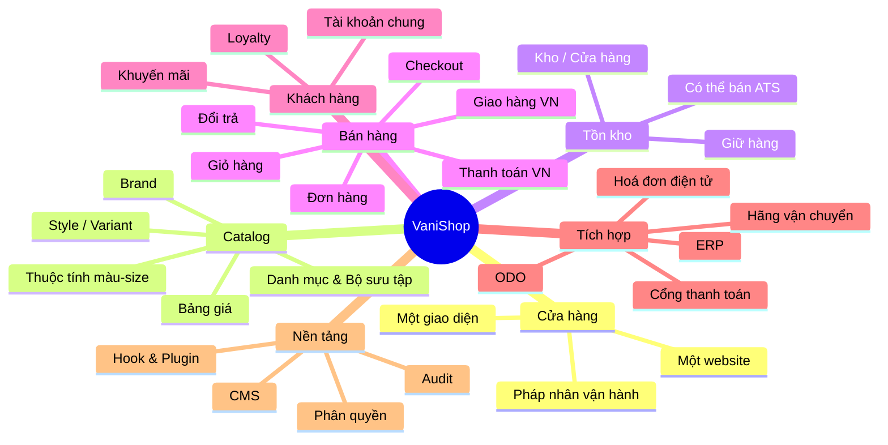

# Vision

> Trạng thái: **Designed**. Hiện trạng code: [status](status.md).

## 1. Bối cảnh

Owner kinh doanh thời trang với **nhiều thương hiệu** (ví dụ: công sở nữ, streetwear, trẻ em, phụ kiện). Hiện tại việc bán hàng có thể đang:

- Rải trên nhiều website/nền tảng khác nhau (Haravan, Sapo, WooCommerce…), dữ liệu phân mảnh.
- Bán thêm trên sàn (Shopee, Lazada, TikTok Shop) và cửa hàng vật lý với POS riêng.
- Quản lý tồn kho, kế toán trên ERP; điều phối đơn/giao nhận trên **ODO**.

Hệ quả: khách hàng bị tách, tồn kho không nhìn được toàn cục, đối soát COD và hoá đơn thủ công.

## 2. Tầm nhìn

> **Một cửa hàng — một website — một giao diện — nhiều thương hiệu trong cùng catalog — một khách hàng — một bức tranh tồn kho.**

VaniShop là **Commerce Kernel** của Owner, chạy **một cửa hàng** ([ADR-028](../19-adr/ADR-028-single-store-brand-as-catalog.md)). Thương hiệu là **nhóm sản phẩm** trong catalog: khách duyệt theo danh mục hoặc theo brand, cho sản phẩm của nhiều brand vào cùng một giỏ, thanh toán một lần.

| Nhu cầu | Cách đáp ứng |
|---|---|
| Một website, nhiều thương hiệu | Brand là thực thể Catalog: trang brand, bộ lọc, khuyến mãi theo brand ([store-and-brand](../12-store/store-and-brand.md)) |
| Fashion commerce | Core: mô hình Style → Màu → Size ([catalog-pricing](../03-domains/catalog-pricing.md)) |
| Native storefront và headless/API-first | Core: Storefront Application + API dùng chung catalog/giá/tồn ([storefront](../14-storefront/storefront.md)) |
| ERP và tích hợp ngoài | Core: Integration platform; connector là plugin |
| Nghiệp vụ riêng | Plugin qua Extension Points |

> **Core cung cấp commerce primitives và business invariants. Capability đặc thù nghiệp vụ được xây ngoài Core qua Extension Points.** Mục tiêu cuối cùng: một Commerce Kernel ổn định, extension point rõ ràng, plugin phát triển độc lập, nâng cấp an toàn, không fork Core.

Với Owner, điều đó có nghĩa là:

- **Một website** trên một domain, **một giao diện** (theme `vani-base` hoặc theme con), một bộ cấu hình, một pháp nhân đứng tên bán hàng.
- Thương hiệu có **trang riêng trong website** (`/thuong-hieu/{slug}`), logo, mô tả, bộ lọc; giá, khuyến mãi, tồn dùng chung cơ chế của cửa hàng.
- **Một tài khoản khách hàng**, loyalty chung, báo cáo hợp nhất (lọc được theo brand).
- Tồn kho **đa điểm** (kho tổng, cửa hàng) đồng bộ gần thời gian thực với ERP/ODO.
- Sẵn sàng **omnichannel** bằng plugin: BOPIS, ship-from-store, POS qua API/connector — đơn từ các nguồn này vào cùng luồng, ghi `source` để báo cáo.

## 3. Mục tiêu (Goals)

| # | Mục tiêu | Đo lường |
|---|---|---|
| G1 | Một cửa hàng nhiều thương hiệu | Thêm brand mới = tạo brand trong Catalog + gán sản phẩm, không cần deploy, trong ngày |
| G2 | Single customer view | 100% đơn web gắn với 1 hồ sơ khách hàng hợp nhất |
| G3 | Tồn kho chính xác | Chênh lệch tồn web vs ERP < 0,5%; oversell < 0,1% đơn |
| G4 | Tích hợp tự động qua module Integration | ≥ 99% message tới hệ thống ngoài (ERP, ODO khi có) không cần can thiệp tay; độ trễ P95 < 60 giây |
| G5 | Phù hợp thị trường VN | Hỗ trợ COD, VietQR, ví điện tử, hoá đơn điện tử, địa chỉ 2 cấp mới |
| G6 | Hiệu năng | TTFB storefront P95 < 300 ms (cache nóng), LCP mobile < 2,5 s |
| G7 | Pháp lý | Tuân thủ quy định TMĐT, bảo vệ dữ liệu cá nhân, hoá đơn điện tử |

## 4. Không nằm trong phạm vi (Non-goals)

- Danh sách hạng mục **không phải mục tiêu của dự án** (không hoãn, không đóng băng): [ADR-033](../19-adr/ADR-033-out-of-scope.md). Không thiết kế, không plugin, không extension point chuẩn bị cho chúng.
- **Không** làm SaaS cho khách hàng khác (một bản cài đặt = một Owner).
- **Không** thay thế ERP (kế toán, giá vốn, mua hàng, sản xuất) hay ODO (vận hành kho, pick–pack, điều phối vận chuyển).
- **Không** tự xây POS (POS hiện hữu tích hợp qua API; POS riêng là tuỳ chọn về sau).
- **Không** hỗ trợ bán xuyên biên giới / đa tiền tệ ở giai đoạn đầu (thiết kế schema vẫn chừa chỗ).

## 5. Các bên liên quan (Stakeholders)

| Vai trò | Nhu cầu chính |
|---|---|
| Ban điều hành Owner | Báo cáo hợp nhất, lọc theo brand/danh mục/nguồn đơn/cửa hàng vật lý |
| Quản lý ngành hàng | Catalog, giá, khuyến mãi, nội dung; theo dõi hiệu quả từng brand |
| E-commerce / Merchandiser | Sắp xếp danh mục, bộ sưu tập, landing page, SEO |
| CSKH | Tra cứu đơn/khách, xử lý đổi trả |
| Vận hành kho / ODO | Nhận đơn chuẩn hoá, trả trạng thái giao nhận (vai trò ODO tạm hoãn — [ADR-007](../19-adr/ADR-007-erp-integration.md)) |
| Kế toán / ERP | Đối soát thanh toán, COD, hoá đơn điện tử, doanh thu (theo brand khi cần) |
| Cửa hàng vật lý | Nhận đơn BOPIS, ship-from-store, đổi trả hàng mua online |
| Khách hàng cuối | Mua nhanh trên mobile, thanh toán quen thuộc, theo dõi đơn, đổi trả dễ |
| Đội IT | Hệ thống dễ bảo trì, test được, mở rộng được |

## 6. Phạm vi chức năng tổng quát

## 7. Nguyên tắc định hướng

1. **Clean-room tuyệt đối**: không copy mã, schema, asset, file ngôn ngữ từ BeikeShop. Chỉ học ý tưởng ở mức khái niệm.
2. **Một cửa hàng, không phân mảnh**: dữ liệu nghiệp vụ ở cấp cửa hàng; brand là thuộc tính catalog để duyệt/lọc/báo cáo, không phải ranh giới dữ liệu ([ADR-028](../19-adr/ADR-028-single-store-brand-as-catalog.md)).
3. **Authority dữ liệu rõ ràng** cho từng loại dữ liệu, xem ma trận trong [erp-integration](../11-integration/erp-integration.md).
4. **Tích hợp bất đồng bộ, idempotent**: không để lỗi ERP/ODO làm hỏng checkout.
5. **Core tối giản, nghiệp vụ bằng plugin** ([commerce-kernel](../02-architecture/commerce-kernel.md)): Core chỉ gồm primitives, invariants và extension points.
6. **Modular monolith**: ranh giới module rõ ràng trong một ứng dụng, không tách service chạy riêng ([ADR-033](../19-adr/ADR-033-out-of-scope.md)).
7. **Mobile-first, Việt Nam-first**: VNĐ, tiếng Việt có dấu, COD, địa chỉ mới.
8. **Test là một phần của tính năng**: không merge nếu thiếu test cho nghiệp vụ lõi.
9. **Tài liệu phản ánh implementation**: trạng thái thật nằm ở [status](status.md). Các quy tắc bắt buộc nằm ở [architecture-rules](../01-principles/architecture-rules.md).
