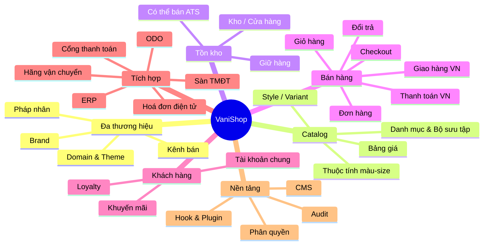

# Vision

> Trạng thái: **Designed**. Hiện trạng code: [status](status.md).

## 1. Bối cảnh

Tập đoàn (**Owner**) sở hữu nhiều thương hiệu thời trang (ví dụ: một brand công sở nữ, một brand streetwear, một brand trẻ em, một brand phụ kiện). Hiện tại mỗi brand có thể đang:

- Bán qua website riêng dựng trên nền tảng khác nhau (Haravan, Sapo, WooCommerce…), dữ liệu phân mảnh.
- Bán trên sàn (Shopee, Lazada, TikTok Shop) và chuỗi cửa hàng vật lý với POS riêng.
- Quản lý tồn kho, kế toán trên ERP; điều phối đơn/giao nhận trên **ODO**.

Hệ quả: khách hàng bị tách theo brand, tồn kho không nhìn được toàn cục, khuyến mãi chéo brand khó làm, đối soát COD và hoá đơn thủ công.

## 2. Tầm nhìn

> **Một nền tảng — nhiều thương hiệu — một khách hàng — một bức tranh tồn kho.**

VaniShop là một **Commerce Platform / Commerce Kernel** thuộc sở hữu của Owner. Nó không chỉ là một website bán hàng. Cùng một nền tảng phải phục vụ được:

| Mô hình | Cách đáp ứng |
|---|---|
| Single-brand, multi-brand, multi-channel | Core: Tenancy/Brand/Channel ([multi-brand](../12-multi-brand/multi-brand.md)) |
| Fashion commerce | Core: mô hình Style → Màu → Size ([catalog-pricing](../03-domains/catalog-pricing.md)) |
| Native storefront và headless/API-first | Core: Storefront Application + API ([storefront](../14-storefront/storefront.md)) |
| ERP và tích hợp ngoài | Core: Integration platform; connector là plugin |
| Marketplace/Seller, Creator/Affiliate | Plugin ([marketplace](../13-marketplace/marketplace.md), [creator-affiliate](../13-marketplace/creator-affiliate.md)) |
| Nghiệp vụ riêng của từng brand | Plugin qua Extension Points |

> **Core cung cấp commerce primitives và business invariants. Capability đặc thù nghiệp vụ được xây ngoài Core qua Extension Points.** Mục tiêu cuối cùng: một Commerce Kernel ổn định, extension point rõ ràng, plugin phát triển độc lập, nâng cấp an toàn, không fork Core.

Với Owner, điều đó có nghĩa là:

- Mỗi brand có **storefront riêng** (domain, giao diện, catalog, giá, khuyến mãi riêng) nhưng chạy trên **một lõi chung**.
- Owner có **tài khoản khách hàng dùng chung** (single customer view), **loyalty chung**, báo cáo hợp nhất.
- Tồn kho **đa điểm** (kho tổng, kho brand, cửa hàng) được đồng bộ gần thời gian thực với ERP/ODO.
- Sẵn sàng **omnichannel**: BOPIS (mua online – nhận tại cửa hàng), ship-from-store, đổi trả chéo kênh.
- **Mở rộng về sau**: thêm brand mới trong vài ngày, thêm kênh (sàn TMĐT, POS, app mobile) qua API/connector.

## 3. Mục tiêu (Goals)

| # | Mục tiêu | Đo lường |
|---|---|---|
| G1 | Vận hành N brand trên 1 nền tảng | Thêm brand mới (cấu hình + theme từ template) ≤ 5 ngày làm việc |
| G2 | Single customer view | 100% đơn web gắn với 1 hồ sơ khách hàng hợp nhất |
| G3 | Tồn kho chính xác | Chênh lệch tồn web vs ERP < 0,5%; oversell < 0,1% đơn |
| G4 | Tích hợp tự động qua module Integration | ≥ 99% message tới hệ thống ngoài (ERP, ODO khi có) không cần can thiệp tay; độ trễ P95 < 60 giây |
| G5 | Phù hợp thị trường VN | Hỗ trợ COD, VietQR, ví điện tử, hoá đơn điện tử, địa chỉ 2 cấp mới |
| G6 | Hiệu năng | TTFB storefront P95 < 300 ms (cache nóng), LCP mobile < 2,5 s |
| G7 | Pháp lý | Tuân thủ quy định TMĐT, bảo vệ dữ liệu cá nhân, hoá đơn điện tử |

## 4. Không nằm trong phạm vi (Non-goals) ở giai đoạn đầu

- **Không** làm marketplace/multi-vendor trong giai đoạn đầu; kiến trúc cho phép thêm bằng plugin về sau. **Không** làm SaaS cho khách hàng khác (một bản cài đặt = một Owner).
- **Không** thay thế ERP (kế toán, giá vốn, mua hàng, sản xuất) hay ODO (vận hành kho, pick–pack, điều phối vận chuyển).
- **Không** tự xây POS (POS hiện hữu tích hợp qua API; POS riêng là tuỳ chọn về sau).
- **Không** hỗ trợ bán xuyên biên giới / đa tiền tệ ở giai đoạn đầu (thiết kế schema vẫn chừa chỗ).

## 5. Các bên liên quan (Stakeholders)

| Vai trò | Nhu cầu chính |
|---|---|
| Ban điều hành Owner | Báo cáo hợp nhất theo brand/kênh/cửa hàng, kiểm soát chi phí |
| Brand Manager | Tự chủ catalog, giá, khuyến mãi, nội dung của brand mình |
| E-commerce / Merchandiser | Sắp xếp danh mục, bộ sưu tập, landing page, SEO |
| CSKH | Tra cứu đơn/khách xuyên brand, xử lý đổi trả |
| Vận hành kho / ODO | Nhận đơn chuẩn hoá, trả trạng thái giao nhận (vai trò ODO tạm hoãn — [ADR-007](../19-adr/ADR-007-erp-integration.md)) |
| Kế toán / ERP | Đối soát thanh toán, COD, hoá đơn điện tử, doanh thu theo pháp nhân |
| Cửa hàng vật lý | Nhận đơn BOPIS, ship-from-store, đổi trả hàng mua online |
| Khách hàng cuối | Mua nhanh trên mobile, thanh toán quen thuộc, theo dõi đơn, đổi trả dễ |
| Đội IT | Hệ thống dễ bảo trì, test được, mở rộng được |

## 6. Phạm vi chức năng tổng quát

## 7. Nguyên tắc định hướng

1. **Clean-room tuyệt đối**: không copy mã, schema, asset, file ngôn ngữ từ BeikeShop. Chỉ học ý tưởng ở mức khái niệm.
2. **Brand-aware by default**: mọi dữ liệu nghiệp vụ đều trả lời được câu hỏi "thuộc brand nào / kênh nào / pháp nhân nào".
3. **Authority dữ liệu rõ ràng** cho từng loại dữ liệu, xem ma trận trong [erp-integration](../11-integration/erp-integration.md).
4. **Tích hợp bất đồng bộ, idempotent**: không để lỗi ERP/ODO làm hỏng checkout.
5. **Core tối giản, nghiệp vụ bằng plugin** ([commerce-kernel](../02-architecture/commerce-kernel.md)): Core chỉ gồm primitives, invariants và extension points.
6. **Modular monolith trước, microservice khi cần**: ranh giới module rõ ràng để tách sau này.
7. **Mobile-first, Việt Nam-first**: VNĐ, tiếng Việt có dấu, COD, địa chỉ mới.
8. **Test là một phần của tính năng**: không merge nếu thiếu test cho nghiệp vụ lõi.
9. **Tài liệu phản ánh implementation**: trạng thái thật nằm ở [status](status.md). Các quy tắc bắt buộc nằm ở [architecture-rules](../01-principles/architecture-rules.md).
