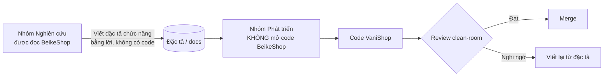

# Clean-room & License

> Trạng thái: **Implemented** (quy trình; mã nguồn BeikeShop đã xoá khỏi máy phát triển) · kiểm tra tự động trong CI: **Designed**.

> Tài liệu này là **bắt buộc** với mọi thành viên, kể cả khi dùng AI agent sinh code. Đây là hướng dẫn kỹ thuật–quy trình, **không phải tư vấn pháp lý**; trước khi phát hành thương mại, Owner nên nhờ luật sư sở hữu trí tuệ rà soát.

## 1. Vì sao cần clean-room

BeikeShop v3.0.0.11 (bản tham khảo **đã được xoá khỏi máy phát triển ngày 2026-09-28**) phát hành theo:

1. **Open Software License v3.0 (OSL-3.0)** — license copyleft: sản phẩm phái sinh (*derivative work*) khi phân phối **hoặc cung cấp qua mạng** (điều khoản "External Deployment") phải công bố mã nguồn theo cùng license.
2. **Điều khoản bản quyền bổ sung** của Chengdu GuangDa Network Technology Co., Ltd.:
   - Không được bán/cho thuê hệ thống **và sản phẩm phái sinh** nếu chưa có văn bản cho phép.
   - Phải giữ thông tin bản quyền; muốn gỡ cần được cho phép.

Nếu VaniShop chứa mã (kể cả đã sửa, đổi tên) từ BeikeShop, nó có thể bị xem là sản phẩm phái sinh → buộc mở mã nguồn, giữ bản quyền của bên thứ ba, và rủi ro vi phạm điều khoản thương mại. **Do đó VaniShop phải là tác phẩm độc lập.**

## 2. Được phép và không được phép

| ✅ Được phép (ý tưởng, khái niệm) | ❌ Không được phép (biểu đạt) |
|---|---|
| Học **khái niệm**: "có hệ thống hook", "có plugin thanh toán", "có máy trạng thái đơn hàng", "SKU có biến thể" | Copy/paste bất kỳ file, hàm, class, đoạn code nào — kể cả đã đổi tên biến |
| Tham khảo **danh sách tính năng** để không bỏ sót (checklist) | Dịch máy/viết lại từng dòng từ code gốc ("line-by-line paraphrase") |
| Dùng **chuẩn công khai**: Laravel docs, PSR, RFC, tài liệu cổng thanh toán, API hãng vận chuyển | Copy **schema migration**, tên bảng/cột y hệt, thứ tự cột, seed data |
| Dùng thư viện mã nguồn mở có license tương thích (MIT, BSD, Apache-2.0) cài qua Composer/NPM | Copy file ngôn ngữ (`lang/*`), template Blade, CSS/SCSS, JS, icon, ảnh, logo, theme `default` |
| Tự thiết kế UI/UX dựa trên nghiên cứu người dùng VN | Copy cấu trúc plugin (`config.json` + `Bootstrap.php` + `columns.php`) nguyên dạng, tên hook y hệt |
| Viết tài liệu thiết kế bằng lời của mình | Copy comment, docblock, chuỗi thông báo lỗi |

> Nguyên tắc ngón tay cái: **nếu bạn đang mở file BeikeShop trong một cửa sổ và gõ code VaniShop ở cửa sổ kia — dừng lại.**

### 2.1 VaniCommerce cũng thuộc diện clean-room

`~/Ecommerce/VaniCommerce` là nền tảng **dẫn xuất từ BeikeShop** (cùng họ helper hook, header phiên khách, cấu trúc plugin, bảng mô tả đa ngôn ngữ). Áp dụng **đúng các quy tắc như với BeikeShop**: không mở mã nguồn/tài liệu của nó khi code VaniShop, không đưa vào context AI agent khi sinh code, không chép tên hook/bảng/class/chuỗi. Kết quả nghiên cứu đã được viết lại bằng thiết kế của VaniShop tại [reference-comparison](../02-architecture/reference-comparison.md); người code chỉ đọc tài liệu đó.

## 3. Quy trình clean-room



1. **Tách vai trò** (khi có thể): người đọc BeikeShop chỉ viết *đặc tả chức năng* (hành vi, input/output nghiệp vụ). Người code chỉ đọc đặc tả trong `docs/`.
2. Bộ tài liệu `docs/` này **chính là đặc tả clean-room**: nó mô tả VaniShop bằng thiết kế riêng, không chứa code BeikeShop.
3. Nhóm nhỏ không tách được người: tối thiểu **không mở code BeikeShop trong lúc code**, và mọi thiết kế phải bắt nguồn từ `docs/`.
4. **AI agent** (Claude, Copilot, Cursor…): không đưa file BeikeShop vào context khi yêu cầu sinh code; cấm prompt kiểu "viết lại file X của BeikeShop". Cấu hình agent chỉ cho phép đọc thư mục `vanishop/`.
5. **Lưu vết**: mỗi PR tích checklist clean-room (mục 5). Lịch sử git là bằng chứng phát triển độc lập.

## 4. Khác biệt có chủ đích so với BeikeShop

Để đảm bảo độc lập cả về thiết kế, VaniShop **chủ động khác** ở các điểm lõi:

| Chủ đề | Hướng của VaniShop |
|---|---|
| Mô hình | Một cửa hàng, brand là thuộc tính catalog ([ADR-028](../19-adr/ADR-028-single-store-brand-as-catalog.md)). **Cùng khái niệm** với BeikeShop và hầu hết nền tảng TMĐT (khái niệm không được bảo hộ); thiết kế bảng `brands`, màn hình, luồng phải viết độc lập, không mở BeikeShop để tham khảo |
| Tổ chức code | Modular monolith theo bounded context trong `modules/*`, plugin trong `custom/plugin/*` (xem [overview](../02-architecture/overview.md)) |
| Trạng thái đơn | Tách **4 chiều** trạng thái: đơn, thanh toán, fulfillment, đổi trả (xem [order](../09-order/order.md)) |
| Tồn kho | Đa location + reservation + ATS, không trừ tồn trực tiếp trên SKU |
| Hook | Quy ước tên riêng `vani.<module>.<entity>.<moment>`, contract có kiểu (xem [extension-model](../04-extension/extension-model.md)) |
| Plugin | Là Laravel package / module với manifest `vanishop.json` và `ServiceProvider`, capability khai báo |
| Tính tổng tiền | Pipeline "adjustments" có thứ tự, lưu vết từng dòng khuyến mãi |
| Đa ngôn ngữ nội dung | Bảng `*_translations` + locale mặc định `vi`, (không dùng cấu trúc `*_descriptions`) |
| Tiền tệ | Lưu số nguyên (VNĐ không có phần lẻ), `amount` kiểu `bigint` |

## 5. Checklist clean-room cho mỗi Pull Request

Dán vào mô tả PR:

```markdown
### Clean-room
- [ ] Tôi không mở/copy code, template, CSS/JS, lang, asset từ BeikeShop khi làm PR này
- [ ] Thiết kế bắt nguồn từ docs/ (ghi rõ tài liệu: ...)
- [ ] Không có chuỗi, comment, tên hook/bảng trùng khớp nguyên văn với BeikeShop
- [ ] Dependency mới (nếu có) có license tương thích: MIT / BSD / Apache-2.0 / ISC
```

## 6. Kiểm tra tự động (khuyến nghị)

- **So sánh độ tương đồng** chỉ thực hiện khi **audit** (trước phát hành thương mại, hoặc khi có nghi vấn): người được chỉ định (không thuộc nhóm phát triển) dùng bản BeikeShop lưu trữ ngoài máy dev để chạy công cụ phát hiện code trùng (`jscpd`, `PMD CPD`, `moss`) với `modules/`, `custom/plugin/`, `app/`, `resources/`. Ngưỡng cảnh báo: bất kỳ khối ≥ 10 dòng trùng.
- **Kiểm tra license dependency**: `composer licenses` và `npx license-checker --onlyAllow "MIT;BSD-2-Clause;BSD-3-Clause;Apache-2.0;ISC"` trong CI.
- **Grep chuỗi đặc trưng** trong CI: `beike`, `guangda`, `bk_`, `hook_filter(`, `hook_action(` → fail build nếu xuất hiện trong `app/`, `modules/`, `custom/`, `resources/`, `lang/`, `database/`.

## 7. Lưu trữ mã nguồn tham khảo

- ✅ Thư mục mã nguồn `beikeshop_v3.0.0.11/` **đã được xoá** khỏi máy phát triển (2026-09-28). Đặc tả trong `docs/` là nguồn thiết kế duy nhất.
- File nén `BeikeShop-v3.0.0.zip` vẫn còn ở thư mục cha `~/Ecommerce/` → nên xoá hoặc chuyển cho pháp chế lưu trữ offline (chỉ phục vụ audit ở mục 6).
- Mã BeikeShop **không** được nằm trong repo VaniShop, không commit, không deploy, không dùng làm dữ liệu test/seed.

## 8. License của VaniShop

- Mã VaniShop là **độc quyền của Owner** (proprietary) trừ khi Owner quyết định khác.
- Laravel và phần lớn dependency hiện tại là MIT → tương thích với phần mềm độc quyền.
- Giữ file `THIRD_PARTY_NOTICES.md` liệt kê dependency và license (sinh tự động trong CI).
