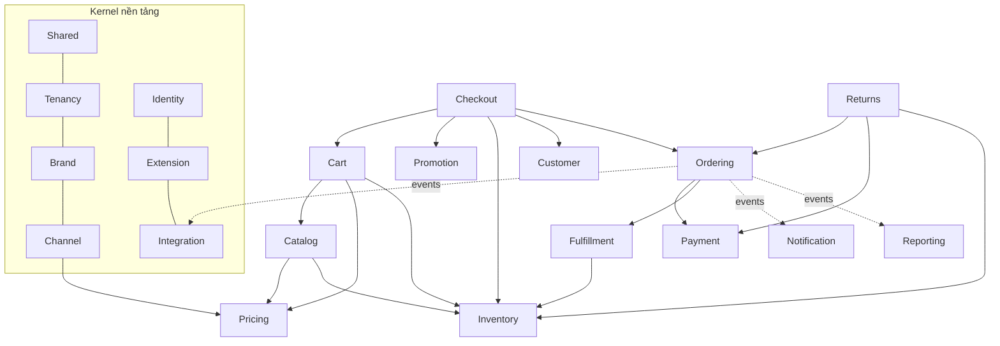

# Bounded Contexts

> Trạng thái: **Designed**.

## 1. Danh sách context

| Context | Sở hữu (dữ liệu, quy tắc) | Không sở hữu | Contract công bố chính |
|---|---|---|---|
| **Shared** | `Money`, `Currency`, `Phone`, `Address` VO, `CurrentContext`, địa giới hành chính VN, `CorrelationId` | Nghiệp vụ | — (kernel dùng chung) |
| **Tenancy** | Owner, Legal Entity, settings theo scope (owner → legal entity → brand → channel) | Nội dung brand | `SettingsRepository`, `TenancyDirectory` |
| **Brand** | Danh tính brand, logo, theme tokens, cấu hình brand, quyền sở hữu sản phẩm | Kênh bán, đơn hàng | `BrandDirectory` |
| **Channel** | Kênh bán, domain, locale, currency, brand trong kênh, gán bảng giá, gán location | Giá, tồn | `ChannelResolver`, `ChannelDirectory` |
| **Identity & Access** | Nhân viên, vai trò, permission theo scope, audit log | Khách hàng | `Authorizer`, `AuditLogger` |
| **Extension** | Hook registry, plugin loader, manifest, trạng thái plugin, settings schema | Nghiệp vụ plugin | `Hook`, `PluginRegistry` |
| **Catalog** | Style, style color, variant/SKU, thuộc tính, danh mục, bộ sưu tập, media, nội dung | Giá, tồn | `CatalogReader` |
| **Pricing** | Bảng giá, giá theo variant, lịch giá, lịch sử giá, `PricingStrategy` | Khuyến mãi | `PriceResolver` |
| **Inventory** | Location, stock level, reservation, movement/ledger, ATS | Chọn kho cho đơn (thuộc Fulfillment) | `InventoryReservation`, `InventoryAdjuster`, `AvailabilityReader` |
| **Customer** | Tài khoản hợp nhất, địa chỉ, nhóm khách, consent, xác thực khách | Loyalty | `CustomerDirectory` |
| **Cart** | Giỏ, dòng giỏ, gộp giỏ, snapshot giá khi thêm | Tính tổng cuối cùng | `Carts` |
| **Checkout** | Phiên checkout, totals pipeline, `PlaceOrder` (điều phối) | Đơn sau khi tạo | `TotalsCalculator` (extension), `CheckoutValidator` (extension) |
| **Promotion** | Framework khuyến mãi: context, rule/action contract, đánh giá, stacking, ghi nhận sử dụng | Rule cụ thể (thuộc plugin) | `PromotionRule`, `PromotionAction` |
| **Ordering** | Order, order line (snapshot), state machine, sự kiện đơn, order group | Thanh toán, giao hàng | `OrderWriter` (**Implemented**), `OrderReader`, `OrderTransitions` |
| **Payment** | Payment, transaction, refund, khung gateway, COD, chuyển khoản thủ công | Đối soát COD chi tiết (plugin) | `PaymentGateway` (extension), `PaymentRecorder` |
| **Fulfillment** | Shipment, sourcing, fulfillment method, carrier abstraction, vận đơn thủ công | Tồn | `ShippingCarrier`, `SourcingStrategy`, `FulfillmentMethod`, `ShipmentRecorder` |
| **Returns** | Yêu cầu đổi/trả, kiểm hàng, quyết định hoàn | Hoàn tiền (gọi Payment) | `ReturnPolicy` |
| **Content** | Trang, menu, banner, page builder, redirect | Theme | `StorefrontBlock` |
| **Notification** | Template theo brand/event/kênh, gửi tin, nhật ký gửi | Nội dung marketing | `NotificationChannel` |
| **Reporting** | Read model báo cáo, dashboard | Dữ liệu gốc | `DashboardWidget` |
| **Integration** | Integration Client, API, webhook, outbox/inbox, mapping, ownership, connector framework | Nghiệp vụ domain | `Connector`, `IntegrationOutbox`, `ErpConnector` |
| **Storefront** | Không có dữ liệu riêng: ghép Catalog + Pricing (+ Inventory, Promotion…) cho Storefront API và native storefront ([ADR-021](../19-adr/ADR-021-storefront-composition-module.md)) | Mọi dữ liệu nghiệp vụ | `ProductViews` (nội bộ) |

## 2. Context map



Mũi tên liền nghĩa là **gọi đồng bộ qua Contract** (downstream phụ thuộc upstream). Mũi tên đứt nghĩa là **lắng nghe Domain Event**. Không có vòng phụ thuộc: nếu hai context cần nhau thì một chiều đi qua event.

## 3. Quan hệ giữa các context

| Quan hệ | Kiểu | Ghi chú |
|---|---|---|
| Checkout → Inventory | Customer/Supplier, đồng bộ | `reserve()` trong transaction đặt hàng |
| Checkout → Ordering | Đồng bộ | `CreateOrder` trong cùng transaction; Checkout điều phối |
| Ordering → Payment/Fulfillment | Event + Contract | Payment/Fulfillment cập nhật trạng thái qua `OrderTransitions` |
| Integration → mọi context | Anti-Corruption Layer | Payload canonical có version; không lộ model nội bộ ra ngoài |
| Plugin → Core | Conformist với Contract | Plugin tuân theo contract; Core không biết plugin |

## 4. Cấu trúc một module (pragmatic DDD)

```
modules/Inventory/
├── Contracts/          # PUBLIC: interface + DTO cho module khác & plugin
│   ├── InventoryReservation.php
│   └── Data/ReservationRequest.php
├── Events/             # PUBLIC: domain events (DTO bất biến)
│   └── StockReserved.php
├── Domain/             # PRIVATE: VO, enum, entity thuần, domain service, invariant — không dùng Eloquent/Facade
│   ├── StockLevel.php            # quy tắc ATS, reserve/release thuần PHP
│   ├── ReservationStatus.php
│   └── Exceptions/InsufficientStock.php
├── Application/        # PRIVATE: use case (Command/Action), Query, DTO nội bộ, transaction boundary
│   ├── Commands/ReserveStock.php
│   ├── Queries/GetAvailability.php
│   └── Services/ReservationService.php   # implements Contracts\InventoryReservation
├── Persistence/        # PRIVATE: Eloquent model, repository, migration, factory, seeder
│   ├── Models/StockLevelRecord.php
│   ├── Repositories/EloquentStockLevelRepository.php
│   └── Database/{migrations,Factories,Seeders}/
├── Infrastructure/     # PRIVATE: adapter hạ tầng (Redis counter, queue job, HTTP client nếu có)
├── Http/               # Controller, Form Request, API Resource, routes
│   ├── Controllers/{Storefront,Admin,Api}/
│   ├── Requests/  Resources/
│   └── routes/{storefront,admin,api}.php
├── Policies/           # Laravel Policy (phân quyền theo scope)
├── resources/{views,lang,js/Pages}/
├── hooks.php           # Khai báo hook công khai của module
├── Tests/{Unit,Feature}/
└── InventoryServiceProvider.php
```

### Quy tắc phụ thuộc trong module

```text
Http ──► Application ──► Domain
              │             ▲
              ▼             │
        Persistence ────────┘ (map record ↔ domain)
        Infrastructure
```

- `Domain` không phụ thuộc gì ngoài `Modules\Shared\Domain` (rule R8).
- `Application` là **transaction boundary**: mỗi Command handler mở tối đa một transaction.
- Module khác và plugin chỉ thấy `Contracts/` và `Events/` (rule R5, R7).

### Hai mức độ "giàu" của domain

Để tránh over-engineering, mỗi context chọn một mức, ghi rõ trong README của module:

| Mức | Context | Cách làm |
|---|---|---|
| **Rich domain** | Inventory, Checkout (totals), Ordering (state machine), Payment, Pricing, Promotion | Quy tắc nằm trong `Domain/` thuần PHP, test unit không cần DB. Eloquent chỉ lưu trữ |
| **CRUD domain** | Content, Notification (template), Brand/Channel config, thuộc tính Catalog | Application dùng Eloquent trực tiếp qua Persistence; vẫn không có logic trong Controller |

## 5. Đăng ký module

`App\Providers\ModuleServiceProvider` đọc `config/modules.php` (danh sách module theo thứ tự phụ thuộc) rồi đăng ký `<Context>ServiceProvider` của từng module. Service provider của module nạp route, migration, view, lang, trang Inertia, hooks.php và bind các Contract.

```php
// config/modules.php
return [
    'Shared', 'Tenancy', 'Brand', 'Channel', 'Identity', 'Extension', 'Integration',
    'Catalog', 'Pricing', 'Inventory', 'Customer', 'Cart', 'Promotion', 'Checkout',
    'Ordering', 'Payment', 'Fulfillment', 'Returns', 'Content', 'Notification', 'Reporting',
];
```

## 6. Kiểm thử ranh giới

Chi tiết: [testing §5](../17-testing/testing.md). Tối thiểu có các arch test sau:

```php
arch('core không phụ thuộc plugin')->expect('Modules')->not->toUse('Plugin');
arch('domain thuần')->expect('Modules\*\Domain')->not->toUse(['Illuminate\Database', 'Illuminate\Support\Facades', 'Illuminate\Http']);
arch('ordering không dùng persistence của inventory')->expect('Modules\Ordering')->not->toUse('Modules\Inventory\Persistence');
```
