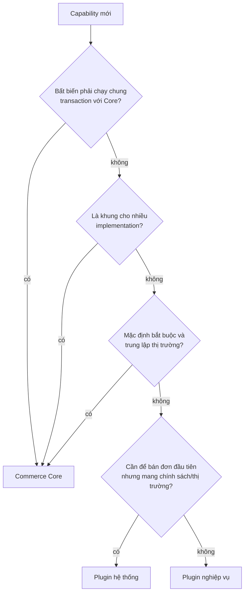

# Microkernel thương mại: Kernel, Core và Plugin

> Trạng thái: **Partially Implemented**. Vòng 0, 1, 3 có code; plugin hệ thống, extension point bắt buộc, plugin công bố hook: Designed. Quyết định: [ADR-029](../19-adr/ADR-029-commerce-microkernel.md) (mở rộng [ADR-003](../19-adr/ADR-003-plugin-architecture.md), [ADR-004](../19-adr/ADR-004-extension-points.md)). Đánh giá đối chiếu code: [kernel-review](kernel-review.md).

> **Kernel không biết thương mại. Core giữ primitive, bất biến và extension point. Nghiệp vụ — kể cả mặc định mang chính sách kinh doanh — là plugin.**

## 1. Bốn vòng

```text
┌──────────────────────────────────────────────────────────────────────────┐
│ 3. Plugin nghiệp vụ   custom/plugin/*                                    │
│    VietQR · VNPay · GHN · promotion-rules · loyalty · e-invoice · ERP ·  │
│    marketplace · creator · báo cáo · wishlist · reviews …                │
│  ┌────────────────────────────────────────────────────────────────────┐  │
│  │ 2. Plugin hệ thống   custom/plugin/* (bundled, tự cài + bật)       │  │
│  │    vani.cod · vani.bank-transfer · vani.shipping-flat-rate ·       │  │
│  │    vani.tax-vn-vat                                                 │  │
│  │  ┌──────────────────────────────────────────────────────────────┐  │  │
│  │  │ 1. Commerce Core   modules/*                                 │  │  │
│  │  │    Catalog · Pricing · Inventory · Customer · Cart ·         │  │  │
│  │  │    Promotion engine · Checkout totals · Ordering · Payment · │  │  │
│  │  │    Fulfillment · Returns · Notification · Integration ·      │  │  │
│  │  │    Storefront (tầng ghép)                                    │  │  │
│  │  │  ┌────────────────────────────────────────────────────────┐  │  │  │
│  │  │  │ 0. Microkernel   modules/{Shared,Tenancy,Identity,     │  │  │  │
│  │  │  │                          Extension}                    │  │  │  │
│  │  │  │    plugin lifecycle · extension registry · hook bus ·  │  │  │  │
│  │  │  │    event bus theo plugin · settings · quyền · audit ·  │  │  │  │
│  │  │  │    Money · idempotency · context · correlation id      │  │  │  │
│  │  │  └────────────────────────────────────────────────────────┘  │  │  │
│  │  └──────────────────────────────────────────────────────────────┘  │  │
│  └────────────────────────────────────────────────────────────────────┘  │
└──────────────────────────────────────────────────────────────────────────┘
          phụ thuộc chỉ hướng vào trong (R4, R5); vòng trong không biết vòng ngoài
```

| Vòng | Trách nhiệm | Không được chứa | Thay đổi khi |
|---|---|---|---|
| **0. Microkernel** | Nạp module/plugin, registry implementation theo tag, hook có khai báo, event theo plugin, settings, RBAC + audit, `Money`, idempotency, `CurrentContext` | Bất kỳ khái niệm thương mại nào (sản phẩm, đơn, giá) | Hiếm; thay đổi là breaking cho mọi plugin |
| **1. Commerce Core** | Primitive thương mại, bất biến, extension point, mặc định **trung lập thị trường** | Tích hợp nhà cung cấp; chính sách kinh doanh/đặc thù thị trường; rule khuyến mãi cụ thể | Thêm extension point tổng quát, sửa lỗi bất biến |
| **2. Plugin hệ thống** | Mặc định để bán đơn đầu tiên tại VN | Logic Core; dùng internal của Core | Đổi chính sách (phí ship, VAT, điều kiện COD) |
| **3. Plugin nghiệp vụ** | Mọi capability còn lại | Phá bất biến (R6) | Theo nhu cầu kinh doanh |

### 1.1 Bản đồ chức năng

Cùng hệ thống, nhìn theo **nhóm nghiệp vụ** thay vì theo vòng — dùng để định hướng người mới, nhóm menu Admin và mục lục tài liệu. Bản đồ này **không** thay mô hình bốn vòng: phụ thuộc và ranh giới Core/plugin vẫn theo §1, và mỗi ô vẫn là một module (bounded context) riêng trong `modules/`, không gom thư mục theo nhóm.

```text
                          VaniShop
   ┌───────────────────────────────────────────────────────┐
   │ Plugin nghiệp vụ: cổng TT · hãng VC · rule KM ·       │  vòng 3
   │ loyalty · HĐĐT · ERP · báo cáo …                      │
   │ Plugin hệ thống: COD · chuyển khoản · phí ship · VAT  │  vòng 2
   └───────────────────────────┬───────────────────────────┘
                               │ extension points
   ┌───────────────── Commerce Core (vòng 1) ──────────────┐
   │  Catalog          Commerce              Khung dùng chung│
   │  Brand            Pricing · Promotion    Notification  │
   │  Style/Variant    Customer · Cart        Integration   │
   │  Category         Checkout · Order       Storefront    │
   │  Collection       Payment · Inventory    Content       │
   │  Attribute/Media  Fulfillment · Returns                │
   └───────────────────────────┬───────────────────────────┘
   ┌──────────────── Microkernel (vòng 0) ─────────────────┐
   │  Extension (plugin, hook, event) · Identity ·          │
   │  Tenancy (cửa hàng, cấu hình) · Shared (Money, …)      │
   └────────────────────────────────────────────────────────┘
```

| Nhóm | Module | Ghi chú |
|---|---|---|
| Catalog | `Catalog` | Brand ([ADR-028](../19-adr/ADR-028-single-store-brand-as-catalog.md)), Style → Style Color → Variant, danh mục, bộ sưu tập, thuộc tính, media |
| Commerce | `Pricing`, `Promotion`, `Customer`, `Cart`, `Checkout`, `Ordering`, `Payment`, `Inventory`, `Fulfillment`, `Returns` | Primitive + bất biến của luồng bán |
| Khung dùng chung | `Notification`, `Integration`, `Storefront`, `Content` | Thuộc Core (vòng 1), **không** thuộc nền tảng: Notification/Integration biết về đơn hàng (mẫu `order_placed`, payload `vanishop.order.v1`), đặt ở vòng 0 sẽ vi phạm R29 |
| Microkernel | `Extension`, `Identity`, `Tenancy`, `Shared` | Không biết thương mại |

## 2. Tiêu chí: vào Core hay làm plugin

**Mặc định là plugin** (plugin-first, R27). Một capability chỉ vào Core khi thoả **ít nhất một**:

1. **Bất biến dùng chung** phải chạy cùng transaction với dữ liệu Core: tiền, reservation/ATS, vòng đời đơn, snapshot, idempotency, quyền.
2. **Khung mở rộng**: abstraction mà nhiều implementation cắm vào (contract, engine, pipeline, registry).
3. **Mặc định trung lập** cho một extension point bắt buộc, không mang chính sách kinh doanh hay đặc thù thị trường.



Đưa capability vào Core cần ADR. "Tiện hơn", "nhanh hơn" hay "chỉ cửa hàng mình dùng" không phải lý do.

## 3. Phân loại module và implementation hiện có

### 3.1 Module

| Module | Vòng | Ghi chú |
|---|---|---|
| Shared, Tenancy, Identity, Extension | 0 | Tenancy = cửa hàng + settings ([ADR-028](../19-adr/ADR-028-single-store-brand-as-catalog.md)) |
| Brand, Channel (code cũ) | — | Gỡ ở slice 12; brand vào Catalog |
| Catalog (gồm brand), Pricing, Inventory, Customer, Cart, Promotion, Checkout, Ordering, Payment, Fulfillment, Returns | 1 | Primitive + bất biến + extension point |
| Notification, Integration | 1 (khung) | Kênh gửi, connector là plugin |
| Storefront | 1 (tầng ghép) | Không có bảng ([ADR-021](../19-adr/ADR-021-storefront-composition-module.md)) |
| Content (trang, menu, banner, redirect) | 1 (Designed) | Page builder block do plugin thêm qua `StorefrontBlock` |
| Reporting | **3** (plugin `vani.reports`, Designed) | Đọc qua `OrderReader`/event; Core chỉ có slot dashboard |

### 3.2 Implementation mặc định

| Extension point | Bắt buộc | Mặc định | Vị trí đích | Hiện ở |
|---|---|---|---|---|
| `PaymentGateway` | ≥ 1 | `cod`, `manual_bank_transfer` | **Plugin hệ thống** `vani.cod`, `vani.bank-transfer` | `modules/Payment/Application/Gateways` |
| `ShippingRateProvider` | ≥ 1 | `flat_rate` | **Plugin hệ thống** `vani.shipping-flat-rate` | `modules/Checkout/Application/FlatRateShipping.php` |
| `TaxCalculator` | đúng 1 | `vn_vat_inclusive` | **Plugin hệ thống** `vani.tax-vn-vat`; Core giữ `none` (không thuế) làm dự phòng | `modules/Checkout/Application/VnVatInclusiveTax.php` |
| `ShippingCarrier` | ≥ 1 | `manual` (nhập mã vận đơn) | Core (trung lập) | `modules/Fulfillment/Application/Carriers` |
| `NotificationChannel` | ≥ 1 | `mail` | Core (trung lập) | `modules/Notification/Application/Channels` |
| `OtpSender` | ≥ 1 | `email` (`log` chỉ dev) | Core (trung lập) | `modules/Customer/Application/OtpSenders` |
| `SearchProvider` | đúng 1 | `database` | Core (trung lập); `meilisearch` đã là plugin | `modules/Catalog/Application/Search` |
| `PricingStrategy`, `InventoryStrategy`, `SourcingStrategy` | đúng 1 | `price_list_priority`, `standard`, `reserved_locations` | Core (định nghĩa bất biến; plugin chỉ được thu hẹp) | `modules/*/Application` |
| `ReturnPolicy` | đúng 1 | `days_window` | Core (trung lập) | `modules/Returns/Application` |
| `PromotionAction` | — | `percent_off`, `amount_off` | Core (primitive) | `modules/Promotion/Application/Actions` |
| `TotalsCalculator`, `CheckoutValidator` | — | subtotal/promotion/shipping/tax/guard, `core` | Core (engine + bất biến) | `modules/Checkout/Application` |

## 4. Plugin hệ thống

Plugin hệ thống là plugin bình thường (manifest, `PluginServiceProvider`, contract test) với thêm:

- Manifest `"bundled": true`: lệnh cài đặt hệ thống mới `vani:install` (Designed; hiện dựng bằng `migrate` + `vani:plugin:install` từng plugin) tự `install` + `enable`; có trong mọi môi trường.
- Gỡ được nếu đã có plugin khác thay thế (ví dụ VNPay thay chuyển khoản tay); tắt được khi không phải implementation cuối cùng của extension point bắt buộc (§5).
- Không được dùng internal của Core (R5) — chính các plugin này chứng minh extension point đủ dùng.
- Đổi chính sách (phí ship theo tỉnh, ngưỡng COD, thuế suất) = sửa/cấu hình plugin, **không** chạm Core.

## 5. Extension point bắt buộc

Mỗi contract trong registry khai báo số implementation đang bật tối thiểu/tối đa (`required: at_least_one | exactly_one | none`), ví dụ trên interface:

```php
interface PaymentGateway
{
    public const TAG = 'vani.payment.gateways';
    public const REQUIRED = Requirement::AtLeastOne;   // Designed
    // …
}
```

| Thời điểm | Kiểm tra |
|---|---|
| `vani:plugin:disable` / `uninstall` | Từ chối nếu làm extension point bắt buộc không còn implementation (`exactly_one`: phải chọn cái thay thế trước) |
| `vani:plugin:doctor` | Báo lỗi extension point bắt buộc thiếu hoặc thừa implementation |
| Runtime | Nếu vẫn thiếu (cấu hình sai): checkout trả lỗi rõ ràng `checkout.no_payment_method` thay vì lỗi 500 |

## 6. Lộ trình chuyển (slice 12d)

| # | Việc | Ghi chú |
|---|---|---|
| 1 | Extension: hằng `REQUIRED` trên contract + kiểm tra ở disable/uninstall/doctor; manifest `bundled`; lệnh `vani:install` cài plugin bundled | Public API: thêm (minor) |
| 2 | Tách `CodGateway`, `ManualBankTransferGateway` → `vani.cod`, `vani.bank-transfer` | Giữ `code()` để đơn cũ không đổi |
| 3 | Tách `FlatRateShipping` → `vani.shipping-flat-rate` (cấu hình qua `settings()` thay `.env`) | |
| 4 | Tách `VnVatInclusiveTax` → `vani.tax-vn-vat`; Core thêm `NoTax` dự phòng | |
| 5 | Reporting làm plugin `vani.reports`; Admin dashboard chỉ còn slot | |
| 6 | Arch test: `modules/` không chứa class implement `PaymentGateway`/`ShippingRateProvider`/`TaxCalculator` ngoài danh sách trung lập | R28 |

Done khi: cài mới → 4 plugin hệ thống tự bật, E2E COD chạy; tắt `vani.cod` khi còn `vani.bank-transfer` được, tắt cả hai bị từ chối; contract test của 4 plugin pass; arch test R28 pass.

## 7. Plugin công bố extension point

Plugin có thể là "lõi" cho plugin khác (ví dụ `vani.loyalty` công bố `LoyaltyLedger` cho `vani.promotion-advanced` đổi điểm; `vani.marketplace` công bố `SellerDirectory` cho `vani.creator`):

- Contract/event đặt trong `Plugin\<Name>\Contracts`, `Plugin\<Name>\Events`; hook khai báo trong `custom/plugin/<Name>/hooks.php` với tên `<plugin-id>.<…>` (Designed: registry hiện chỉ đọc `modules/*/hooks.php`).
- Plugin dùng khai báo `requires.plugins`; resolver sắp thứ tự nạp và chặn tắt plugin đang được phụ thuộc (đã có).
- Theo cùng compatibility policy (SemVer của plugin cung cấp) và có contract test nếu là extension contract.

## 8. Bất biến Core bảo vệ (không có extension point)

| Invariant | Cơ chế bảo vệ |
|---|---|
| Đơn chỉ đổi trạng thái theo bảng chuyển hợp lệ | `OrderTransitions` là cổng duy nhất; model `Order` không public setter trạng thái |
| Không bán vượt ATS | `InventoryReservation::reserve()` khoá dòng + kiểm tra trong transaction; strategy chỉ thu hẹp ATS |
| Tổng tiền không âm; adjustment truy vết được | Totals pipeline + guard cuối |
| Order line là snapshot bất biến | Không có API sửa line |
| Thao tác đúng quyền | Policy + `Authorizer` |
| Message ra ngoài có idempotency, đi qua outbox | `IntegrationOutbox` là con đường duy nhất |
| Tiền là `Money` | Contract chỉ nhận/trả `Money` |
| Extension point bắt buộc luôn có implementation | Extension chặn tắt/gỡ implementation cuối (§5, Designed) |

## 9. Khi Core thiếu extension point

1. Mô tả nhu cầu **tổng quát** (không gắn với một plugin), kiểm tra danh sách chờ ở [extension-point-catalog §7](../04-extension/extension-point-catalog.md).
2. PR vào Core: contract/event/hook + tài liệu catalog + implementation tham chiếu + contract test (R26) + [CHANGELOG-extension](../04-extension/CHANGELOG-extension.md).
3. Plugin dùng extension point mới, khai báo `requires.vanishop` là phiên bản có nó.

Ví dụ **sai**: thêm `if ($order->meta['creator_id'])` vào `PlaceOrder`. Ví dụ **đúng**: Core có hook `vani.order.after_create`, plugin Creator nghe hook đó và ghi attribution vào bảng riêng.
