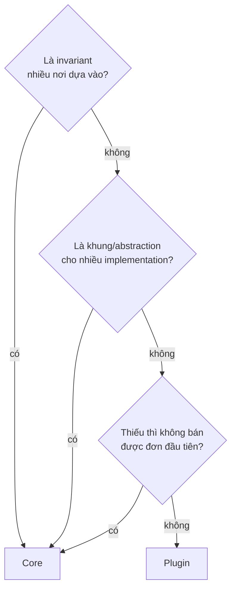

# Commerce Kernel: ranh giới Core và Plugin

> Trạng thái: **Designed**. Quyết định: [ADR-003](../19-adr/ADR-003-plugin-architecture.md), [ADR-004](../19-adr/ADR-004-extension-points.md). Đánh giá đối chiếu với code: [kernel-review](kernel-review.md) (2026-10-13).

> **Core cung cấp commerce primitives và business invariants. Capability đặc thù nghiệp vụ được xây ngoài Core qua Extension Points.**

## 1. Tiêu chí phân loại

Một capability thuộc **Core** khi thoả **ít nhất một** trong các điều sau:

1. Nó là **invariant** mà nhiều capability khác dựa vào: tiền, tồn/reservation, vòng đời đơn, snapshot, idempotency.
2. Nó là **extension point**, tức là khung/abstraction để plugin cắm vào.
3. Thiếu nó thì **không bán được đơn đầu tiên** (COD, phí ship cố định, vận đơn nhập tay…).

Ngược lại, capability **thay đổi độc lập mà không làm đổi invariant** thì là **Plugin** (rule R2).

## 2. Core sở hữu

| Capability | Context | Ghi chú |
|---|---|---|
| Product (Style), Variant, SKU, Catalog | Catalog | Mô hình style–màu–size cho thời trang |
| Price, bảng giá, lịch sử giá | Pricing | `PricingStrategy` là extension |
| Customer, consent | Customer | Đăng nhập: khung + mật khẩu + OTP email |
| Cart | Cart | |
| Checkout, totals pipeline | Checkout | Calculator do plugin thêm |
| Order + **state machine** + snapshot | Ordering | Plugin không phá vòng đời |
| Payment abstraction + COD + chuyển khoản thủ công | Payment | Cổng thanh toán là plugin |
| Inventory reservation, ledger, ATS | Inventory | `InventoryStrategy` là extension |
| **Promotion primitives** (context, rule/action contract, engine, stacking, usage) | Promotion | Rule cụ thể là plugin |
| **Tax abstraction** + VAT mặc định (giá đã gồm thuế) | Checkout (tax) | `TaxCalculator` là extension |
| **Shipping abstraction** + `flat_rate` + `manual` | Fulfillment | Hãng vận chuyển là plugin |
| Transaction boundary, idempotency | Shared/Application | [consistency](consistency.md) |
| Domain events | Mọi context | [extension-point-catalog §3](../04-extension/extension-point-catalog.md) |
| Integration primitives (API, outbox/inbox, mapping, connector framework) | Integration | Connector cụ thể là plugin |
| Authorization, audit | Identity | |
| Cửa hàng (pháp nhân vận hành, cấu hình), Brand như thực thể catalog | Tenancy, Catalog | [ADR-028](../19-adr/ADR-028-single-store-brand-as-catalog.md) |
| Extension mechanism | Extension | |

## 3. Plugin sở hữu

| Nhóm | Ví dụ | Dùng extension point |
|---|---|---|
| Thanh toán | VietQR, VNPay, MoMo, ZaloPay | `PaymentGateway` |
| Vận chuyển | GHN, GHTK, Viettel Post | `ShippingCarrier` |
| Khuyến mãi | Buy X Get Y, giảm theo brand/collection, first order, VIP, flash sale | `PromotionRule`, `PromotionAction` |
| Loyalty | Hạng, điểm, đổi điểm | `TotalsCalculator`, events |
| Sourcing nâng cao | Chấm điểm khoảng cách/chi phí | `SourcingStrategy` |
| ERP / ODO | Odoo, SAP, MISA, ERP tự viết | `ErpConnector`, Integration API |
| Marketplace / Seller | Seller, commission, settlement | [marketplace](../13-marketplace/marketplace.md) |
| Creator / Affiliate | Attribution, commission | [creator-affiliate](../13-marketplace/creator-affiliate.md) |
| Merchandising nâng cao, Recommendation | Gợi ý, sắp xếp thông minh | hook listing, `StorefrontBlock` |
| Tìm kiếm ngoài | Algolia, Elasticsearch | `SearchProvider` |
| Quy tắc riêng của cửa hàng | Chặn COD theo tỉnh, quà tặng theo brand | `CheckoutValidator`, hooks |

Danh mục đầy đủ và thứ tự làm: [plugin-catalog](../05-plugin/plugin-catalog.md).

## 4. Bất biến Core bảo vệ (plugin không được vượt qua)

| Invariant | Cơ chế bảo vệ |
|---|---|
| Đơn chỉ đổi trạng thái theo bảng chuyển hợp lệ | `OrderTransitions` là cổng duy nhất; model `Order` không public setter trạng thái |
| Không bán vượt ATS | `InventoryReservation::reserve()` khoá dòng + kiểm tra trong transaction |
| Tổng tiền không âm; adjustment luôn truy vết được | Totals pipeline kiểm tra sau mỗi calculator |
| Order line là snapshot bất biến sau khi tạo | Không có API sửa line; thay đổi đi qua huỷ một phần/đổi hàng |
| Thao tác Admin/API đúng quyền | Policy + `Authorizer` (permission); scope `location` cho nhân viên kho/cửa hàng (Designed) |
| Mọi message ra ngoài có idempotency và đi qua outbox | `IntegrationOutbox` là con đường duy nhất |
| Tiền là `Money` (số nguyên minor unit) | Contract chỉ nhận/trả `Money` |

## 5. Khi Core thiếu extension point

1. Mô tả nhu cầu **tổng quát** (không gắn với một plugin).
2. PR vào Core: thêm contract/event/hook, tài liệu trong [extension-point-catalog](../04-extension/extension-point-catalog.md), test mặc định.
3. Plugin dùng extension point mới, khai báo `requires.vanishop` là phiên bản có nó.

Ví dụ **sai**: thêm `if ($order->meta['creator_id'])` vào `PlaceOrder`. Ví dụ **đúng**: Core có hook `vani.order.after_create`, plugin Creator lắng nghe hook đó và ghi attribution vào bảng riêng.
