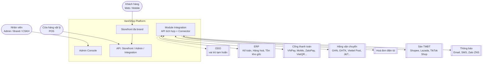
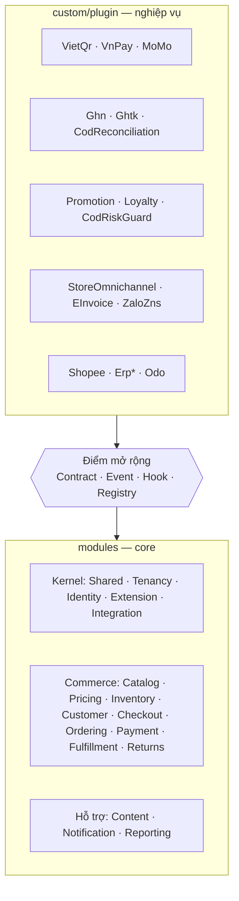
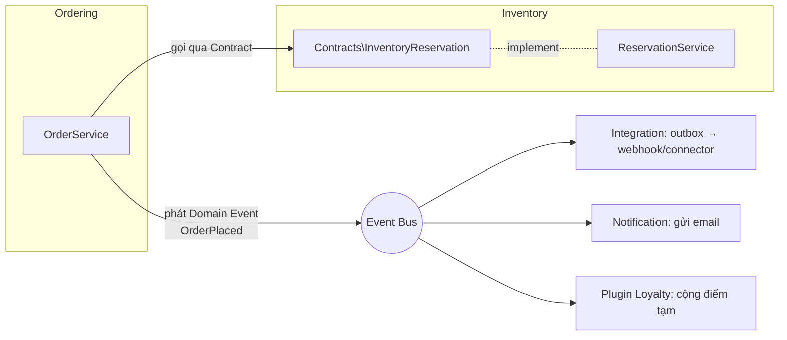
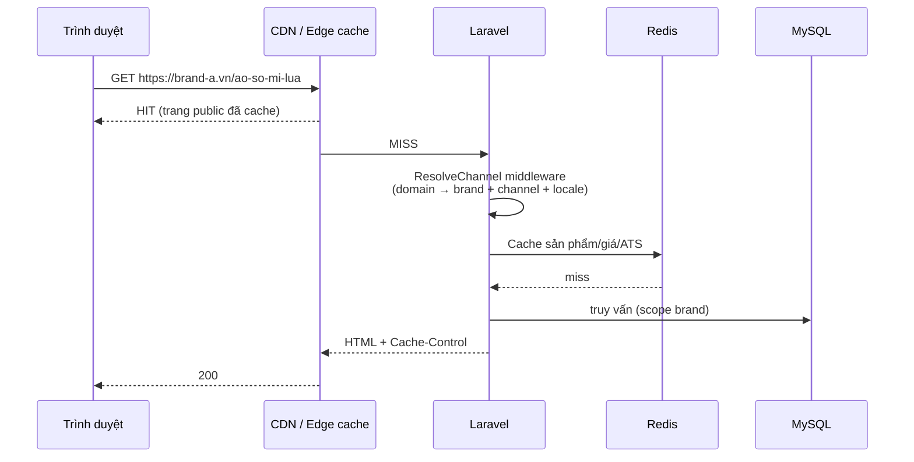

# 02 — Kiến trúc tổng thể

## 1. Lựa chọn kiến trúc: Modular Monolith

VaniShop là **một ứng dụng Laravel** được chia thành các **module theo bounded context**. Lý do (chi tiết: [ADR-0001](adr/0001-modular-monolith.md)):

- Đội nhỏ–vừa, cần tốc độ phát triển và 1 lần deploy.
- Giao dịch nghiệp vụ lõi (checkout ↔ tồn kho ↔ khuyến mãi) cần tính nhất quán mạnh — dễ hơn trong 1 DB.
- Ranh giới module rõ ràng cho phép **tách thành service** sau này (ví dụ Search, Integration) khi tải hoặc tổ chức đòi hỏi.

## 2. Sơ đồ ngữ cảnh (C4 — Level 1)



> Đường nét đứt: ODO chưa chốt vai trò ([ADR-0007](adr/0007-integration-module-odo-deferred.md)); khi sẵn sàng sẽ kết nối qua Integration API hoặc connector plugin.

## 3. Core và Plugin

Theo [ADR-0009](adr/0009-core-toi-gian-nghiep-vu-bang-plugin.md): **core** (`modules/`) gồm kernel nền tảng, nguyên liệu thương mại và điểm mở rộng; **nghiệp vụ** (cổng thanh toán, hãng VC, khuyến mãi, loyalty, omnichannel, HĐĐT, sàn, ERP…) là **plugin** (`custom/plugin/`, danh mục ở [17](17-danh-muc-plugin.md)).



### Module core

| Module | Trách nhiệm (core) | Điểm mở rộng chính | Tài liệu |
|---|---|---|---|
| **Shared** | `Money`, `Phone`, enum chung, `CurrentContext`, địa giới hành chính VN | — | [09](09-dac-thu-viet-nam.md) |
| **Tenancy** | Owner, pháp nhân, brand, kênh bán, domain, cấu hình theo phạm vi | `SettingsRepository` | [03](03-mo-hinh-da-thuong-hieu.md) |
| **Identity** | Nhân viên, vai trò, quyền theo phạm vi, audit log | registry `permissions` | [13](13-bao-mat-phan-quyen.md) |
| **Extension** | Hook, plugin loader, manifest, settings schema, registry Admin | toàn bộ §6 của [10](10-hook-va-plugin.md) | [10](10-hook-va-plugin.md) |
| **Integration** | Integration API, client, webhook subscription, outbox/inbox, mapping, khung connector | `Connector`, `IntegrationOutbox` | [08](08-module-integration.md) |
| **Catalog** | Style, variant, thuộc tính, danh mục, bộ sưu tập, media, nội dung đa ngôn ngữ, tìm kiếm | `CatalogReader`, hook listing | [04](04-catalog-va-gia.md) |
| **Pricing** | Bảng giá theo brand/kênh, giá niêm yết/bán, lịch giá, lịch sử giá | event `PriceChanged` | [04](04-catalog-va-gia.md) |
| **Inventory** | Location, tồn theo location, reservation, ATS, movement | `InventoryReservation`, filter `vani.inventory.ats` | [05](05-ton-kho-va-cua-hang.md) |
| **Customer** | Tài khoản hợp nhất, địa chỉ, nhóm khách, consent, đăng nhập | `OtpSender`, `CustomerDirectory` | [07](07-khach-hang-khuyen-mai-loyalty.md) |
| **Checkout** | Giỏ hàng, totals pipeline, đặt hàng | `TotalsCalculator`, `CheckoutValidator` | [06](06-don-hang-thanh-toan-giao-hang.md) |
| **Ordering** | Đơn hàng, 4 chiều trạng thái, lịch sử | `OrderTransitions`, domain events | [06](06-don-hang-thanh-toan-giao-hang.md) |
| **Payment** | Khung thanh toán, giao dịch, hoàn tiền; COD + chuyển khoản thủ công | `PaymentGateway` | [06](06-don-hang-thanh-toan-giao-hang.md) |
| **Fulfillment** | Shipment, sourcing mặc định, phí cố định/theo bảng, vận đơn nhập tay | `ShippingCarrier`, `FulfillmentMethod`, `SourcingStrategy` | [06](06-don-hang-thanh-toan-giao-hang.md) |
| **Returns** | Quy trình RMA cơ bản | `ReturnPolicy` | [06](06-don-hang-thanh-toan-giao-hang.md) |
| **Content** | Trang, menu, banner, page builder | `StorefrontBlock` | — |
| **Notification** | Template theo brand/event, gửi email | `NotificationChannel` | — |
| **Reporting** | Dashboard cơ bản | `DashboardWidget` | — |

### Quy tắc giao tiếp giữa module



1. Module **chỉ gọi module khác qua `Contracts/`** (interface + DTO) — không truy cập trực tiếp Model/bảng của module khác.
2. **Lệnh đồng bộ** (cần kết quả ngay, cùng transaction): gọi Contract. Ví dụ checkout gọi `InventoryReservation::reserve()`.
3. **Phản ứng phụ** (side effect): phát **Domain Event** Laravel; listener ở module khác xử lý, thường qua queue.
4. **Không có khoá ngoại** (foreign key) *xuyên module* ở mức logic nghiệp vụ tuỳ tiện; nếu có FK xuyên module phải được ghi trong [11](11-co-so-du-lieu.md).
5. Module Extension (hook) dùng cho **điểm mở rộng cho plugin**, không thay thế Domain Event nội bộ.
6. **Core không bao giờ phụ thuộc plugin.** Plugin phụ thuộc core (và có thể phụ thuộc plugin khác qua `requires.plugins`).

## 4. Các lớp trong một module

```
modules/Ordering/
├── Contracts/          # Interface + DTO công khai cho module khác
├── Domain/             # Enum, Value Object, quy tắc nghiệp vụ thuần (không phụ thuộc framework nếu có thể)
├── Models/             # Eloquent model (nội bộ module)
├── Actions/            # Use case: PlaceOrder, CancelOrder... (1 class = 1 hành động)
├── Services/           # Logic dùng chung trong module
├── Events/             # Domain events phát ra
├── Listeners/          # Lắng nghe event của module khác
├── Jobs/               # Queue jobs
├── Http/
│   ├── Controllers/{Storefront,Admin,Api}/
│   ├── Requests/       # Form Request validation
│   └── Resources/      # API Resource
├── Policies/
├── Database/{migrations,factories,seeders}/
├── Routes/{storefront,admin,api}.php
├── resources/{views,lang}/   # view storefront + bản dịch
├── resources/js/Pages/       # trang Admin Inertia (Vue) của module
└── OrderingServiceProvider.php
```

Chi tiết quy ước: [16](16-quy-uoc-code-kiem-thu.md).

### Vị trí trong dự án

Module **không đặt trong `app/`** mà nằm ở thư mục gốc riêng (đã được Owner phê duyệt — [ADR-0001](adr/0001-modular-monolith.md)):

```
vanishop/
├── app/                 # Chỉ phần khung ứng dụng: Providers, Http/Kernel-level middleware, Console
├── modules/             # Module nghiệp vụ — namespace Modules\<Module>\
│   ├── Catalog/
│   ├── Ordering/
│   └── ...
├── custom/
│   ├── plugin/          # Plugin/connector — namespace Plugin\<Name>\ (xem 10)
│   └── theme/           # Theme storefront theo brand
├── resources/js/        # Entry Admin Inertia, component dùng chung, asset storefront
└── ...
```

Autoload trong `composer.json`:

```json
"autoload": {
    "psr-4": {
        "App\\": "app/",
        "Modules\\": "modules/",
        "Plugin\\": "custom/plugin/",
        "Database\\Factories\\": "database/factories/",
        "Database\\Seeders\\": "database/seeders/"
    }
}
```

`App\Providers\ModuleServiceProvider` quét `modules/*/*ServiceProvider.php` (danh sách bật/tắt trong `config/modules.php`) và đăng ký theo thứ tự phụ thuộc.

## 5. Tech stack

| Tầng | Lựa chọn | Ghi chú |
|---|---|---|
| Ngôn ngữ / Framework | PHP 8.4, **Laravel 13** | Đã có sẵn trong repo |
| Hook | `tormjens/eventy` | Đã có; bọc bởi facade riêng `Vani\Hook` (xem [10](10-hook-va-plugin.md)) |
| CSDL | **MySQL 8.4 LTS** (InnoDB, `utf8mb4`) cho mọi môi trường chạy thật; SQLite chỉ cho unit test nhanh | `SKIP LOCKED` cho outbox/reservation, cột JSON — [ADR-0003](adr/0003-mysql.md) |
| Cache / Queue / Session / Lock | **Redis 7** + **Laravel Horizon** | Queue tách theo mức ưu tiên |
| Tìm kiếm | **Meilisearch** qua Laravel Scout | Hỗ trợ tìm không dấu tiếng Việt, facet màu/size |
| Hạ tầng | Trung tâm dữ liệu tại **Việt Nam** (Viettel, FPT, VNG, BizFly, CMC) | [ADR-0008](adr/0008-ha-tang-tai-viet-nam.md) |
| Lưu trữ file | Object storage S3-compatible của nhà cung cấp VN + CDN có PoP tại VN | Ảnh resize qua dịch vụ ảnh/CDN |
| Storefront | Blade + Tailwind CSS 4 + Alpine.js, Vite 8 | SSR để tối ưu SEO; theme theo brand |
| Admin | **Inertia.js 2 + Vue 3 + TypeScript**, Tailwind CSS 4 | SPA dùng routing/controller Laravel, không cần Admin API riêng cho màn hình — [ADR-0005](adr/0005-admin-ui.md) |
| API | REST JSON, Laravel Sanctum (storefront/mobile/POS), API key + HMAC cho Integration API | Versioning `/api/.../v1` |
| Kiểm thử | Pest 5, Laravel Dusk/Pest Browser cho E2E | |
| Chất lượng code | Laravel Pint, Larastan (PHPStan level ≥ 6) | |
| Giám sát | Laravel Pulse / Nightwatch, Sentry, log tập trung | |

> ⚠️ Theo quy ước repo (AGENTS.md), **mọi dependency mới cần được phê duyệt** trước khi cài. Bảng trên là đề xuất; mỗi dependency được chốt qua ADR.

## 6. Luồng request storefront



- **ResolveChannel middleware** là trái tim đa brand: xác định `brand`, `channel`, `locale`, `price_list`, `theme` từ domain và đưa vào `CurrentContext` (singleton theo request).
- Trang có yếu tố cá nhân (giỏ hàng, giá thành viên) render phần động qua API/Alpine.

## 7. Thuộc tính chất lượng (NFR)

| Thuộc tính | Mục tiêu |
|---|---|
| Khả dụng | 99,9%/tháng cho storefront & checkout |
| Hiệu năng | Xem [00 — G6](00-tong-quan-du-an.md); API P95 < 200 ms (không tính cổng ngoài) |
| Tải | 500 đơn/phút giờ cao điểm (flash sale 11.11, 12.12), 5.000 req/s qua CDN |
| Nhất quán tồn kho | Không oversell do race condition (khóa hàng + reservation atomic) |
| Khả năng mở rộng | Thêm brand không cần deploy code; thêm connector không sửa lõi |
| Khả năng quan sát | Mọi request có `trace_id`; mọi message tích hợp có `correlation_id` |
| Bảo mật | OWASP ASVS L2; PCI-DSS SAQ-A (không lưu thẻ) |
