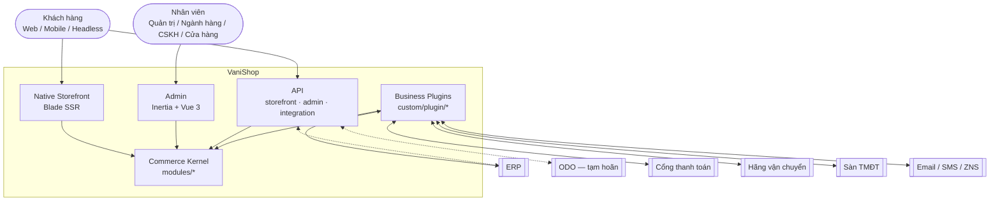
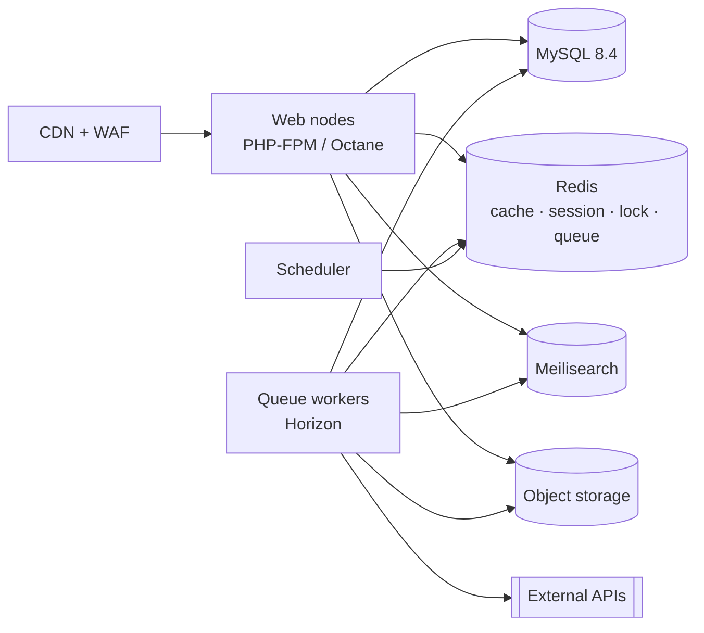
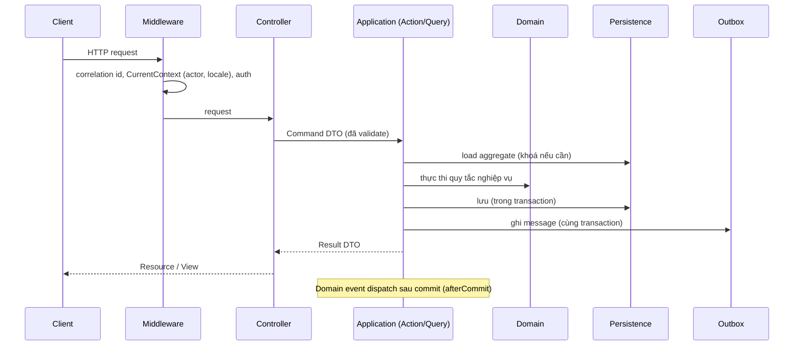

# Kiến trúc tổng thể

> Trạng thái: **Partially Implemented**: khung Foundation đã có (slice 0), nghiệp vụ chưa có ([status](../00-overview/status.md)).

## 1. Phong cách kiến trúc

**Microkernel thương mại** trên **Laravel + Modular Monolith + DDD (pragmatic) + API-first**: microkernel (Extension, Identity, Tenancy, Shared) → Commerce Core → plugin hệ thống → plugin nghiệp vụ ([commerce-kernel](commerce-kernel.md), [ADR-029](../19-adr/ADR-029-commerce-microkernel.md)).

| Lựa chọn | Lý do | ADR |
|---|---|---|
| Modular Monolith | Một lần deploy, transaction cục bộ cho checkout/tồn kho, đội nhỏ–vừa | [ADR-001](../19-adr/ADR-001-modular-monolith.md) |
| DDD theo bounded context | Ranh giới rõ, ownership dữ liệu rõ, về sau có thể tách service | [ADR-002](../19-adr/ADR-002-ddd-boundaries.md) |
| Microkernel + plugin | Nghiệp vụ (kể cả mặc định COD/phí ship/VAT) nằm ngoài Core; Core ổn định | [ADR-003](../19-adr/ADR-003-plugin-architecture.md), [ADR-004](../19-adr/ADR-004-extension-points.md), [ADR-029](../19-adr/ADR-029-commerce-microkernel.md) |
| API-first | Storefront native, headless, mobile, đối tác dùng chung Application layer | [ADR-009](../19-adr/ADR-009-storefront-architecture.md), [ADR-010](../19-adr/ADR-010-api-versioning.md) |
| Tích hợp hướng sự kiện | Hệ thống ngoài không làm hỏng checkout | [ADR-005](../19-adr/ADR-005-event-driven-integration.md), [ADR-013](../19-adr/ADR-013-outbox-inbox.md) |

**Không** làm microservices. Chỉ tách service khi có lý do vận hành/scale đo được (rule R19).

## 2. Sơ đồ ngữ cảnh (C4 level 1)



Hệ thống ngoài kết nối theo hai cách ([integration-platform](../11-integration/integration-platform.md)): **tự gọi Integration API** (ERP, ODO, POS), hoặc **qua connector plugin** (cổng thanh toán, hãng vận chuyển, sàn TMĐT).

## 3. Sơ đồ container (C4 level 2)



Tất cả đặt tại trung tâm dữ liệu ở Việt Nam ([ADR-018](../19-adr/ADR-018-infrastructure-vietnam.md)). Chi tiết vận hành: [operations](../18-operations/operations.md).

## 4. Cấu trúc thư mục dự án

```
vanishop/
├── app/                    # Khung ứng dụng: Providers, middleware chung, Console
│   └── Providers/ModuleServiceProvider.php
├── modules/                # Commerce Kernel — namespace Modules\<Context>\
│   ├── Shared/  Tenancy/  Identity/  Extension/      (Brand/, Channel/: gỡ ở slice 12, ADR-028)
│   ├── Catalog/ Pricing/  Inventory/ Customer/ Cart/ Checkout/
│   ├── Ordering/ Payment/ Fulfillment/ Returns/ Promotion/
│   └── Content/ Notification/ Reporting/ Integration/
├── custom/
│   ├── plugin/             # Business plugins — namespace Plugin\<Name>\
│   └── theme/              # Theme storefront của cửa hàng (một theme hoạt động)
├── resources/js/           # Entry Admin Inertia, component Vue dùng chung
├── routes/                 # Chỉ route khung; route nghiệp vụ nằm trong module/plugin
├── tests/                  # Test xuyên module (E2E, architecture)
└── docs/
```

Autoload (`composer.json`):

```json
"psr-4": {
    "App\\": "app/",
    "Modules\\": "modules/",
    "Plugin\\": "custom/plugin/",
    "Database\\Factories\\": "database/factories/",
    "Database\\Seeders\\": "database/seeders/"
}
```

Cấu trúc bên trong module: [bounded-contexts §4](bounded-contexts.md). Cấu trúc plugin: [plugin-system](../05-plugin/plugin-system.md). Bản đồ kiểm chứng từ code (bề mặt, thứ tự nạp module, số liệu): [system-map](system-map.md); middleware, boot, lịch chạy: [request-lifecycle](request-lifecycle.md).

## 5. Tech stack

| Tầng | Lựa chọn | Trạng thái |
|---|---|---|
| Ngôn ngữ / Framework | PHP 8.4, Laravel 13 | Implemented |
| Hook | `tormjens/eventy`, bọc bởi facade `Modules\Extension\Facades\Hook` | Implemented |
| CSDL | MySQL 8.4 LTS, InnoDB, `utf8mb4` ([ADR-016](../19-adr/ADR-016-mysql.md)) | Implemented (dev: MySQL 9.7; CI: 8.4) |
| Cache / Queue / Lock | Redis 7 + Laravel Horizon | Designed |
| Tìm kiếm | Laravel Scout; `SearchProvider` contract; Meilisearch là provider mặc định | Designed |
| File | Object storage S3-compatible tại VN + CDN | Designed |
| Admin | Inertia v3 + Vue 3 + TypeScript 5.9 + Tailwind 4 ([ADR-017](../19-adr/ADR-017-admin-ui-inertia.md)) | Implemented (khung) |
| Storefront | Blade SSR + Alpine.js + Tailwind 4, theme `custom/theme/*` | Designed |
| API auth | Sanctum (storefront/admin), API key + HMAC (integration) | Designed |
| Test | Pest 5 (unit, feature, arch), Pest Browser (E2E, chưa cài) | Implemented (unit/feature/arch) |
| Chất lượng | Pint, Larastan level ≥ 6 | Pint Implemented |

## 6. Luồng request tiêu biểu



## 7. Thuộc tính chất lượng (NFR)

| Thuộc tính | Mục tiêu |
|---|---|
| Khả dụng | 99,9%/tháng cho storefront và checkout |
| Hiệu năng | Storefront TTFB P95 < 300 ms (cache nóng); API P95 < 200 ms (không tính cổng ngoài) |
| Tải | 500 đơn/phút giờ cao điểm; 5.000 req/s qua CDN |
| Nhất quán tồn | 0 oversell do race condition ([inventory](../08-inventory/inventory.md)) |
| Mở rộng | Thêm brand = dữ liệu catalog, không cần deploy; thêm capability bằng plugin, không sửa Core |
| Quan sát | Mọi flow truy vết được bằng correlation id ([observability](../16-observability/observability.md)) |
| Bảo mật | OWASP ASVS L2; PCI-DSS SAQ-A ([security](../15-security/security.md)) |

### Đo NFR lần 1 (2026-10-09)

Đo trên máy dev (`php artisan serve`, PHP 8.4, MySQL local, dữ liệu `DemoSeeder`: 4 style / 18 variant / 30 giá), ApacheBench, header `X-Vani-Channel: web-lumiere` (lần đo trước slice 12; từ slice 12 không cần header kênh). Chạy lại bằng:

```bash
php artisan migrate:fresh --force && php artisan vani:install --no-migrate && php artisan db:seed --class=DemoSeeder
php artisan serve --port=8899 &
./scripts/bench/storefront-nfr.sh          # exit 0 = đạt, exit 1 = không đạt
```

| Endpoint | P50 | **P95** | Throughput | Kết quả |
|---|---|---|---|---|
| `GET /api/storefront/v1/categories` | 49 ms | **53 ms** | ~100 req/s | ✅ < 200 ms |
| `GET /api/storefront/v1/products` | 91 ms | **120 ms** | ~52 req/s | ✅ < 200 ms |
| `GET /api/storefront/v1/products/{slug}` (PDP) | 107 ms | **147 ms** | ~45 req/s | ✅ < 200 ms |

(Mỗi endpoint 60 request, c=5. Số liệu thay đổi theo tải máy; script là nguồn chuẩn.)

Cách đọc số liệu:
- `php artisan serve` là **single-process**; throughput ~50 req/s là giới hạn của công cụ đo, **không phải** năng lực hệ thống. Mục tiêu 5.000 req/s phải đo lại trên staging khi có PHP-FPM + OPcache + CDN.
- Storefront API giới hạn **240 req/phút/IP**; vượt ngưỡng trả `429` — rate limit cố ý, không phải lỗi. Vì vậy script mặc định 60 request/endpoint và **từ chối báo PASS khi có response không phải 2xx** (nếu không sẽ đo nhầm latency của lỗi). Cần tính lại tải khi đã đặt CDN.
- Dữ liệu demo rất nhỏ; catalog thật (hàng chục nghìn SKU) cần đo lại vì listing có phân trang và facet.

→ Mục "Load test đạt NFR" của [go-live gate](../20-roadmap/roadmap.md) **chưa đóng**: hiện mới xác nhận latency, chưa xác nhận tải.
