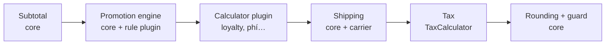

# Cart & Checkout

> Trạng thái: **Designed**.

## 1. Cart

| Mục | Thiết kế |
|---|---|
| Phạm vi | Một giỏ theo **channel**; kênh đa brand có giỏ chứa nhiều brand |
| Định danh | `public_id` (ULID) + `cart_token` cookie cho khách vãng lai |
| Dòng giỏ | `variant_id`, `quantity`, `unit_price_snapshot` (giá lúc thêm, để cảnh báo "giá đã đổi"), `meta` |
| Gộp giỏ | Khi đăng nhập: cộng dồn số lượng, giới hạn theo ATS, phát `CartUpdated` |
| Không giữ hàng | Giỏ **không** reserve tồn (tránh khoá hàng ảo); reserve chỉ xảy ra trong `PlaceOrder` |
| Hết hạn | 30 ngày không hoạt động; job dọn dẹp |
| Giỏ bỏ quên | Event `CartAbandoned` (1h/24h), plugin `vani.abandoned-cart` xử lý |

Invariant: `quantity > 0` (DB `CHECK`), unique `(cart_id, variant_id)` (DB), variant phải thuộc brand có trong channel (App).

## 2. Totals pipeline

Tổng tiền là kết quả của chuỗi **calculator** có thứ tự. Mỗi calculator sinh **adjustment** truy vết được.



```php
interface TotalsCalculator
{
    public function code(): string;
    public function priority(): int;                               // subtotal=100, promotion=200, plugin 300-399, shipping=500, tax=800, rounding=900
    public function calculate(TotalsContext $context): TotalsContext; // trả context mới (bất biến), thêm adjustment
}

interface TaxCalculator
{
    public function code(): string;
    /** Tách thuế theo từng dòng sau khi đã trừ giảm giá phân bổ */
    public function calculate(TaxableLines $lines, ChannelData $channel): TaxBreakdown;
}
```

| Guard (Core, sau mỗi calculator) | Hành vi |
|---|---|
| Tổng dòng không âm | Cắt giảm giá ở mức 0, ghi log cảnh báo plugin |
| Adjustment phải có `source` (core/plugin id) và `Money` cùng tiền tệ | Exception, fail flow |
| Adjustment cấp đơn được phân bổ xuống dòng | `Money::allocate` ([money](../02-architecture/money.md)) |

Cùng một pipeline dùng cho: xem giỏ, checkout, `PlaceOrder`, và tính lại khi Admin sửa đơn trước khi xác nhận.

## 3. Checkout flow

1. **Liên hệ**: SĐT (bắt buộc), email (tuỳ chọn), họ tên.
2. **Nhận hàng**: địa chỉ 2 cấp ([vietnam-localization](vietnam-localization.md)) hoặc phương thức khác do `FulfillmentMethod` cung cấp (nhận tại cửa hàng là plugin).
3. **Vận chuyển**: lựa chọn từ carrier đang bật + filter `vani.checkout.shipping_options`.
4. **Thanh toán**: danh sách `PaymentGateway` có `isAvailable()` + filter `vani.checkout.payment_methods`.
5. **Trường bổ sung** từ `checkoutFields()` (ví dụ xuất hoá đơn công ty).
6. **Voucher**.
7. Đặt hàng → `PlaceOrder`.

Validation: `CheckoutValidator` (core: giá, tồn, địa chỉ) + hook `vani.checkout.before_validate` / `vani.checkout.after_validate` (plugin: chống bom hàng, quy tắc riêng brand).

## 4. `PlaceOrder`: transaction boundary

```php
final class PlaceOrder
{
    public function handle(PlaceOrderCommand $cmd): PlaceOrderResult
    {
        return $this->idempotency->remember($cmd->idempotencyKey, $cmd->hash(), function () use ($cmd) {
            // Ngoài transaction: tính trước để fail sớm, không giữ lock
            $checkout = $this->checkouts->build($cmd);
            $this->validators->validateOrFail($checkout);

            $result = DB::transaction(function () use ($checkout, $cmd) {
                $cart   = $this->carts->lockForCheckout($cmd->cartId);            // FOR UPDATE, chống đặt 2 lần
                $totals = $this->totals->calculate($checkout->refreshFrom($cart)); // tính lại bên trong
                $this->validators->validateOrFail($checkout->withTotals($totals));

                $reservation = $this->inventory->reserve(ReservationRequest::fromCheckout($checkout)); // atomic
                $order = $this->orders->create(OrderDraft::from($checkout, $totals, $reservation));  // snapshot
                $payment = $this->payments->createIntent($order, $checkout->paymentMethod);
                $this->promotions->recordUsage($order, $totals);                  // UPDATE có điều kiện
                Hook::action('vani.order.after_create', OrderData::from($order)); // plugin ghi DB, không I/O
                $this->carts->markConverted($cart, $order);
                $this->outbox->record(OrderPlacedMessage::from($order));

                return new PlaceOrderResult($order, $payment);
            }, attempts: 3);

            event(new OrderPlaced(OrderData::from($result->order)));             // afterCommit
            return $result->withInitiation($this->payments->initiate($result->payment)); // sau commit: URL/QR
        });
    }
}
```

| Lỗi | Kết quả |
|---|---|
| Hết hàng | Rollback, `409 inventory.insufficient_stock` kèm dòng lỗi |
| Giá/KM thay đổi so với lúc xem | Rollback, `409 checkout.totals_changed` kèm tổng mới để khách xác nhận lại |
| Voucher hết lượt | Rollback, `409 promotion.voucher_exhausted` |
| Cổng thanh toán lỗi khi `initiate` (sau commit) | Đơn vẫn tồn tại ở `pending`/`unpaid`; khách thử lại hoặc chọn phương thức khác; reservation hết hạn theo TTL |
| Request trùng | Trả kết quả đã lưu (idempotency) |

## 5. Kiểm thử

- Unit: pipeline (thứ tự, guard, phân bổ), `TaxCalculator` mặc định (VAT gồm thuế).
- Feature: `PlaceOrder` thành công, hết hàng, totals thay đổi, voucher hết lượt, request trùng.
- Concurrency: 2 request đặt cùng một giỏ → một đơn.
- Contract test cho `TotalsCalculator`, `CheckoutValidator`, `TaxCalculator`.
