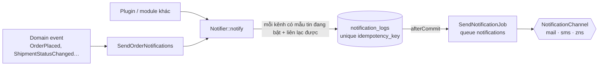

# Notification

> Trạng thái: **Partially Implemented** (2026-10-13). Module `modules/Notification` (context "CRUD domain", [ADR-002](../19-adr/ADR-002-ddd-boundaries.md)). Kênh ngoài email là plugin: [`vani.sms-brandname`](../../custom/plugin/SmsBrandname/README.md), [`vani.zalo-zns`](../../custom/plugin/ZaloZns/README.md).
>
> Định hướng [ADR-028](../19-adr/ADR-028-single-store-brand-as-catalog.md): mẫu tin theo **loại × kênh gửi × locale** (bỏ chiều brand); consent không theo brand. Code hiện còn `brand_id` trên mẫu/nhật ký, gỡ ở slice 12. ("Kênh" trong tài liệu này luôn là **kênh gửi tin**: mail, sms, zns.)

## 1. Trách nhiệm

| Core (`modules/Notification`) | Plugin |
|---|---|
| Mẫu tin theo **loại × kênh gửi × locale**, render biến `{{ ten_bien }}` | Kênh gửi: SMS brandname, Zalo ZNS, web push… (`NotificationChannel`) |
| Chọn kênh, kiểm consent (tin marketing), nhật ký gửi, retry | Loại tin riêng (abandoned cart, loyalty…) gửi qua `Notifier` |
| Tin giao dịch theo domain event của đơn/giao hàng | OTP qua SMS/ZNS (`OtpSender` của Customer) |
| Kênh `mail` (văn bản thuần, mailer Laravel) | |

## 2. Luồng gửi



- **Chọn mẫu tin**: với mỗi kênh, mẫu đang bật của loại tin; locale của người nhận ghi đè `vi`. Kênh chỉ dùng khi plugin cung cấp kênh đang bật và `canReach()` người nhận (email cho `mail`, SĐT cho `sms`/`zns`).
- **Render lúc xếp hàng**: `subject`, `body` và mọi chuỗi trong `meta` (tham số riêng của kênh, vd. ZNS `template_id` + `params`) được render rồi lưu vào nhật ký → mọi lần thử gửi cùng một nội dung.
- **Idempotent (R18)**: `idempotency_key = <key của sự việc>:<kênh>` unique; listener chạy lại không gửi trùng. Key của Core: `order_placed:<order id>`, `order_cancelled:<order id>`, `shipment_shipped:<shipment id>`, `shipment_delivered:<shipment id>`.
- **Retry**: `SendResult::retryable` → thử lại (backoff 1m, 5m, 15m, 1h; tối đa 5 lần), `permanent` → `failed`. Exception bất ngờ coi như retryable.
- **Consent**: tin `marketing` chỉ gửi khi khách có consent `marketing` theo kênh (`mail` ↔ consent `email`); không có → nhật ký `skipped` (`consent.missing`). Tin giao dịch không cần consent ([customer §5](customer.md)).
- Lỗi xếp hàng tin không làm hỏng nghiệp vụ (listener bắt lỗi, ghi log).

## 3. Loại tin của Core

| Loại | Khi | Biến |
|---|---|---|
| `order_placed` | `OrderPlaced` | `store_name`, `customer_name`, `order_number`, `total` |
| `order_cancelled` | `OrderCancelled` | như trên |
| `shipment_shipped` | vận đơn sang `picked_up`/`in_transit` (một lần mỗi vận đơn) | + `carrier`, `tracking_number` |
| `shipment_delivered` | vận đơn `delivered` | + `carrier`, `tracking_number` |

Loại tin được khai báo qua `NotificationCatalog` (Core: 4 loại dưới; plugin: loại riêng kèm mẫu mặc định theo kênh — dùng khi DB chưa có mẫu). Migration tạo sẵn mẫu **email tiếng Việt** mặc định cho 4 loại. Mẫu SMS/ZNS tạo trong Admin → Thông báo khi bật plugin (SMS phải khớp mẫu đăng ký với nhà mạng; ZNS cần template Zalo đã duyệt).

## 4. Contract

```php
interface NotificationChannel            // tag vani.notification.channels
{
    public function code(): string;                          // mail | sms | zns | …
    public function canReach(Recipient $recipient): bool;
    public function send(OutgoingMessage $message): SendResult; // sent(id) | retryable(err) | permanent(err)
}

interface Notifier
{
    /** @return list<string> kênh đã xếp hàng */
    public function notify(NotificationRequest $request): array;  // type, key, Recipient, variables, category
}
```

## 5. Dữ liệu

`notification_templates(type, channel, locale, subject, body, meta json, active, lock_version)`, `notification_logs(idempotency_key unique, type, category, channel, template_id, customer_id, recipient, subject, body, meta, status[queued|sent|failed|skipped], attempts, provider_message_id, error, correlation_id, created_at, sent_at)`.

## 6. Admin

`/{admin}/notifications/templates` (quyền `notifications.view` / `notifications.manage`, cấp Owner): danh sách, thêm/sửa/xoá mẫu tin (khoá lạc quan, không trùng loại × kênh × locale, audit). `/{admin}/notifications/logs`: nhật ký gửi, người nhận đã che.

## 7. Chưa có

Email HTML theo theme cửa hàng, mẫu tin do plugin khai báo (`notificationTemplates()`), gửi lại tin lỗi từ Admin, chiến dịch marketing + link huỷ đăng ký, kênh dự phòng cho tin giao dịch (ZNS lỗi → SMS; hiện chỉ OTP có dự phòng), dọn nhật ký cũ.
