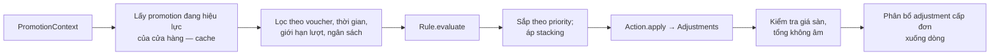

# Promotion

> Trạng thái: **Partially Implemented (slice 6)**. Định hướng [ADR-028](../19-adr/ADR-028-single-store-brand-as-catalog.md): khuyến mãi **cấp cửa hàng**; giới hạn theo brand bằng rule điều kiện. Code hiện còn phạm vi brand, gỡ ở slice 12.
>
> **Đã có:** module `modules/Promotion`: `promotions` (phạm vi **brand**, priority, `exclusive`/`combinable`, cần voucher hay tự động, giới hạn lượt, ngân sách, khung giờ, `lock_version`), `promotion_rules` (rule của plugin), `vouchers` (mã chữ hoa duy nhất, giới hạn lượt, hết hạn, bật/tắt), `promotion_usages`; `PromotionEngine` (đánh giá chỉ đọc; `recordUsage` bằng UPDATE có điều kiện; `revertUsage` idempotent), action `percent_off` / `amount_off`, extension point `PromotionRule` / `PromotionAction`, giá sàn `VANI_PROMOTION_MAX_DISCOUNT_BP` (mặc định 50%), Admin brand workspace (khuyến mãi, voucher cụ thể + sinh hàng loạt), concurrency test voucher.
>
> **Khác thiết kế:** mỗi khuyến mãi **một action** (cột `action_type` + `action_config` thay bảng `promotion_actions`); chỉ phạm vi brand (sẽ thành cấp cửa hàng, slice 12). **Chưa có:** action trên phí giao hàng, giới hạn lượt theo khách (`usage_per_customer`, chờ Customer), giá sàn tính theo giá niêm yết (hiện tính theo giá bán của dòng — khi có giá sale, tổng mức giảm so với giá niêm yết có thể vượt 50%; pháp chế cần xác nhận cách áp), cache danh sách khuyến mãi, Admin cấu hình rule của plugin. Core cung cấp **framework**, rule cụ thể do plugin cung cấp ([commerce-kernel](../02-architecture/commerce-kernel.md)).

## 1. Trách nhiệm

| Core (`modules/Promotion`) | Plugin (ví dụ `vani.promotion-rules`, `vani.creator`) |
|---|---|
| Mô hình promotion: phạm vi, thời gian, ưu tiên, stacking, ngân sách, giới hạn lượt | Rule điều kiện cụ thể: BxGy, giảm theo **brand**/collection/danh mục, đơn đầu tiên, VIP, flash sale, creator/seller discount |
| Voucher: mã, sinh hàng loạt, giới hạn lượt, gán khách | Hành động đặc thù: tặng quà, đồng giá combo |
| `PromotionEngine`: đánh giá rule, áp action, chống chồng, phân bổ | Admin UI cho rule của plugin |
| Action primitive: `percent_off`, `amount_off` (trên dòng/đơn/phí ship) | |
| Ghi nhận sử dụng (usage) atomic, hoàn lượt khi huỷ đơn | |
| `PromotionCalculator` trong totals pipeline | |

Không viết từng loại khuyến mãi vào Order/Checkout service (rule R1).

## 2. Contract

```php
namespace Modules\Promotion\Contracts;

interface PromotionRule
{
    public function type(): string;                                  // 'buy_x_get_y', 'first_order', ...
    public function configSchema(): array;                           // JSON Schema cho Admin
    /** Trả về các dòng đủ điều kiện (rỗng = không áp dụng) */
    public function evaluate(PromotionContext $context, RuleConfig $config): Eligibility;
}

interface PromotionAction
{
    public function type(): string;                                  // 'percent_off', 'amount_off', 'free_gift'...
    public function configSchema(): array;
    /** @return list<AdjustmentData> — luôn là Money, luôn ≤ 0 với giảm giá */
    public function apply(PromotionContext $context, Eligibility $eligibility, ActionConfig $config): array;
}

final readonly class PromotionContext
{
    public function __construct(
        public ?CustomerData $customer,       // null = khách vãng lai
        public CartSnapshot $cart,            // dòng, giá, brandId, collection, category của từng dòng (brand là thuộc tính catalog)
        public Money $subtotal,
        public ?Money $shippingFee,
        public array $voucherCodes,
        public CarbonImmutable $now,
        public array $attributes = [],        // plugin bổ sung qua hook (ví dụ creator_ref)
    ) {}
}
```

## 3. Dữ liệu (Core)

```
promotions(id, name, status, starts_at, ends_at,
           priority, stacking[exclusive|combinable], budget_amount NULL, budget_used_amount,
           usage_limit NULL, usage_per_customer NULL, requires_voucher, lock_version)
promotion_rules(promotion_id, rule_type, config json)          -- rule_type do plugin đăng ký
promotion_actions(promotion_id, action_type, config json)
vouchers(id, promotion_id, code UNIQUE, usage_limit, used_count, customer_id NULL, expires_at)
promotion_usages(promotion_id, voucher_id NULL, order_id, customer_id NULL, discount_amount, status[applied|reverted])
```

Nếu một `rule_type` thuộc plugin đang bị tắt thì promotion đó **không áp dụng** (engine bỏ qua và ghi log), không gây lỗi.

## 4. Flow đánh giá



- **Stacking**: `exclusive` có priority cao nhất thắng và dừng; `combinable` cộng dồn theo thứ tự priority, mỗi action tính trên giá **sau** action trước.
- **Giá sàn**: tổng giảm của một dòng không vượt `max_discount_bp` của cửa hàng (mặc định 5000 = 50%, phù hợp quy định KM VN — [vietnam-localization §6](vietnam-localization.md)).
- Kết quả lưu vào `order_adjustments` (snapshot: mã promotion, tên, số tiền, dòng áp dụng).

## 5. Transaction và concurrency

- Đánh giá khi xem giỏ/checkout: **không** ghi gì.
- Trong `PlaceOrder`: đánh giá lại → `promotion_usages` insert + `vouchers.used_count` tăng bằng `UPDATE … SET used_count = used_count + 1 WHERE id = ? AND (usage_limit IS NULL OR used_count < usage_limit)`; không có dòng nào được cập nhật thì báo lỗi `promotion.voucher_exhausted` và rollback.
- Ngân sách: tương tự, `budget_used_amount + x <= budget_amount` trong câu `UPDATE` có điều kiện.
- Flash sale đông khách: cổng chặn Redis counter trước.
- `OrderCancelled` → usage `reverted`, trả lượt voucher (idempotent theo `order_id`).

## 6. Ví dụ plugin rule

```php
namespace Plugin\PromotionRules\Rules;

final class FirstOrderRule implements PromotionRule
{
    public function __construct(private OrderReader $orders) {}

    public function type(): string { return 'first_order'; }

    public function configSchema(): array
    {
        return ['type' => 'object', 'properties' => []];
    }

    public function evaluate(PromotionContext $ctx, RuleConfig $config): Eligibility
    {
        if ($ctx->customer === null) {
            return Eligibility::none();
        }
        $hasOrders = $this->orders->customerHasCompletedOrder($ctx->customer->id);

        return $hasOrders ? Eligibility::none() : Eligibility::wholeCart($ctx->cart);
    }
}
```

### 6.1 Rule "thuộc brand"

Rule `in_brands` (plugin `vani.promotion-rules`, Designed) nhận `{brand_ids: [...]}`, trả `Eligibility` gồm các dòng có `brandId` trong danh sách. Ví dụ "giảm 20% toàn bộ Urbanx" = promotion tự động + rule `in_brands` + action `percent_off`. Không cần phạm vi brand trong Core.

## 7. Kiểm thử

- Unit: engine với rule/action giả, stacking, giá sàn, phân bổ (bảo toàn tổng).
- Contract test cho `PromotionRule`/`PromotionAction` (plugin phải pass).
- Concurrency: 100 request dùng voucher `usage_limit = 10` → đúng 10 đơn thành công.
- Feature: huỷ đơn hoàn lượt voucher đúng một lần.
