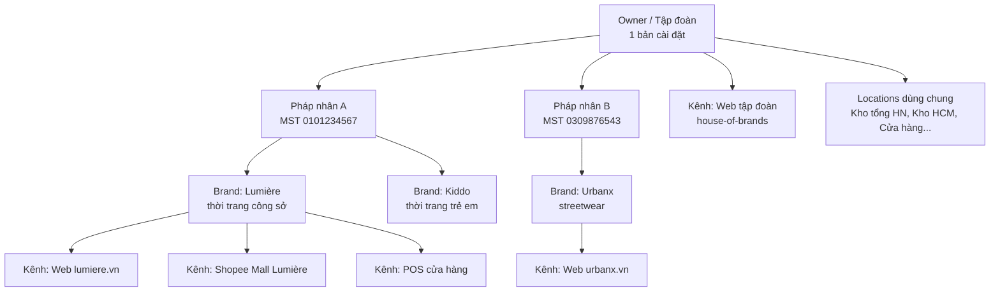

# 03 — Mô hình đa thương hiệu

## 1. Cây tổ chức



| Thực thể | Định nghĩa | Ví dụ |
|---|---|---|
| **Owner** | Chủ sở hữu duy nhất của hệ thống. Chỉ có 1 Owner/bản cài đặt (không multi-tenant SaaS) | Tập đoàn Vani |
| **Legal Entity (Pháp nhân)** | Công ty có MST riêng, xuất hoá đơn, nhận tiền | Công ty TNHH Vani Fashion |
| **Brand** | Thương hiệu: nhận diện, catalog, chính sách riêng. Thuộc 1 pháp nhân | Lumière |
| **Channel (Kênh bán)** | Một điểm bán cụ thể: website, sàn, POS, app. Gắn 1 brand **hoặc** là kênh tập đoàn (đa brand) | `lumiere-web`, `group-web` |
| **Location** | Kho hoặc cửa hàng giữ hàng; có thể dùng chung giữa các brand | `WH-HN-01`, `ST-HCM-Q1` |

> Vì sao có **Pháp nhân**: tại VN các brand trong cùng tập đoàn thường thuộc công ty khác nhau. Doanh thu, hoá đơn điện tử, tài khoản nhận tiền cổng thanh toán, hợp đồng hãng vận chuyển đều gắn với pháp nhân.

## 2. Chiến lược cô lập dữ liệu

**Một database, cô lập bằng cột phạm vi** (`brand_id`, `channel_id`) + global scope — không tách DB theo brand. Lý do trong [ADR-0002](adr/0002-single-database-brand-scope.md): Owner cần báo cáo và khách hàng hợp nhất; brand không phải khách hàng độc lập.

| Loại dữ liệu | Phạm vi | Ghi chú |
|---|---|---|
| Khách hàng, tài khoản, loyalty | **Owner** (dùng chung) | Consent marketing tách theo brand |
| Location, tồn kho | **Owner** | Mỗi location khai báo brand được phép bán từ nó |
| Style/Variant (sản phẩm) | **Brand** | 1 style thuộc đúng 1 brand |
| Danh mục, bộ sưu tập, CMS, menu | **Brand** (hoặc Channel) | Kênh tập đoàn có danh mục riêng |
| Bảng giá | **Brand**, gán cho **Channel** | Giá web và giá sàn có thể khác |
| Khuyến mãi | **Brand** / **Channel** / **Owner** (cross-brand) | |
| Đơn hàng | **Channel** (suy ra brand, pháp nhân) | Kênh đa brand → tách đơn theo brand (xem 5) |
| Cấu hình (setting) | Kế thừa **Owner → Brand → Channel** | |
| Nhân viên, vai trò | **Owner**, gán quyền theo phạm vi | Xem [13](13-bao-mat-phan-quyen.md) |

### Thực thi trong code

- Trait `BelongsToBrand` thêm **global scope** lọc theo `CurrentContext::brandIds()`.
  - Storefront: 1 brand của kênh hiện tại (hoặc tập brand của kênh tập đoàn).
  - Admin: các brand mà nhân viên được phân quyền.
  - Job/console: phải **chỉ định rõ** context (`CurrentContext::runAs($brand, fn () => ...)`); thiếu context → ném exception, **không** mặc định "tất cả".
- Test bắt buộc cho mỗi model có phạm vi brand: "nhân viên brand A không đọc/ghi được dữ liệu brand B".

## 3. Cấu hình kế thừa

```
settings(scope_type, scope_id, key, value)
  scope_type ∈ {owner, legal_entity, brand, channel}
```

Đọc `setting('checkout.cod.max_amount')` sẽ tìm lần lượt: channel → brand → legal_entity → owner → giá trị mặc định trong `config/vanishop.php`. Các nhóm cấu hình chính:

- `store.*`: tên, logo, hotline, địa chỉ, giờ mở cửa.
- `checkout.*`: cho phép khách vãng lai, COD, ngưỡng miễn phí vận chuyển.
- `payment.<method>.*`: bật/tắt, credential (mã hoá), pháp nhân nhận tiền.
- `shipping.<carrier>.*`: tài khoản hãng theo pháp nhân.
- `seo.*`, `tracking.*` (GA4, Meta Pixel, TikTok Pixel theo brand).
- `invoice.*`: nhà cung cấp hoá đơn điện tử, mẫu số/ký hiệu theo pháp nhân.

## 4. Domain, theme và ngôn ngữ

| Mục | Thiết kế |
|---|---|
| Domain | Bảng `channel_domains` (domain, channel, is_primary, redirect). Hỗ trợ cả `lumiere.vn` và `shop.vani.vn/lumiere` (path prefix) |
| Theme | Mỗi channel chọn 1 theme; theme = thư mục view + token thiết kế (màu, font, bo góc) + block page builder. Theme cơ sở `vani-base`, theme brand ghi đè có chọn lọc |
| Ngôn ngữ | Mặc định `vi`; `en` tuỳ brand. Nội dung dịch lưu bảng `*_translations` |
| Tiền tệ | `VND` (Phase 1). Schema có `currency_code` để mở rộng |
| SEO | Canonical theo domain chính; sitemap, robots, schema.org Product/Offer riêng từng channel |

## 5. Kênh tập đoàn (house-of-brands)

Website chung của tập đoàn bán nhiều brand trong 1 giỏ:

- Giỏ hàng chứa dòng hàng nhiều brand; checkout 1 lần, **thanh toán 1 lần**.
- Khi đặt hàng: tạo 1 **Order Group** (mã hiển thị cho khách) → tách thành **N đơn con theo brand/pháp nhân** (mỗi đơn con có hoá đơn, fulfillment, đối soát riêng).
- Khuyến mãi cross-brand phân bổ (allocate) giá trị giảm về từng đơn con theo tỷ lệ doanh thu.
- Một giao dịch thanh toán → ghi nhận phân bổ cho từng pháp nhân (cần thoả thuận thu hộ nội bộ; kế toán xác nhận trước khi bật tính năng).

> Phase 1 chỉ làm website **theo brand**. Kênh tập đoàn là Phase 3 nhưng schema (Order Group, allocation) có từ đầu.

## 6. Quy trình thêm brand mới (mục tiêu ≤ 5 ngày)

1. Tạo pháp nhân (nếu mới) + brand + channel web trong Admin.
2. Gắn domain, SSL (tự động qua Let's Encrypt / CDN).
3. Chọn theme cơ sở, cấu hình token thiết kế, logo.
4. Khai báo location được phép bán, bảng giá, phương thức thanh toán/vận chuyển.
5. Import catalog từ ERP (mapping mã hàng) hoặc file Excel mẫu.
6. Cấu hình Integration Client/connector cho brand (ERP, ODO khi có; mapping kho, mã kênh).
7. Chạy checklist go-live tự động (`php artisan vani:brand:preflight {brand}`): thiếu cấu hình nào sẽ báo đỏ.
