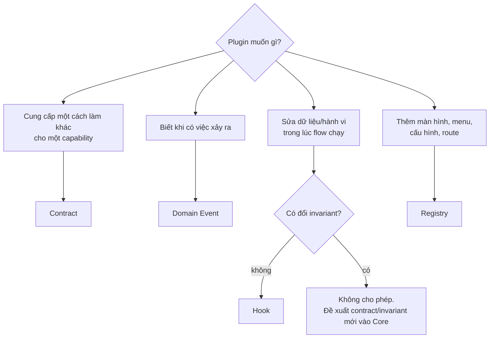

# Extension Model

> Trạng thái: **Partially Implemented**. Đã có: `Hook` (filter/action/collect/slot), registry `hooks.php`, strict mode, public/internal, cô lập lỗi ở slot, listener gắn với plugin và chỉ chạy khi plugin active, **kiểm tra kiểu trả về của filter** (strict: exception; production: bỏ kết quả sai + log), **đo thời gian listener theo hook × plugin** (`HookManager::timings()`, log cảnh báo khi > 50 ms), contract test suite (17 bộ). Chưa có: xuất metric `hook_duration_ms` ra hệ thống giám sát, slot storefront (chờ theme, [ADR-025](../19-adr/ADR-025-native-storefront-ssr-slots.md)). Quyết định: [ADR-004](../19-adr/ADR-004-extension-points.md). Chữ ký chính xác cho người viết plugin: [05-plugin/contracts](../05-plugin/contracts/README.md).

Extension Points là **API quan trọng nhất của VaniShop**: nhờ chúng mà nghiệp vụ mới được xây ngoài Core ([commerce-kernel](../02-architecture/commerce-kernel.md)). Danh mục cụ thể: [extension-point-catalog](extension-point-catalog.md).

## 1. Bốn cơ chế

| Cơ chế | Bản chất | Dùng khi | Ví dụ |
|---|---|---|---|
| **Contract** | Interface + DTO, plugin đăng ký implementation (tag container) | Capability **thay thế được**, có nhiều implementation song song, Core chọn theo cấu hình/scope | `PaymentGateway`, `ShippingCarrier`, `PromotionRule`, `TaxCalculator` |
| **Domain Event** | DTO bất biến phát **sau khi** việc đã xảy ra (sau commit) | Phản ứng phụ, **không** thay đổi kết quả của flow đang chạy | `OrderPlaced` → gửi ZNS, cộng điểm, webhook |
| **Hook** (filter/action/slot) | Điểm có tên trong flow, cho plugin sửa dữ liệu hoặc chèn hành vi/UI | Cần **can thiệp vào flow đang chạy** nhưng không thay thế cả capability | `vani.checkout.before_validate`, `vani.storefront.pdp.after_price` |
| **Registry** | Khai báo tĩnh qua `PluginServiceProvider` | Đăng ký thứ để Core **hiển thị/nạp**: menu, trang Admin, permission, settings, route, scheduled task | `adminMenu()`, `settingsSchema()` |

### Chọn cơ chế



## 2. Khi nào KHÔNG được mở rộng

Các điểm sau **không có** extension point, và sẽ không bao giờ có:

- Bảng chuyển trạng thái đơn, thanh toán, fulfillment. Plugin chỉ **yêu cầu** chuyển qua `OrderTransitions`.
- Công thức ATS và logic khoá reservation. Plugin chỉ điều chỉnh qua `InventoryStrategy`, và kết quả luôn ≤ công thức gốc.
- Kiểu `Money`, làm tròn cuối cùng của tổng đơn.
- Kiểm tra quyền, xác thực, chữ ký webhook.
- Nội dung snapshot đơn sau khi tạo.
- Ghi ledger (movement, audit, order events) theo kiểu append-only.

## 3. Public và Internal

| Loại | Nhận diện | Cam kết |
|---|---|---|
| **Public** | Namespace `Modules\<Ctx>\Contracts\*`, `Modules\<Ctx>\Events\*`; hook có trong `hooks.php` với `visibility: public`; registry của `PluginServiceProvider` | Theo compatibility policy (§5) |
| **Internal** | Mọi thứ khác: `Domain`, `Application`, `Persistence`, `Infrastructure`, hook `visibility: internal` | Có thể đổi bất kỳ lúc nào. Plugin dùng internal sẽ bị arch test chặn (rule R5) |

## 4. Hook

### 4.1 Quy ước tên

```
vani.<context>.<subject?>.<moment>
moment ∈ before_<verb> | after_<verb> | <noun> (filter dữ liệu) | slot UI
```

| Loại | Ví dụ | Trả về |
|---|---|---|
| filter | `vani.catalog.listing.query`, `vani.integration.order_payload` | Giá trị đã sửa (cùng kiểu) |
| action | `vani.order.after_create` | `void` |
| validate | `vani.checkout.before_validate` | Danh sách lỗi (`ValidationIssue[]`) |
| slot | `vani.storefront.pdp.after_price` | **Một** phần tử: dữ liệu có cấu trúc (Admin) hoặc view component (storefront); chỉ nối thêm ([ADR-025](../19-adr/ADR-025-native-storefront-ssr-slots.md)) |

### 4.2 API

```php
use Modules\Extension\Facades\Hook;

// Core công bố
$query   = Hook::filter('vani.catalog.listing.query', $query, $context);
$issues  = Hook::collect('vani.checkout.before_validate', $checkout);   // gộp lỗi từ mọi listener
$cards   = Hook::slot('vani.admin.dashboard.cards');                  // listener lỗi bị bỏ qua, có log
Hook::action('vani.order.after_create', $orderData);

// Plugin đăng ký trong boot() qua helper của PluginServiceProvider (gắn plugin id → chỉ chạy khi plugin active)
$this->onFilter('vani.integration.order_payload',
    fn (array $payload, OrderData $order): array => $payload + ['gift_wrap' => true],
    priority: 20);
// Tương tự: onAction(), onValidate() (trả list lỗi), onSlot() (trả một phần tử UI)
```

```blade
<x-vani::hook-slot name="vani.storefront.pdp.after_price" :product="$product" />
```

### 4.3 Khai báo (registry hook)

```php
// modules/Checkout/hooks.php
return [
    'vani.checkout.before_validate' => [
        'type' => 'validate', 'visibility' => 'public', 'since' => '1.0',
        'args' => ['checkout' => CheckoutData::class],
        'runs' => 'inside transaction = no',
    ],
    'vani.order.after_create' => [
        'type' => 'action', 'visibility' => 'public', 'since' => '1.0',
        'args' => ['order' => OrderData::class],
        'runs' => 'inside PlaceOrder transaction — chỉ ghi DB, không I/O',
    ],
];
```

- Gọi `Hook::filter/action` với tên **chưa khai báo** → exception ở môi trường local/test và bị CI chặn.
- `php artisan vani:plugin:hooks` liệt kê hook công khai và plugin nào đang nghe.

### 4.4 Quy tắc chạy hook

| Quy tắc | Lý do |
|---|---|
| Hook chạy **trong transaction** (ví dụ `vani.order.after_create`) chỉ được ghi DB của plugin, không I/O mạng, thời gian < 50 ms | Không kéo dài lock, không làm hỏng checkout |
| Exception trong hook `validate`/`filter` của flow giao dịch → **fail flow** (rollback) | Rõ ràng hơn là bỏ qua lỗi âm thầm |
| Exception trong **slot UI** → bỏ qua slot đó, ghi log, trang vẫn hiển thị | Plugin lỗi không được làm sập storefront |
| Filter phải trả về **đúng kiểu** đầu vào; Core kiểm tra kiểu ở môi trường non-production | Chặn plugin trả dữ liệu sai |
| Thứ tự chạy theo `priority` (nhỏ chạy trước), cùng priority thì theo thứ tự nạp plugin | Có thể dự đoán |
| Mỗi lần gọi hook được đo thời gian theo hook × plugin; quá 50 ms thì log cảnh báo kèm plugin id (**Implemented**; xuất metric `hook_duration_ms{hook,plugin}`: chưa) | Phát hiện plugin chậm |
| Priority mặc định **10** trong `PluginServiceProvider` | Ghi tường minh khi thứ tự quan trọng |

## 5. Compatibility policy

Extension point public được đánh version theo **SemVer của Core**:

| Thay đổi | Cho phép ở |
|---|---|
| Thêm contract/event/hook mới; thêm field **tuỳ chọn** vào DTO | Minor (1.x) |
| Thêm method vào **service contract** (Core implement, plugin chỉ gọi: `OrderReader`, `Carts`…) | Minor |
| Mở rộng **extension contract** (plugin implement: `PaymentGateway`, `NotificationChannel`…) bằng field tuỳ chọn trên DTO/capabilities, hoặc interface bổ sung tuỳ chọn mà Core kiểm tra bằng `instanceof` | Minor |
| Đổi tên, xoá, đổi kiểu tham số, **thêm method vào extension contract**, đổi ngữ nghĩa | **Major** (giai đoạn `0.x`: tăng số giữa), sau khi đã `@deprecated` ít nhất 1 minor |
| Sửa internal | Bất kỳ lúc nào |

- Plugin khai báo `requires.vanishop: "^1.2"`. Loader từ chối bật plugin không tương thích ([plugin-system](../05-plugin/plugin-system.md)).
- Deprecation được log (`vani.deprecation`) khi plugin dùng điểm đã deprecated.
- [`CHANGELOG-extension.md`](CHANGELOG-extension.md) ghi mọi thay đổi extension point. **Implemented** (0.2.0).
- `tests/Architecture/PublicApiSnapshotTest.php` chụp chữ ký của `Contracts`, `Events`, `PluginServiceProvider` vào `public-api.snapshot`: đổi API mà không cập nhật snapshot (`VANI_UPDATE_API_SNAPSHOT=1`) + changelog thì CI đỏ. Không dùng abstract base cho contract — mở rộng extension contract theo hai cách ở bảng trên.

## 6. Kiểm thử

- **Contract test suite** do Core cung cấp: mỗi contract có một bộ test trừu tượng (ví dụ `PaymentGatewayContractTests`) mà plugin implement phải chạy và pass ([testing §6](../17-testing/testing.md)).
- Test hook: plugin giả lập trong `tests/Fixtures/Plugins` đăng ký filter/action và kiểm tra Core gọi đúng thời điểm, đúng kiểu.
- Arch test: plugin không dùng namespace internal của Core.
- Mỗi extension point public có implementation tham chiếu + contract test (rule R26).
