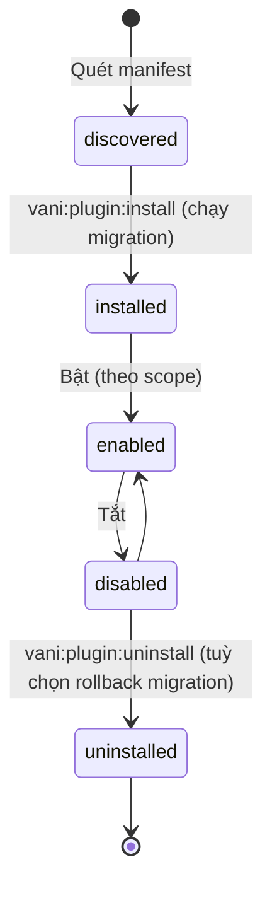

# 10 — Hook, Plugin & Điểm mở rộng của Core

> Theo [ADR-0009](adr/0009-core-toi-gian-nghiep-vu-bang-plugin.md), core giữ tối giản và **nghiệp vụ được xây bằng plugin**. Vì vậy các **điểm mở rộng** trong tài liệu này (đặc biệt là §6) là API quan trọng nhất của core. Danh mục plugin nằm ở [17](17-danh-muc-plugin.md).

## 1. Ba cơ chế mở rộng — dùng đúng chỗ

| Cơ chế | Dùng khi | Ví dụ |
|---|---|---|
| **Contract + Service Container** | Thay thế/đăng ký **một implementation** của năng lực | Cổng thanh toán, hãng VC, connector ERP, nhà cung cấp HĐĐT |
| **Domain Event (Laravel Events)** | Phản ứng **sau khi** một việc đã xảy ra, thường bất đồng bộ | `OrderConfirmed` → Integration gửi webhook |
| **Hook (filter/action)** | Cho plugin **sửa dữ liệu đang chảy** hoặc **chèn nội dung UI** tại điểm đã công bố | Thêm cột vào bảng Admin, thêm block vào PDP, sửa payload trước khi gửi ERP |

Không dùng hook để thay đổi logic lõi nghiệp vụ (tính tồn, trạng thái đơn) — những chỗ đó phải có contract rõ ràng và test.

## 2. Hook — thiết kế riêng của VaniShop

Nền tảng: package `tormjens/eventy` (MIT, đã có trong `composer.json`). VaniShop **không gọi Eventy trực tiếp** trong code nghiệp vụ mà qua lớp bọc `Modules\Extension\Hook` để: kiểm soát tên hook, ghi registry, đo thời gian, và có thể thay engine.

### 2.1 Quy ước tên

```
vani.<module>.<đối tượng>.<thời điểm|mục đích>
```

| Loại | Ví dụ |
|---|---|
| Filter dữ liệu | `vani.catalog.product_card.data`, `vani.integration.order_payload` |
| Filter truy vấn | `vani.catalog.listing.query` |
| Action | `vani.checkout.order.placed_after` |
| Slot UI (render) | `vani.storefront.pdp.after_price`, `vani.admin.order.sidebar` |

### 2.2 API

```php
use Modules\Extension\Facades\Hook;

// Lõi công bố điểm filter
$payload = Hook::filter('vani.integration.odo.order_payload', $payload, $order);

// Lõi công bố điểm action
Hook::action('vani.checkout.order.placed_after', $order);

// Plugin đăng ký (trong ServiceProvider::boot của plugin)
Hook::onFilter('vani.integration.odo.order_payload', function (array $payload, Order $order): array {
    $payload['gift_wrap'] = $order->hasGiftWrap();

    return $payload;
}, priority: 20);
```

Blade slot:

```blade
<x-vani::hook-slot name="vani.storefront.pdp.after_price" :product="$product" />
```

### 2.3 Registry hook công khai

- Mọi hook công khai được **khai báo** trong `modules/*/hooks.php` (tên, loại, tham số, kiểu trả về, mô tả, phiên bản từ khi có).
- Lệnh `php artisan vani:hooks:list` in danh sách; CI kiểm tra: gọi `Hook::filter/action` với tên **chưa khai báo** → fail.
- Hook công khai là **API có cam kết**: đổi tên/xoá phải qua deprecation 1 phiên bản minor.

## 3. Plugin

### 3.1 Cấu trúc

Plugin đặt tại **`custom/plugin/<Tên>/`** trong dự án ([ADR-0006](adr/0006-extension-packaging.md)), namespace `Plugin\<Tên>\` (autoload PSR-4 `"Plugin\\": "custom/plugin/"`). Mỗi thư mục con là 1 plugin độc lập; về sau có thể tách thành Composer package private mà không đổi namespace.

```
custom/plugin/GhnCarrier/
├── vanishop.json                  # manifest
├── GhnCarrierServiceProvider.php
├── GhnCarrier.php                 # implements ShippingCarrier
├── Http/Controllers/WebhookController.php
├── config/ghn.php
├── database/migrations/
├── resources/{views,lang}/
├── resources/js/Pages/            # (tuỳ chọn) trang Admin Inertia riêng của plugin
├── routes/webhooks.php
└── tests/
```

### 3.2 Manifest `vanishop.json`

```json
{
  "id": "vani/ghn-carrier",
  "name": { "vi": "Giao Hàng Nhanh", "en": "GHN Express" },
  "version": "1.0.0",
  "requires": { "vanishop": "^1.0", "plugins": {} },
  "kind": ["shipping_carrier"],
  "provider": "Plugin\\GhnCarrier\\GhnCarrierServiceProvider",
  "settings_schema": "config/settings-schema.json",
  "scopes": ["legal_entity", "brand"],
  "permissions": ["orders.read", "shipments.write"]
}
```

| Trường | Ý nghĩa |
|---|---|
| `kind` | Loại năng lực: `payment_gateway`, `shipping_carrier`, `connector`, `einvoice_provider`, `promotion_rule`, `totals_calculator`, `storefront_block`, `report`, `generic` |
| `settings_schema` | JSON Schema → Admin (Inertia) tự sinh form cấu hình, lưu vào `settings` theo scope, secret được mã hoá |
| `scopes` | Plugin được bật/cấu hình ở phạm vi nào (ví dụ credential GHN theo pháp nhân) |
| `permissions` | Quyền plugin cần — hiển thị khi cài, dùng cho API token nội bộ của plugin |

### 3.3 Vòng đời



- Trạng thái lưu bảng `plugins(code, version, status, installed_at)` + `plugin_scopes(plugin_code, scope_type, scope_id, enabled)`.
- Loader quét `custom/plugin/*/vanishop.json` (cache manifest khi `php artisan optimize`).
- ServiceProvider chỉ được **register** khi plugin `installed`; logic kiểm tra `enabled` theo scope tại thời điểm chạy (ví dụ cổng thanh toán chỉ hiện ở brand đã bật).
- Plugin lỗi khi boot → cô lập, ghi log, tự `disabled`, không làm sập storefront.

### 3.4 Đăng ký năng lực

```php
final class GhnCarrierServiceProvider extends PluginServiceProvider
{
    public function register(): void
    {
        $this->app->tag([GhnCarrier::class], 'vani.shipping.carriers');
    }

    public function boot(): void
    {
        $this->loadPluginRoutes(__DIR__.'/routes/webhooks.php');
        $this->loadMigrationsFrom(__DIR__.'/database/migrations');
    }
}
```

Registry lõi (`ShippingCarrierRegistry`) lấy mọi service có tag `vani.shipping.carriers`, lọc theo trạng thái enabled của scope hiện tại.

## 4. Theme

- Theme là thư mục view + asset build bằng Vite, khai báo `theme.json` (tên, theme cha, design tokens, block hỗ trợ).
- Cơ chế **view fallback**: `custom/theme/<brand-theme>` → `custom/theme/vani-base` → view mặc định của module.
- Design tokens (màu, font, radius, spacing) xuất thành CSS variables → Tailwind 4 `@theme` dùng chung.
- Page builder: trang chủ/landing là danh sách **block** (hero, product grid, collection carousel, rich text, lookbook) lưu JSON theo channel; plugin thêm block qua kind `storefront_block`.

## 5. Quy tắc cho người viết plugin

1. Không truy cập bảng của module lõi trực tiếp — dùng Contract/Service/Model public đã công bố.
2. Không sửa migration lõi; bảng riêng của plugin có tiền tố `plg_<plugin>_`.
3. Mọi gọi HTTP ra ngoài có timeout, retry, log qua `integration_logs`.
4. Có test Pest trong thư mục `tests/` của plugin, chạy trong CI chung.
5. Tuân thủ checklist clean-room ([01](01-clean-room-va-license.md)).

## 6. Danh mục điểm mở rộng của Core

Đây là **API công khai có cam kết** của core. Thêm điểm mới cần PR vào core và cập nhật bảng này; đổi hoặc xoá phải qua deprecation một phiên bản minor.

### 6.1 Contract (năng lực thay thế/bổ sung)

Plugin đăng ký implementation bằng tag trong Service Container. Registry của core lọc theo trạng thái bật của plugin trong phạm vi hiện tại (brand/channel/pháp nhân).

| Contract | Tag | Module core | Dùng cho | Mặc định trong core |
|---|---|---|---|---|
| `PaymentGateway` | `vani.payment.gateways` | Payment | Cổng thanh toán | `cod`, `manual_bank_transfer` |
| `ShippingCarrier` | `vani.shipping.carriers` | Fulfillment | Báo phí, vận đơn, webhook | `flat_rate`, `manual` |
| `FulfillmentMethod` | `vani.fulfillment.methods` | Fulfillment | Hình thức nhận hàng (giao tận nơi, nhận tại cửa hàng…) | `delivery` |
| `SourcingStrategy` | `vani.fulfillment.sourcing` | Fulfillment | Chọn location xuất hàng | `priority_first_fit` |
| `TotalsCalculator` | `vani.totals.calculators` | Checkout | Thêm adjustment (KM, điểm, phí) vào pipeline | subtotal, shipping, tax |
| `CheckoutValidator` | `vani.checkout.validators` | Checkout | Chặn/cảnh báo trước khi đặt hàng | kiểm tra giá, tồn |
| `ReturnPolicy` | `vani.returns.policies` | Returns | Điều kiện đổi trả theo brand | số ngày cấu hình |
| `OtpSender` | `vani.auth.otp_senders` | Customer | Gửi OTP | email |
| `NotificationChannel` | `vani.notification.channels` | Notification | Kênh gửi tin | mail |
| `Connector` | `vani.integration.connectors` | Integration | Kết nối dịch vụ ngoài | — |
| `StorefrontBlock` | `vani.content.blocks` | Content | Block page builder | hero, product grid, rich text, banner |
| `DashboardWidget` | `vani.admin.widgets` | Reporting | Widget trang tổng quan Admin | doanh số, đơn mới |

### 6.2 Contract đọc/ghi cho plugin (dịch vụ core)

Plugin **gọi** các dịch vụ này thay vì chạm vào bảng của core:

| Contract | Chức năng |
|---|---|
| `CatalogReader` | Đọc style/variant/giá/ATS theo channel |
| `InventoryReservation` | Giữ/giải phóng/commit tồn |
| `InventoryAdjuster` | Điều chỉnh on-hand có lý do (movement) |
| `OrderReader`, `OrderTransitions` | Đọc đơn; yêu cầu chuyển trạng thái qua state machine |
| `PaymentRecorder` | Ghi nhận giao dịch/hoàn tiền |
| `ShipmentRecorder` | Tạo/cập nhật shipment, trạng thái vận đơn |
| `CustomerDirectory` | Tìm/tạo khách theo SĐT, đọc consent |
| `SettingsRepository` | Đọc/ghi cấu hình theo scope |
| `IntegrationOutbox` | Đưa message ra ngoài có đảm bảo |
| `CurrentContext` | Brand/channel/locale/actor hiện tại, `runAs()` |

### 6.3 Domain event (plugin lắng nghe)

`OrderPlaced`, `OrderConfirmed`, `OrderCancelled`, `OrderCompleted`, `PaymentCaptured`, `PaymentFailed`, `PaymentRefunded`, `ShipmentCreated`, `ShipmentStatusChanged`, `ReturnRequested`, `ReturnResolved`, `CartUpdated`, `CartAbandoned`, `CustomerRegistered`, `CustomerMerged`, `ConsentChanged`, `StyleUpdated`, `PriceChanged`, `AvailabilityChanged`, `IntegrationMessageFailed`.

Payload của event là DTO bất biến (không phải Eloquent model) để plugin không phụ thuộc cấu trúc bảng.

### 6.4 Registry khai báo (qua `PluginServiceProvider`)

| Registry | Ví dụ |
|---|---|
| `adminMenu()` | Thêm mục menu Admin, gắn permission |
| `adminPages()` | Đăng ký trang Inertia của plugin (`'Promotion::Rules/Index'`) |
| `permissions()` | Khai báo permission mới, gán vào role mẫu |
| `settingsSchema()` | JSON Schema cấu hình theo scope, Admin tự sinh form |
| `storefrontRoutes()` / `apiRoutes()` | Storefront API dưới `/api/storefront/v1/…` (được mở rộng tài nguyên core, ví dụ `/carts/{id}/vouchers`, nhưng không ghi đè route core); Admin API dưới `/api/admin/v1/plugins/{code}/…` |
| `webhookRoutes()` | Webhook vào tại `/api/integrations/{plugin}/…` |
| `scheduledTasks()` | Tác vụ định kỳ |
| `notificationTemplates()` | Mẫu tin theo event (email/ZNS/SMS) |
| `orderActions()` | Nút thao tác trên trang đơn Admin (ví dụ "Tạo vận đơn GHN") |
| `customerProfileTabs()` | Tab trên hồ sơ khách (ví dụ "Điểm thưởng") |
| `checkoutFields()` | Trường bổ sung ở checkout (ví dụ thông tin xuất hoá đơn), lưu vào `meta` của đơn |
| `integrationMessageTypes()` | Loại message tích hợp mới + JSON Schema |

### 6.5 Hook filter/action/slot công khai (tiêu biểu)

| Hook | Loại | Mục đích |
|---|---|---|
| `vani.catalog.listing.query` | filter | Sửa truy vấn danh sách sản phẩm |
| `vani.catalog.product.view_data` | filter | Bổ sung dữ liệu PDP |
| `vani.inventory.ats` | filter | Điều chỉnh ATS theo kênh (channel allocation) |
| `vani.checkout.payment_methods` | filter | Ẩn/hiện phương thức thanh toán theo điều kiện |
| `vani.checkout.shipping_options` | filter | Sửa danh sách phương thức giao |
| `vani.integration.order_payload` | filter | Bổ sung payload canonical gửi đối tác |
| `vani.storefront.pdp.after_price` | slot | Chèn UI dưới giá (ví dụ điểm thưởng dự kiến) |
| `vani.storefront.checkout.before_submit` | slot | Chèn UI trước nút đặt hàng |
| `vani.admin.order.sidebar` | slot | Chèn panel vào trang đơn Admin |

### 6.6 Dữ liệu của plugin

- Dữ liệu nghiệp vụ của plugin nằm trong **bảng riêng `plg_<plugin>_*`**, tham chiếu ID của core (`order_id`, `customer_id`…).
- Các thực thể chính của core (`orders`, `order_lines`, `carts`, `customers`, `styles`, `variants`) có cột **`meta` (json)** cho dữ liệu nhỏ, **namespace theo mã plugin** (`meta.einvoice.tax_code`). Không dùng `meta` cho dữ liệu cần lọc hoặc báo cáo thường xuyên.
- Plugin bị gỡ thì bảng `plg_*` được giữ lại, trừ khi chạy `vani:plugin:uninstall --purge`.

