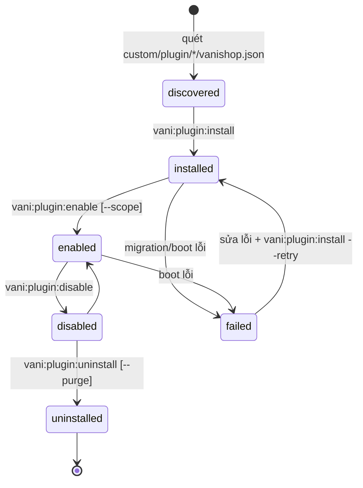

# Plugin System

> Trạng thái: **Designed**. Loader, manifest, CLI chưa có code. Quyết định: [ADR-003](../19-adr/ADR-003-plugin-architecture.md).

## 1. Hướng phụ thuộc

```text
Plugin  ──►  Core Contracts / Events / Hooks / Registry  ──►  Core
Core    ──X  Plugin            (cấm — arch test, rule R4)
Plugin  ──►  Plugin khác        (chỉ qua Contracts/Events của plugin đó, khai báo trong requires)
```

## 2. Cấu trúc plugin

Plugin đặt tại `custom/plugin/<Name>/`, namespace `Plugin\<Name>\`. Cấu trúc giống một module, nhưng có thể mỏng hơn tuỳ độ phức tạp:

```
custom/plugin/VietQr/
├── vanishop.json                 # manifest
├── VietQrServiceProvider.php     # extends Modules\Extension\PluginServiceProvider
├── Contracts/  Events/           # (tuỳ chọn) API công khai cho plugin khác
├── Domain/                       # quy tắc của plugin (thuần PHP)
├── Application/                  # use case của plugin
├── Infrastructure/               # client HTTP gọi dịch vụ ngoài, adapter
│   └── VietQrGateway.php         # implements PaymentGateway
├── Http/
│   ├── Controllers/WebhookController.php
│   └── routes/{webhooks,admin-api}.php
├── Config/vietqr.php
├── Database/{migrations,factories}/   # bảng plg_vietqr_*
├── Resources/{views,lang,js/Pages}/
├── settings-schema.json
├── README.md                     # đặc tả + hướng dẫn cấu hình
└── Tests/{Unit,Feature,Contract}/
```

## 3. Manifest `vanishop.json`

```json
{
  "id": "vani.vietqr",
  "name": { "vi": "Thanh toán VietQR", "en": "VietQR Payment" },
  "version": "1.0.0",
  "kind": "payment_gateway",
  "provider": "Plugin\\VietQr\\VietQrServiceProvider",
  "requires": {
    "vanishop": "^1.0",
    "plugins": {}
  },
  "conflicts": [],
  "scopes": ["legal_entity", "brand", "channel"],
  "permissions": ["payments.write"],
  "settings_schema": "settings-schema.json",
  "author": "VaniShop Team"
}
```

| Trường | Bắt buộc | Ý nghĩa |
|---|---|---|
| `id` | ✔ | `vendor.name`, duy nhất, không đổi |
| `version` | ✔ | SemVer |
| `kind` | ✔ | `payment_gateway`, `shipping_carrier`, `promotion`, `connector`, `notification_channel`, `storefront`, `business`, `theme_extension` |
| `provider` | ✔ | ServiceProvider |
| `requires.vanishop` | ✔ | Ràng buộc phiên bản Core (Composer semver) |
| `requires.plugins` | | `{ "vani.einvoice": "^1.0" }` |
| `conflicts` | | Danh sách plugin id không được bật cùng lúc |
| `scopes` | | Phạm vi được bật/cấu hình |
| `permissions` | | Quyền plugin cần; hiển thị khi cài |
| `settings_schema` | | JSON Schema cấu hình |

## 4. Vòng đời



| Trạng thái | ServiceProvider được `register()`? | Tham gia flow? |
|---|---|---|
| discovered | Không | Không |
| installed | Có (để route webhook/Admin cấu hình chạy được) | Không |
| enabled (theo scope) | Có | Có, trong scope được bật |
| disabled | Có | Không |
| failed | **Không** | Không |

Lưu trữ: `plugins(id, version, status, installed_at, last_error)`, `plugin_scopes(plugin_id, scope_type, scope_id, enabled)`. Manifest đã resolve được cache vào `bootstrap/cache/vanishop-plugins.php` để lúc boot không phải truy vấn DB.

## 5. CLI

```bash
php artisan vani:plugin:list                      # id, version, trạng thái, scope, tương thích
php artisan vani:plugin:install vani.vietqr       # kiểm tra deps → chạy migration → installed
php artisan vani:plugin:enable vani.vietqr --scope=brand:lumiere
php artisan vani:plugin:disable vani.vietqr [--scope=...]
php artisan vani:plugin:uninstall vani.vietqr [--purge]   # --purge: rollback migration, xoá bảng plg_*
php artisan vani:plugin:upgrade vani.vietqr       # chạy migration mới khi version tăng
php artisan vani:plugin:hooks [vani.vietqr]       # hook công khai & listener của plugin
php artisan vani:plugin:doctor                    # kiểm tra tương thích, deps, conflict, contract test
```

## 6. Dependency resolution và tương thích

1. Đọc mọi manifest, kiểm tra `requires.vanishop` với phiên bản Core (`config('vanishop.version')`), dùng `composer/semver`.
2. Dựng đồ thị `requires.plugins`; **topological sort** để xác định thứ tự install/boot; phát hiện vòng thì báo lỗi, không cài.
3. Kiểm tra `conflicts` hai chiều.
4. `enable` plugin A khi dependency B chưa enable trong cùng scope → từ chối (hoặc `--with-deps`).
5. `disable`/`uninstall` B khi còn plugin phụ thuộc đang enable → từ chối.
6. Nâng Core làm plugin không còn tương thích → plugin chuyển `failed` với lý do `incompatible_core`, Core vẫn chạy.

## 7. Migration, upgrade, rollback

| Hành động | Hành vi |
|---|---|
| install | Chạy migration trong `Database/migrations` của plugin (bảng `plg_<plugin>_*`), ghi version |
| upgrade | So version manifest với version đã cài → chạy migration chưa chạy; migration **phải tương thích ngược** (expand/contract) |
| disable | Không đụng dữ liệu |
| uninstall | Giữ bảng (mặc định). `--purge` chạy `down()` của các migration theo thứ tự ngược rồi xoá dữ liệu cấu hình |
| Lỗi migration | MySQL không rollback được DDL → plugin chuyển `failed` + `last_error`; migration phải idempotent (`if (! Schema::hasTable(...))`) để chạy lại an toàn |

## 8. Xử lý lỗi và cô lập

| Tình huống | Hành vi |
|---|---|
| Exception trong `register()`/`boot()` | Loader bắt lỗi, đánh dấu plugin `failed`, ghi log + cảnh báo, **tiếp tục boot Core** |
| Plugin làm hỏng request liên tục | Circuit breaker theo plugin: quá N lỗi/phút ở slot/filter không giao dịch thì tạm bỏ qua plugin đó 5 phút |
| Sự cố nghiêm trọng | **Safe mode**: `VANI_PLUGINS_SAFE_MODE=true` → không nạp plugin nào; Core vẫn bán được bằng mặc định (COD, flat rate) |
| Cổng thanh toán plugin lỗi | `PaymentGateway::isAvailable()` trả false khi health check fail → ẩn phương thức |

## 9. `PluginServiceProvider`

```php
namespace Plugin\VietQr;

use Modules\Extension\PluginServiceProvider;
use Modules\Payment\Contracts\PaymentGateway;

final class VietQrServiceProvider extends PluginServiceProvider
{
    public function register(): void
    {
        $this->app->tag([Infrastructure\VietQrGateway::class], 'vani.payment.gateways');
    }

    public function boot(): void
    {
        $this->webhookRoutes(__DIR__.'/Http/routes/webhooks.php');
        $this->adminPages(__DIR__.'/Resources/js/Pages');
        $this->settingsSchema(__DIR__.'/settings-schema.json');
        $this->migrations(__DIR__.'/Database/migrations');
        $this->translations(__DIR__.'/Resources/lang', 'vietqr');
    }
}
```

## 10. Quy tắc cho người viết plugin

1. Chỉ dùng extension point public ([catalog](../04-extension/extension-point-catalog.md)).
2. Bảng riêng `plg_<plugin>_*`; không sửa bảng hay migration của Core.
3. Gọi HTTP ra ngoài phải có timeout, retry, circuit breaker, log qua `integration_logs`, và mang correlation id.
4. Có test: unit + feature + **contract test của contract mình implement**. CI chạy test của mọi plugin.
5. Có README đặc tả (phạm vi, cấu hình, bảng dữ liệu, event nghe/phát).
6. Tuân thủ [clean-room](../01-principles/clean-room-license.md) và [architecture rules](../01-principles/architecture-rules.md).
7. Thiếu extension point thì mở PR vào Core, không vá Core từ trong plugin (rule R1).
