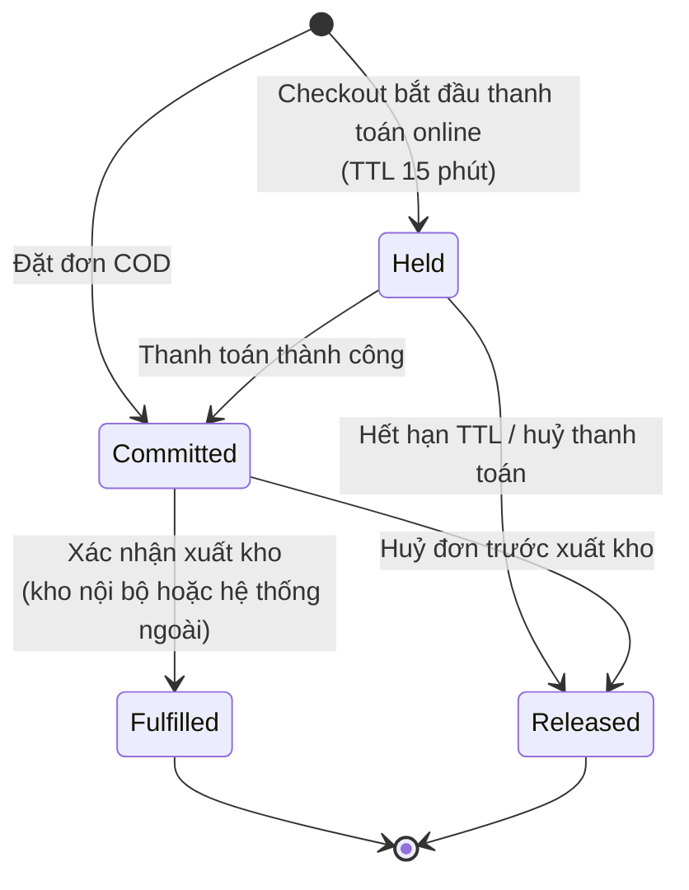

# 05 — Tồn kho & Cửa hàng vật lý

> **Core**: §1–§6 (location, tồn, reservation, ATS, đồng bộ, sourcing mặc định). **Plugin**: §6 chiến lược nâng cao (`AdvancedSourcing`), §7 omnichannel (`StoreOmnichannel`), channel allocation (`ChannelAllocation`) — xem [17](17-danh-muc-plugin.md).

## 1. Nguyên tắc

1. **Tồn vật lý** (on-hand) thuộc về nguồn gốc được cấu hình **theo location**: mặc định VaniShop (nhập/import/điều chỉnh), chuyển sang ERP/POS/ODO khi hệ thống đó kết nối qua module Integration ([08 §7](08-module-integration.md)). **VaniShop luôn nắm tồn có thể bán online** (Available-To-Sell — ATS) và **giữ hàng** (reservation).
2. **Không bao giờ trừ trực tiếp** một con số "quantity" trên SKU khi khách đặt hàng — mọi thay đổi đi qua **reservation** và **stock movement** có lý do.
3. Tồn kho luôn gắn với **location**.

## 2. Location

| Trường | Ý nghĩa |
|---|---|
| `code`, `name`, `type` | `warehouse` (kho), `store` (cửa hàng), `virtual` (ký gửi, sàn) |
| `legal_entity_id` | Pháp nhân sở hữu hàng tại location |
| `address`, `geo(lat,lng)` | Dùng cho tìm cửa hàng gần nhất, tính phí ship |
| `capabilities` | `ship_online_orders`, `pickup_in_store` (BOPIS), `accept_returns` |
| `brands` | Danh sách brand được bán từ location này |
| `priority`, `cutoff_time` | Ưu tiên phân bổ; giờ chốt đơn trong ngày |
| `external_code` | Mã kho tương ứng trên ERP/ODO |

## 3. Các con số tồn

```
on_hand        : tồn vật lý (nội bộ, hoặc đồng bộ từ hệ thống nguồn gốc của location)
reserved       : đang giữ cho đơn online chưa xuất kho
safety_stock   : tồn an toàn không bán online (theo location / variant / channel)
ATS(location)  = max(0, on_hand - reserved - safety_stock)
ATS(channel)   = Σ ATS(location) với location phục vụ channel đó
```

- Cửa hàng thường có `safety_stock` cao hơn (hàng trưng bày, rủi ro lệch tồn).
- Có thể cấu hình **channel allocation** (ví dụ chỉ bán tối đa 30% tồn cho Shopee) — Phase 3.
- Bảng `stock_levels(location_id, variant_id, on_hand, reserved, safety_stock, version, synced_at)`.
- Bảng `stock_movements` ghi sổ (append-only) mọi biến động: `sync_from_erp`, `reserve`, `release`, `commit` (xuất kho), `return`, `adjust`.

## 4. Vòng đời reservation



- **Chống oversell**: reserve thực hiện trong transaction với `SELECT ... FOR UPDATE` trên dòng `stock_levels` (hoặc update có điều kiện `WHERE on_hand - reserved - safety_stock >= :qty`). Test concurrency bắt buộc.
- **Flash sale**: dùng bộ đếm nguyên tử Redis (`DECRBY`) làm cổng chặn phía trước, đối chiếu DB sau.
- Job `ReleaseExpiredReservations` chạy mỗi phút.
- Khi xác nhận xuất kho (`Fulfilled`): nếu VaniShop là nguồn gốc on-hand của location → trừ `reserved` và `on_hand` cùng lúc (movement `commit`); nếu on-hand thuộc hệ thống ngoài → chỉ trừ `reserved`, `on_hand` giảm theo lần đồng bộ tiếp theo (sự kiện có `movement_id` để khử trùng lặp).

## 5. Đồng bộ tồn với hệ thống ngoài (qua module Integration)

| Cơ chế | Khi nào | Ghi chú |
|---|---|---|
| **Delta push** (`PUT /api/integration/v1/inventory/levels`) | Mỗi biến động | Ưu tiên; gửi `on_hand` tuyệt đối + `version`/timestamp để bỏ qua bản cũ |
| **Full snapshot** | Mỗi đêm hoặc theo yêu cầu | Đối chiếu, sửa lệch; báo cáo chênh lệch |
| **Pull theo SKU** | Trước khi xác nhận đơn giá trị cao (tuỳ chọn) | Timeout ngắn, lỗi thì dùng số liệu local |

Chi tiết giao thức: [08](08-module-integration.md).

## 6. Phân bổ đơn (Order Sourcing)

Khi đơn được xác nhận, core gọi `SourcingStrategy` đang bật cho brand ([10 §6](10-hook-va-plugin.md)):

```php
interface SourcingStrategy
{
    public function code(): string;
    /** @return list<AllocationProposal> đề xuất location + dòng hàng + số lượng */
    public function allocate(SourcingRequest $request): array;
}
```

**Core — `priority_first_fit` (mặc định):**

1. Lọc location có capability `ship_online_orders`, phục vụ brand, đủ ATS.
2. Ưu tiên **1 location đủ toàn bộ đơn** (tránh tách kiện), theo `priority`.
3. *(Plugin `AdvancedSourcing`)* chấm điểm theo khoảng cách tới khách, chi phí vận chuyển ước tính, tải hiện tại của location.
4. Không location nào đủ → tách đơn thành nhiều shipment (nếu brand cho phép) hoặc chuyển trạng thái chờ điều phối thủ công.
5. Với `fulfillment.mode = external` (khi có ODO): kết quả sourcing chỉ là **đề xuất**; hệ thống ngoài có thể ghi đè bằng location thực tế qua Integration API.

> Mặc định hiện tại `fulfillment.mode = internal`: VaniShop tự phân bổ kho. Vai trò ODO tạm hoãn ([ADR-0007](adr/0007-integration-module-odo-deferred.md)).

## 7. Omnichannel với cửa hàng *(plugin `StoreOmnichannel`)*

> Core chỉ cung cấp: location `type = store`, capability (`pickup_in_store`, `accept_returns`), contract `FulfillmentMethod` và `SourcingStrategy`, phân quyền theo location. Toàn bộ tính năng dưới đây là **yêu cầu đầu vào cho plugin**.

| Tính năng | Mô tả | Phase |
|---|---|---|
| **Tra tồn tại cửa hàng** | PDP hiển thị "còn hàng tại 3 cửa hàng gần bạn" (theo tỉnh/thành, không hiển thị con số chính xác) | 2 |
| **BOPIS** (Click & Collect) | Khách đặt online, chọn cửa hàng nhận. Cửa hàng xác nhận soạn hàng → SMS/ZNS "hàng đã sẵn sàng" → khách nhận, xuất trình mã | 2 |
| **Ship-from-store** | Cửa hàng là location xuất đơn online | 3 |
| **Endless aisle** | Nhân viên cửa hàng đặt online cho khách khi cửa hàng hết size | 3 |
| **Trả hàng online tại cửa hàng** | Trả/đổi đơn online tại bất kỳ cửa hàng nào có `accept_returns` | 3 |
| **Chuyển kho** | Đề xuất chuyển hàng giữa location (thực hiện trên ERP/ODO hoặc nội bộ) | 4 |

- Cửa hàng thao tác qua **Store App** (web responsive trong Admin, quyền `store_staff` giới hạn theo location) hoặc qua POS hiện hữu tích hợp API.
- SLA BOPIS: soạn hàng trong 2 giờ làm việc; giữ hàng tại quầy 3 ngày, quá hạn tự huỷ và hoàn tiền.
