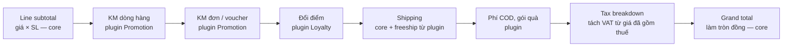
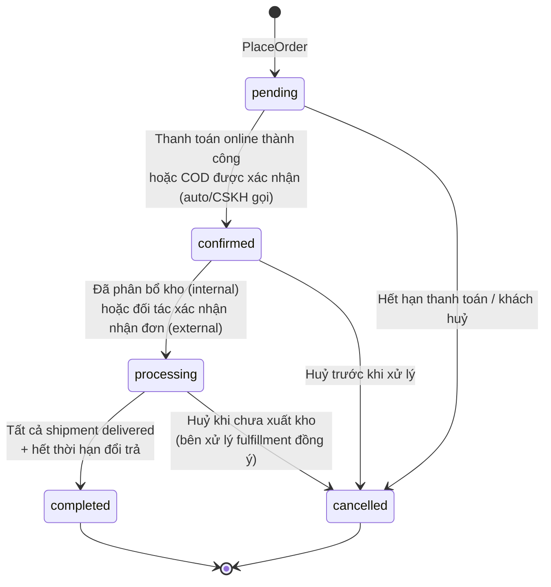
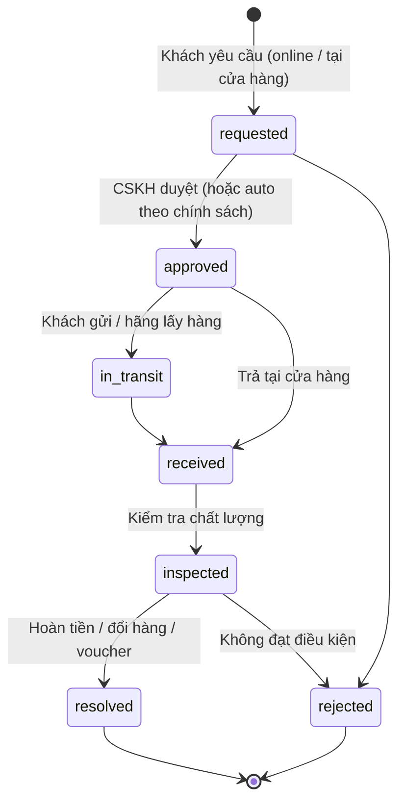

# 06 — Đơn hàng, Thanh toán, Giao hàng, Đổi trả

> **Core**: giỏ hàng, totals pipeline, checkout, 4 chiều trạng thái đơn, khung thanh toán, khung giao hàng, RMA cơ bản. **Plugin**: cổng thanh toán, hãng vận chuyển, đối soát COD, khuyến mãi, loyalty, chống bom hàng — các mục được đánh dấu *(plugin)*, danh mục ở [17](17-danh-muc-plugin.md).

## 1. Giỏ hàng

- Giỏ hàng **theo channel** (kênh brand) — khách có thể có giỏ ở nhiều brand cùng lúc; kênh tập đoàn có giỏ đa brand.
- Khách vãng lai: giỏ gắn `cart_token` (cookie); khi đăng nhập → **gộp giỏ** (cộng dồn số lượng, giới hạn theo ATS).
- Dòng giỏ lưu `variant_id`, `quantity`, **ảnh chụp giá** tại thời điểm thêm để cảnh báo "giá đã thay đổi".
- Giỏ bỏ quên: event `CartAbandoned` (sau 1h/24h) → Notification/marketing automation (có consent).

## 2. Pipeline tính tiền (Totals Pipeline)

Thiết kế riêng của VaniShop: tổng tiền là kết quả của chuỗi **Calculator** có thứ tự, mỗi bước trả về **Adjustment** có thể truy vết.



```php
interface TotalsCalculator
{
    /** Thứ tự chạy trong pipeline, nhỏ chạy trước. */
    public function priority(): int;

    public function calculate(TotalsContext $context): TotalsContext;
}
```

- Mỗi adjustment lưu: `type` (promotion/shipping/fee/loyalty/tax), `source_id` (mã chương trình), `label`, `amount` (âm = giảm), `target` (order hoặc order_line).
- Giảm giá cấp đơn được **phân bổ xuống từng dòng** (theo tỷ lệ giá trị) — cần cho đổi trả một phần, hoá đơn, và tách đơn đa brand.
- **Core** chỉ có calculator: subtotal, shipping, tax, rounding. Khuyến mãi, điểm thưởng, phí phụ… do **plugin** thêm qua tag `vani.totals.calculators` (xem [10 §6](10-hook-va-plugin.md)). Core đảm bảo: thứ tự theo `priority`, không để tổng âm, phân bổ adjustment cấp đơn xuống dòng.
- Cùng 1 pipeline dùng cho giỏ, checkout, và tính lại khi admin sửa đơn.

## 3. Checkout

Checkout 1 trang, tối ưu mobile:

1. **Liên hệ**: số điện thoại (bắt buộc — định danh chính ở VN), email (tuỳ chọn), họ tên.
2. **Giao hàng**: địa chỉ theo địa giới 2 cấp mới (Tỉnh/Thành → Phường/Xã, xem [09](09-dac-thu-viet-nam.md)) **hoặc** nhận tại cửa hàng (*plugin `StoreOmnichannel`* qua `FulfillmentMethod`).
3. **Phương thức vận chuyển**: danh sách + phí + ngày giao dự kiến.
4. **Thanh toán**: danh sách từ các `PaymentGateway` đang bật (core: COD, chuyển khoản thủ công; plugin: VietQR, ví, thẻ, BNPL).
5. **Trường bổ sung từ plugin** qua registry `checkoutFields()` — ví dụ thông tin xuất hoá đơn công ty (*plugin `EInvoice`*).
6. **Voucher / điểm** (*plugin `Promotion`, `Loyalty`* — UI chèn qua slot `vani.storefront.checkout.before_submit`).
7. Đặt hàng → `PlaceOrder` action (idempotent theo `checkout_token`).

`PlaceOrder` trong **1 transaction DB**: chạy lại totals pipeline → chạy các `CheckoutValidator` → reserve tồn → tạo order + lines + adjustments → gọi hook action `vani.checkout.order.placing` (plugin ghi dữ liệu của mình trong cùng transaction, ví dụ usage voucher) → ghi outbox event `OrderPlaced`. Mọi gọi ra ngoài (cổng thanh toán, hãng VC, webhook đối tác) xảy ra **sau commit**.

Chống gian lận/spam COD (*plugin `CodRiskGuard`* qua `CheckoutValidator`): giới hạn số đơn COD chưa giao/số điện thoại, danh sách đen số điện thoại "bom hàng", OTP khi đơn giá trị cao.

## 4. Trạng thái đơn hàng — 4 chiều độc lập

Thay vì 1 trường status duy nhất, VaniShop tách trạng thái theo **chiều trách nhiệm** để phản ánh đúng thực tế omnichannel:

| Chiều | Giá trị | Ai thay đổi |
|---|---|---|
| `order_status` | `pending` → `confirmed` → `processing` → `completed` / `cancelled` | Hệ thống, CSKH |
| `payment_status` | `unpaid`, `authorized`, `paid`, `partially_refunded`, `refunded`, `cod_pending`, `cod_collected`, `failed` | Cổng TT, đối soát COD |
| `fulfillment_status` | `unfulfilled`, `allocated`, `picking`, `packed`, `shipped`, `delivered`, `returned_to_sender` (tổng hợp từ các shipment) | Kho nội bộ, hãng VC, cửa hàng, hệ thống ngoài (ODO khi có) |
| `return_status` | `none`, `requested`, `in_progress`, `partially_returned`, `returned` | CSKH, kho |

### Máy trạng thái `order_status`



- Mỗi chuyển trạng thái đi qua `OrderStateMachine::transition($order, $to, $reason, $actor)`: kiểm tra transition hợp lệ (enum + bảng chuyển), ghi `order_events` (lịch sử, ai làm, nguồn: `customer|staff|system|integration:<client>|carrier|gateway`), phát domain event (`OrderConfirmed`, `OrderCancelled`...).
- Side-effect gắn vào **listener của event**, không hard-code trong state machine (khác biệt thiết kế có chủ đích).
- Trạng thái hiển thị cho khách là **nhãn tổng hợp** tính từ 4 chiều (ví dụ "Đang giao", "Chờ thanh toán").

## 5. Thanh toán

### 5.1 Kiến trúc

```php
interface PaymentGateway
{
    public function code(): string;                                 // 'vnpay', 'momo', 'vietqr', 'cod'...
    public function isAvailable(PaymentContext $context): bool;     // theo brand, số tiền, thiết bị
    public function initiate(Payment $payment): PaymentInitiation;  // redirect URL / QR / deeplink
    public function handleCallback(Request $request): GatewayResult; // IPN / webhook
    public function refund(Payment $payment, Money $amount): GatewayResult;
}
```

- Bảng `payments` (1 đơn có thể nhiều payment: trả một phần bằng điểm/ví) và `payment_transactions` (mọi lần gọi/nhận từ cổng, raw payload đã che thông tin nhạy cảm).
- **Credential theo pháp nhân** (merchant ID của công ty nào nhận tiền).
- **IPN/webhook là nguồn xác nhận** — không tin redirect của trình duyệt. Xác minh chữ ký, idempotent theo mã giao dịch cổng.
- Job `ReconcilePendingPayments`: truy vấn trạng thái giao dịch treo quá 15 phút.

### 5.2 Phương thức cho VN

| Phương thức | Nơi triển khai | Ghi chú |
|---|---|---|
| **COD** | **Core** | Phổ biến nhất. Giới hạn giá trị theo cấu hình; phí COD và chống bom hàng qua plugin `CodRiskGuard` |
| **Chuyển khoản thủ công** | **Core** | Hiển thị tài khoản theo pháp nhân, nhân viên xác nhận đã nhận tiền |
| **VietQR chuyển khoản** | Plugin `VietQr` | QR động theo chuẩn NAPAS kèm nội dung = mã đơn; xác nhận tự động qua webhook ngân hàng/dịch vụ trung gian (Casso, SePay, API ngân hàng) |
| **VNPay / OnePay / Payoo** | Plugin | Thẻ nội địa, quốc tế, QR ứng dụng ngân hàng |
| **MoMo / ZaloPay / ShopeePay** | Plugin | Ví điện tử, deeplink trên mobile |
| **Trả góp / BNPL** | Plugin `Bnpl` | Kredivo, Home PayLater, Fundiin… — Phase 3 |

## 6. Giao hàng

### 6.1 Kiến trúc

```php
interface ShippingCarrier
{
    public function code(): string; // core: 'flat_rate', 'manual'; plugin: 'ghn', 'ghtk', 'viettelpost'...
    public function quote(ShipmentDraft $draft): Collection;              // danh sách dịch vụ + phí + ETA
    public function createShipment(Shipment $shipment): CarrierShipment;  // mã vận đơn, nhãn in
    public function cancel(Shipment $shipment): void;
    public function parseWebhook(Request $request): CarrierEvent;         // trạng thái chuẩn hoá
}
```

- **Core** có sẵn `flat_rate` (phí cố định/theo bảng vùng, ngưỡng miễn phí) và `manual` (nhân viên nhập hãng + mã vận đơn). Tạo vận đơn tự động, webhook trạng thái là **plugin** của từng hãng.
- Mặc định (`fulfillment.mode = internal`): VaniShop tạo vận đơn qua carrier đang bật. Khi có hệ thống ngoài đảm nhiệm (`external`, ví dụ ODO): VaniShop chỉ dùng `quote` để báo phí, hệ thống ngoài tạo vận đơn và gửi lại mã vận đơn + trạng thái qua Integration API ([08](08-module-integration.md)).
- Phí vận chuyển hiển thị: `bảng phí brand` (flat theo vùng/ngưỡng miễn phí) **hoặc** `phí thực từ hãng`. Đa số brand thời trang dùng bảng phí cố định cho dễ hiểu.
- Trạng thái hãng chuẩn hoá về: `created`, `picked_up`, `in_transit`, `out_for_delivery`, `delivered`, `failed_attempt`, `returning`, `returned`.

### 6.2 Shipment

- 1 đơn → N shipment (tách kho, giao thiếu). Mỗi shipment: location xuất, danh sách dòng + số lượng, hãng, mã vận đơn, COD amount, trạng thái, lịch sử.
- Trang **tra cứu đơn** cho khách không cần đăng nhập (mã đơn + số điện thoại).

### 6.3 Đối soát COD *(plugin `CodReconciliation`)*

- Hãng VC gửi bảng kê đối soát (API/file) → import → khớp theo mã vận đơn → `payment_status = cod_collected`, ghi phí VC thực tế, chênh lệch → hàng chờ xử lý cho kế toán.
- Kết quả đối soát đẩy sang ERP (bút toán công nợ hãng VC).

## 7. Đổi trả (Returns / RMA)



- **Core**: quy trình trạng thái, tính tiền hoàn, cập nhật tồn, hoàn tiền thủ công. Chính sách đổi trả **theo brand** (số ngày, điều kiện, hàng sale, phí) cấu hình qua `ReturnPolicy`. Hoàn tiền tự động qua cổng là việc của plugin thanh toán; trả hàng tại cửa hàng thuộc plugin `StoreOmnichannel`.
- Hình thức giải quyết: hoàn tiền về nguồn, hoàn vào **ví/voucher** (store credit), **đổi size/màu** (tạo đơn đổi liên kết, giữ hàng mới ngay).
- Số tiền hoàn tính từ **giá đã phân bổ khuyến mãi** của dòng hàng (mục 2).
- Hàng trả nhập lại location nào, sellable hay không → cập nhật tồn nội bộ và phát webhook cho ERP/hệ thống ngoài.
- Hoàn tiền đơn COD: chuyển khoản thủ công/qua API ngân hàng, cần thông tin tài khoản khách (mã hoá).

## 8. Sự kiện domain chính

| Event | Phát khi | Listener tiêu biểu |
|---|---|---|
| `OrderPlaced` | Tạo đơn | Notification, Loyalty (điểm chờ), Integration (chờ confirm) |
| `OrderConfirmed` | Đơn hợp lệ | Fulfillment (sourcing), Integration (webhook `order.confirmed`), Analytics |
| `PaymentCaptured` / `PaymentRefunded` | Cổng xác nhận | Order state, ERP |
| `ShipmentStatusChanged` | Hãng VC / hệ thống ngoài | Notification (ZNS), fulfillment_status |
| `OrderCompleted` | Hết hạn đổi trả | Loyalty (điểm khả dụng), E-invoice |
| `OrderCancelled` | Huỷ | Inventory release, Payment refund, Voucher hoàn lượt |
| `ReturnResolved` | Hoàn tất đổi trả | Payment refund, Inventory, ERP, Loyalty (trừ điểm) |
