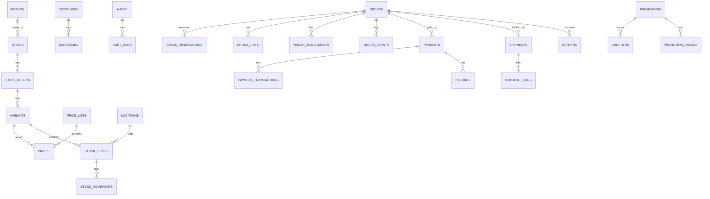

# Database

> Trạng thái: **Partially Implemented**. Đã có migration của Tenancy, Brand, Channel, Identity, Extension, Catalog, Pricing, Inventory (trừ transfer/reconciliation), Cart, Promotion, Ordering (orders, order_lines, order_adjustments, order_events), Shared (`idempotency_keys`, `number_sequences`) ([status](../00-overview/status.md)); phần còn lại Designed. Quyết định: [ADR-016](../19-adr/ADR-016-mysql.md). Schema dưới đây theo định hướng một cửa hàng ([ADR-028](../19-adr/ADR-028-single-store-brand-as-catalog.md)); migration hiện có vẫn mang `brand_id`/`channel_id` phạm vi và các bảng Brand/Channel cũ — gỡ theo [store-and-brand §6](../12-store/store-and-brand.md).

## 1. Quy ước

| Chủ đề | Quy ước |
|---|---|
| Engine | MySQL 8.4 LTS, InnoDB, `utf8mb4`, `utf8mb4_0900_ai_ci`, isolation `READ COMMITTED`. SQLite chỉ cho unit test không đụng tính năng đặc thù |
| Primary key | `BIGINT UNSIGNED AUTO_INCREMENT` (`id`). Thực thể lộ ra ngoài (order, customer, cart, payment, return) có thêm `public_id CHAR(26)` ULID, unique |
| Foreign key | **Trong cùng module**: bắt buộc FK. **Từ downstream sang upstream kernel** (ví dụ `order_lines.variant_id → variants`): cho phép FK với `ON DELETE RESTRICT`. **Core → Plugin**: cấm. **Plugin → Core**: FK `RESTRICT` |
| Tên | Bảng tiếng Anh, số nhiều, `snake_case`; bảng plugin `plg_<plugin>_*` |
| Tiền | `<x>_amount BIGINT` + `currency_code CHAR(3)` ([money](../02-architecture/money.md)). Cấm `DECIMAL/FLOAT/DOUBLE` |
| Tỷ lệ | Basis points `INT` (`tax_rate_bp = 1000` = 10%) |
| Thời gian | `DATETIME(6)` lưu **UTC** cho bảng sự kiện/ledger; `DATETIME` cho còn lại; không dùng `TIMESTAMP` |
| Enum | `VARCHAR` + PHP backed enum (không dùng ENUM của MySQL) |
| JSON | Cột `json` cho snapshot, payload, cấu hình, `meta`; cần lọc thì tạo generated column + index |
| Soft delete | Chỉ cho Catalog (style), Content, cấu hình. **Không** cho order, payment, ledger. Customer dùng **ẩn danh hoá** thay cho xoá |
| Optimistic lock | Cột `lock_version INT` trên aggregate được sửa qua Admin: `styles`, `price_lists`, `promotions`, `orders`, `shipments`, `payments`, `locations` |
| Pessimistic lock | `SELECT … FOR UPDATE` cho `stock_levels`, `vouchers`, `number_sequences`, `carts` (khi checkout), `payments` (khi IPN/refund) |
| Phạm vi | Không có cột phạm vi brand/kênh: mọi dữ liệu thuộc một cửa hàng. `brand_id` chỉ xuất hiện như **thuộc tính catalog** (`styles.brand_id`) và snapshot (`order_lines.brand_id`) |
| Append-only | `stock_movements`, `order_events`, `payment_transactions`, `audit_logs`, `price_history`, `customer_consent_events`, `shipment_events`, `integration_logs`, `integration_events` |

## 2. Invariant: DB enforce hay App enforce

| Invariant | DB | App |
|---|---|---|
| SKU duy nhất | `UNIQUE(variants.sku)` | |
| Một dòng tồn / (location, variant) | `UNIQUE(stock_levels.location_id, variant_id)` | |
| `reserved ≥ 0`, `safety_stock ≥ 0` | `CHECK` | |
| Không reserve vượt available | | Khoá dòng + domain `StockLevel::reserve` |
| Số đơn duy nhất | `UNIQUE(orders.number)` | Sinh từ `number_sequences` |
| Trạng thái đơn chuyển hợp lệ | | `OrderStateMachine` (+ `lock_version`) |
| Order line bất biến | | Không có API sửa; review |
| Σ shipment qty ≤ order qty | | Khoá `order_lines` khi tạo shipment |
| Σ refund ≤ số đã thu | | Khoá `payments` khi tạo refund |
| IPN không xử lý hai lần | `UNIQUE(payment_transactions.gateway_code, gateway_transaction_id, type)` | |
| Idempotency request | `UNIQUE(idempotency_keys.scope, key)` | So `request_hash` |
| Inbox không trùng | `UNIQUE(integration_inbox.system, external_event_id)` | |
| Voucher không vượt lượt | `CHECK(used_count >= 0)` | `UPDATE … WHERE used_count < usage_limit` |
| Số lượng dòng giỏ/đơn > 0 | `CHECK(quantity > 0)` | |
| Tiền đơn không âm | `CHECK(total_amount >= 0)` | Guard totals pipeline |
| Tổng thuế/giảm giá khớp các dòng | | Domain totals + test |
| Ledger không sửa | (khuyến nghị) DB user ứng dụng không có quyền `UPDATE/DELETE` trên bảng ledger | Không có API |

Nguyên tắc: invariant **đơn bản ghi** (unique, not null, check) do DB enforce; invariant **đa bản ghi/quy trình** do App enforce trong transaction có khoá, và phải có test.

## 3. ERD tổng quan (Core)

## 4. Bảng theo context

| Context | Bảng |
|---|---|
| Shared | `currencies`, `administrative_units`, `administrative_unit_mappings`, `idempotency_keys`, `number_sequences` |
| Tenancy (cửa hàng) | `legal_entities` (một bản ghi: pháp nhân vận hành), `settings(key, value json, is_encrypted)` (một cấp; theme tokens là một setting) |
| Identity | `staff_users`, `roles`, `role_permissions(role_id, permission)`: mã permission do module/plugin khai báo trong `PermissionRegistry` (không có bảng `permissions`), `'*'` = mọi quyền; `staff_role_assignments(staff_user_id, role_id, scope_type[owner|location], scope_id)`, `audit_logs` |
| Extension | `plugins(id VARCHAR PK = plugin id, status)` (bật/tắt toàn cửa hàng; `plugin_scopes` bỏ ở slice 12) |
| Catalog | `brands`, `styles(brand_id NULL, meta json)`, `style_translations`, `style_colors`, `variants(meta json)`, `attributes`, `attribute_values`, `style_attribute_values`, `colors`, `sizes`, `size_charts`, `categories`, `category_translations`, `category_style`, `collections`, `collection_rules`, `collection_style`, `media` |
| Pricing | `price_lists`, `prices`, `price_history` |
| Inventory | `locations`, `stock_levels`, `stock_reservations`, `stock_movements`, `stock_transfers`, `stock_transfer_lines`, `inventory_reconciliations`, `inventory_reconciliation_lines` |
| Customer | `customers(meta json)`, `customer_consents`, `customer_consent_events`, `customer_addresses`, `customer_otps`, `customer_tokens`, `customer_groups`, `customer_group_customer` |
| Cart | `carts(meta json)`, `cart_lines` |
| Promotion | `promotions`, `promotion_rules`, `promotion_actions`, `vouchers`, `promotion_usages` |
| Ordering | `orders(source, meta json)`, `order_lines(brand_id, brand_name, meta json)`, `order_adjustments`, `order_events`, `order_notes` |
| Payment | `payments`, `payment_transactions`, `refunds` |
| Fulfillment | `shipments`, `shipment_lines`, `shipment_events`, `shipping_rate_tables` |
| Returns | `returns`, `return_lines`, `return_events` |
| Content | `pages`, `page_translations`, `page_blocks`, `menus`, `menu_items`, `banners`, `redirects` |
| Notification | `notification_templates`, `notification_logs` (unique `idempotency_key`) |
| Integration | `integration_clients`, `integration_client_keys`, `integration_webhook_subscriptions`, `integration_events` (event feed, append-only), `integration_ownerships`, `integration_outbox`, `integration_inbox`, `integration_logs`, `integration_mappings`, `external_references`, `integration_reconciliations` |

Bảng của plugin: xem README của từng plugin; ví dụ trong [marketplace](../13-marketplace/marketplace.md), [loyalty spec](../05-plugin/specs/loyalty.md).

## 5. Index quan trọng

| Bảng | Index |
|---|---|
| `orders` | `(placed_at)`, `(source, placed_at)`, `(customer_id, placed_at)`, `(order_status, fulfillment_status)`, unique `number`, unique `public_id` |
| `stock_levels` | unique `(location_id, variant_id)`, `(variant_id)` |
| `stock_reservations` | `(status, expires_at)`, `(order_id)` |
| `integration_outbox` | `(status, next_attempt_at)`, `(aggregate_type, aggregate_id, created_at)` |
| `customers` | unique `phone_active` (generated), unique `email_normalized` |
| `variants` | unique `sku`, `(barcode)` |
| `prices` | unique `(price_list_id, variant_id, min_qty)` |

## 6. Migration

- Migration nằm trong `modules/<M>/Persistence/Database/migrations`, factory trong `modules/<M>/Persistence/Database/Factories` (chữ F hoa để khớp PSR-4 trên Linux), nạp qua ServiceProvider; plugin nằm trong `custom/plugin/
/Database/migrations`.
- Không sửa migration đã chạy trên production. Thay đổi phá vỡ theo **expand → migrate → contract** qua hai lần deploy.
- Bảng lớn: online schema change (`ALGORITHM=INSTANT/INPLACE`, hoặc `gh-ost`).
- Migration phải idempotent để chạy lại an toàn sau lỗi, vì MySQL không rollback được DDL.

## 7. Dữ liệu lớn

- Archive định kỳ `integration_logs`, `order_events`, `audit_logs` sang bảng lưu trữ; cân nhắc `PARTITION BY RANGE` theo tháng khi vượt khoảng 50 triệu dòng (bảng partition không có FK).
- Read replica cho báo cáo; module Reporting đọc từ replica.
