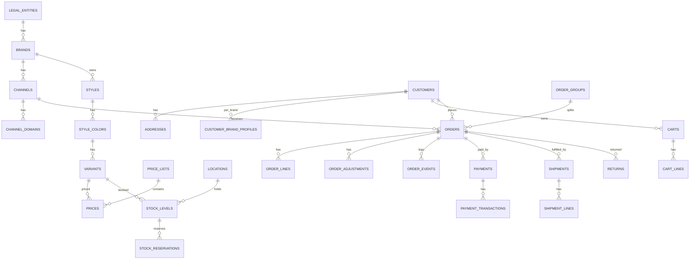

# 11 — Cơ sở dữ liệu

## 1. Quy ước chung

| Quy ước | Chi tiết |
|---|---|
| Engine | **MySQL 8.4 LTS**, InnoDB, charset `utf8mb4`, collation `utf8mb4_0900_ai_ci`, isolation `READ COMMITTED` ([ADR-0003](adr/0003-mysql.md)). SQLite chỉ dùng cho unit test nhanh — tránh SQL đặc thù ngoài migration/Query Builder |
| Khoá chính | `bigint` tự tăng (`id()`) cho bảng nội bộ; thêm `uuid`/`ulid` công khai (`public_id`) cho thực thể lộ ra URL/API (đơn, khách, giỏ) |
| Tên bảng | Tiếng Anh, số nhiều, `snake_case`. Bảng plugin: `plg_<plugin>_*` |
| Tiền | `bigint` (đồng) + `currency_code char(3)` khi cần. **Không** dùng `decimal`/`float` cho tiền VND |
| Thời gian | `datetime` (hoặc `datetime(6)` cho bảng sự kiện cần thứ tự chính xác), **luôn lưu UTC** (`config('app.timezone') = 'UTC'`, hiển thị `Asia/Ho_Chi_Minh`); không dùng `timestamp` (giới hạn năm 2038); `deleted_at` chỉ cho thực thể cần khôi phục |
| Enum | Lưu `string` + PHP backed enum (không dùng enum DB để dễ migrate) |
| JSON | Cột `json` cho dữ liệu linh hoạt (payload tích hợp, cấu hình block, snapshot địa chỉ) — không dùng cho dữ liệu cần lọc/join thường xuyên; nếu cần lọc, tạo **generated column** + index |
| Tìm kiếm tiếng Việt trong DB | Cột `search_text` (bỏ dấu, `đ→d`, lowercase) + FULLTEXT index `ngram` khi cần; storefront dùng Meilisearch |
| Phạm vi | Bảng thuộc brand có `brand_id` NOT NULL + index; bảng theo kênh có `channel_id` |
| Snapshot | Đơn hàng lưu snapshot (tên SP, SKU, giá, địa chỉ, KM) — không join ngược catalog để hiển thị đơn cũ |
| Append-only | `stock_movements`, `loyalty_ledger`, `order_events`, `audit_logs`, `price_history` — không update/delete |
| Dịch | `<entity>_translations(<entity>_id, locale, ...)` unique `(entity_id, locale)` |

## 2. ERD tổng quan

## 3. Danh sách bảng core theo module

> Chỉ gồm bảng của **core**. Bảng của plugin dùng tiền tố `plg_<plugin>_` và được mô tả trong README của plugin (xem §3.1 cuối mục).

### Tenancy
- `legal_entities` (name, tax_code, address, einvoice_config_id)
- `brands` (legal_entity_id, code, name, status, logo, settings snapshot)
- `channels` (brand_id NULL cho kênh tập đoàn, code, type[web|marketplace|pos|app|social], locale, currency_code, theme, status)
- `channel_domains` (channel_id, host, path_prefix, is_primary)
- `channel_brands` (kênh tập đoàn ↔ brand)
- `settings` (scope_type, scope_id, key, value json, is_encrypted)

### Catalog & Pricing
- `styles` (…, meta json), `style_translations`, `style_colors`, `variants` (sku unique, barcode, size_code, status, weight_gram, meta json)
- `attributes`, `attribute_values`, `style_attribute_values`
- `colors` (brand_id, code, name, color_family, hex), `sizes` (size_system, code, sort_order), `size_charts`
- `categories` (brand_id/channel_id, parent_id, path, position), `category_translations`, `category_style`
- `collections`, `collection_rules`, `collection_style`
- `media` (mediable_type, mediable_id, disk, path, role, alt, position)
- `price_lists`, `prices`, `channel_price_lists`, `price_history`

### Inventory
- `locations`, `location_brands`
- `stock_levels` (location_id, variant_id, on_hand, reserved, safety_stock, version) unique `(location_id, variant_id)`
- `stock_reservations` (stock_level_id, order_id/cart_id, qty, status, expires_at)
- `stock_movements` (append-only)

### Customer
- `customers` (public_id, phone unique, email, full_name, status, merged_into_id)
- `customer_brand_profiles`, `customer_consents` (brand_id, channel[email|sms|zns], purpose, granted_at, revoked_at, source)
- `addresses` (province_code, ward_code, street_line, receiver_name, phone, is_default)
- `customer_groups`, `customer_group_customer`

### Cart & Ordering
- `carts` (public_id, channel_id, customer_id NULL, token, currency_code, expires_at, meta json), `cart_lines`
- `order_groups` (public_id, number, customer_id, total_amount)
- `orders` (public_id, number, order_group_id, channel_id, brand_id, legal_entity_id, customer_id, order_status, payment_status, fulfillment_status, return_status, subtotal_amount, discount_amount, shipping_amount, fee_amount, tax_amount, total_amount, shipping_address json, billing_info json, placed_at, confirmed_at, cancelled_at, source, meta json)
- `order_lines` (variant_id, sku, name snapshot, color, size, qty, unit_price, compare_at_price, discount_allocated, tax_amount, line_total, meta json)
- `order_adjustments`, `order_events`, `order_notes`

### Payment, Fulfillment, Returns
- `payments` (order_id, method, gateway, amount, status, legal_entity_id), `payment_transactions`, `refunds`
- `shipments` (order_id, location_id, carrier, service_code, tracking_number, cod_amount, status, shipped_at, delivered_at), `shipment_lines`, `shipment_events`
- `returns`, `return_lines`, `return_events`

### Integration, Plugin, Access
- `integration_clients`, `integration_client_keys`, `integration_webhook_subscriptions`, `integration_ownerships`
- `integration_outbox`, `integration_inbox`, `integration_logs`, `integration_mappings`, `external_references`
- `plugins`, `plugin_scopes`
- `staff_users`, `roles`, `permissions`, `role_permission`, `staff_role_assignments` (staff_id, role_id, scope_type, scope_id), `audit_logs`
- `administrative_units`, `administrative_unit_mappings`

### Content & Notification
- `pages`, `page_translations`, `page_blocks`, `menus`, `menu_items`, `banners`, `redirects`
- `notification_templates` (brand_id, event, channel, locale, subject, body), `notification_logs`

### 3.1 Bảng của plugin chính thức (tham khảo)

| Plugin | Bảng |
|---|---|
| `Promotion` | `plg_promotion_rules`, `plg_promotion_conditions`, `plg_promotion_actions`, `plg_promotion_vouchers`, `plg_promotion_usages` |
| `Loyalty` | `plg_loyalty_tiers`, `plg_loyalty_accounts`, `plg_loyalty_ledger` |
| `CodReconciliation` | `plg_codrecon_batches`, `plg_codrecon_lines` |
| `EInvoice` | `plg_einvoice_invoices`, `plg_einvoice_events` |
| `StoreOmnichannel` | `plg_store_pickups`, `plg_store_tasks` |

Quy tắc: plugin tham chiếu ID của core, **không** thêm cột vào bảng core (dùng `meta` json hoặc bảng riêng — [10 §6.6](10-hook-va-plugin.md)).

## 4. Index & hiệu năng quan trọng

| Bảng | Index |
|---|---|
| `orders` | `(channel_id, placed_at desc)`, `(customer_id, placed_at desc)`, `number` unique, `(order_status, fulfillment_status)` |
| `stock_levels` | unique `(location_id, variant_id)`, `(variant_id)` |
| `integration_outbox` | `(status, next_attempt_at)`, `(aggregate_type, aggregate_id, id)`; dispatcher dùng `FOR UPDATE SKIP LOCKED` |
| `integration_inbox` | unique `(system, external_event_id)` |
| `customers` | unique `phone`, index `lower(email)` |
| `variants` | unique `sku`, index `barcode` |

- Số đơn hàng (`number`) dạng dễ đọc theo brand: `LM2609-000123` (tiền tố brand + yymm + sequence), sinh từ bảng `number_sequences(scope, period, last_value)` với `SELECT … FOR UPDATE` trong transaction (MySQL không có sequence theo brand).
- Bảng lớn (`integration_logs`, `order_events`, `audit_logs`): archive định kỳ sang bảng/kho lưu trữ; cân nhắc `PARTITION BY RANGE` theo tháng khi vượt ~50 triệu dòng (lưu ý MySQL không hỗ trợ FK trên bảng partition).
- Online schema change cho bảng lớn: `ALGORITHM=INSTANT/INPLACE` hoặc `gh-ost`/`pt-online-schema-change`.

## 5. Migration

- Migration nằm trong module (`modules/<M>/Database/migrations`), đăng ký qua `loadMigrationsFrom` trong ServiceProvider.
- Tên file mang tiền tố thời gian như Laravel chuẩn; không sửa migration đã chạy trên production — tạo migration mới.
- Migration phá vỡ (đổi tên cột, xoá cột) theo mô hình **expand → migrate → contract** qua 2 lần deploy.
