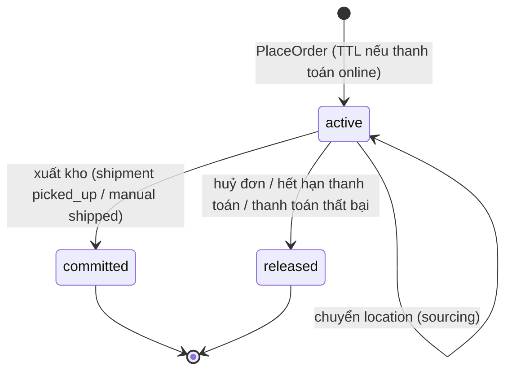

# Inventory

> Trạng thái: **Partially Implemented** (slice 4). Quyết định: [ADR-006](../19-adr/ADR-006-inventory-authority.md).
>
> **Đã có:** `locations` (cấp Owner, `stock_authority`, priority, khả năng giao online/nhận tại quầy/nhận trả, `lock_version`), `location_brands`, `channel_locations` (**thuộc Inventory**, không thuộc Channel, để Channel không phụ thuộc Inventory), `stock_levels`, `stock_reservations`, `stock_movements` (append-only); domain `StockLevel` + `Allocation` (thuần PHP); `InventoryReservation` (reserve idempotent theo `reservation_key`, release, commit), `AvailabilityReader`, `InventoryStrategy` mặc định `standard`; điều chỉnh tay / kiểm kê / tồn an toàn (chặn khi location do hệ thống ngoài quản lý); lệnh `vani:inventory:release-expired` (mỗi phút); Admin: kho & cửa hàng (Owner), lưới tồn variant × location, lịch sử biến động; Storefront API: `in_stock`, `available`, `low_stock` (không lộ số lượng).
>
> **Slice 9:** `InventoryReservation::reservedLines` (Fulfillment tạo vận đơn theo kho đã giữ), `InventoryReturns::restock` (hàng hoàn về, movement `return`, idempotent theo reference), commit khi mọi vận đơn rời kho.
>
> **Slice 11:** sync từ authority ngoài qua `PUT /api/integration/v1/inventory/levels` → contract `InventorySync` (chỉ client là `stock_authority` của location được ghi, bản cũ theo `sync_version` bị bỏ qua, movement `sync` có `reference = v<version>`).
>
> **Phase 1 (2026-10-15):** chuyển kho có vòng đời `pending → shipped → received`, `cancelled` (`stock_transfers`, `stock_transfer_lines`); Admin → Tồn kho → Chuyển kho; quyền `inventory.transfer`.
>
> **Chưa có:** reconciliation với nguồn ngoài (snapshot), import Excel, counter Redis cho flash sale, scope `location` trong RBAC.

## 1. Nguyên tắc

1. **Inventory Reservation là invariant của Core**; **Inventory Strategy là extension** (`InventoryStrategy`, `SourcingStrategy`).
2. Tồn luôn gắn với **location**. Không có con số "quantity" chung trên SKU.
3. Mọi thay đổi tồn đều là một **movement** trong ledger append-only, kèm lý do và tham chiếu. Không có câu `UPDATE` tồn "chay".
4. **Authority**:
   - Tồn vật lý (on-hand): nguồn gốc cấu hình **theo location**. Mặc định là VaniShop; khi ERP/POS/ODO được tích hợp thì chuyển sang hệ thống đó.
   - Giữ hàng online và availability khi checkout: **luôn là VaniShop**. ERP không bao giờ ghi trực tiếp vào `reserved`.

```text
ERP / POS / ODO  (authority của physical stock, nếu được cấu hình)
      │  inventory.levels (số tuyệt đối + version)
      ▼
VaniShop Inventory: on_hand (bản sao có version)
      │
      ▼
Reservation (authority: VaniShop)  ──►  ATS  ──►  Checkout
```

## 2. Mô hình

| Entity | Vai trò | Bảng |
|---|---|---|
| **Location** | Kho, cửa hàng, điểm ảo (ký gửi, sàn, seller) | `locations` |
| **StockLevel** | Trạng thái hiện tại theo `(location, variant)` | `stock_levels` |
| **StockReservation** | Lượng hàng đang giữ cho một đơn | `stock_reservations` |
| **StockMovement / InventoryLedger** | Nhật ký append-only mọi biến động | `stock_movements` |
| **StockTransfer** | Chuyển hàng giữa location | `stock_transfers`, `stock_transfer_lines` |
| **ReconciliationRun** | Một lần đối chiếu với nguồn ngoài | `inventory_reconciliations`, `inventory_reconciliation_lines` |

### Location

| Trường | Ý nghĩa |
|---|---|
| `code`, `name`, `type` | `warehouse`, `store`, `virtual` |
| `address`, `geo` | Cho sourcing, tìm cửa hàng |
| `capabilities` | `ship_online_orders`, `pickup_in_store`, `accept_returns` |
| `stock_authority` | `vanishop` hoặc mã Integration Client (ERP/POS/ODO) |
| `priority`, `cutoff_time` | Sourcing |
| Bán online | `capabilities.ship_online_orders` (code hiện có thêm `location_brands`, `channel_locations` — gỡ ở slice 12, [ADR-028](../19-adr/ADR-028-single-store-brand-as-catalog.md)) |

### Các con số

```text
on_hand       : tồn vật lý (tự quản lý, hoặc bản sao từ authority ngoài)
reserved      : Σ reservation đang active tại location
safety_stock  : không bán online (theo location, có thể override theo variant)
available     = on_hand − reserved − safety_stock   (có thể âm khi authority ngoài hạ on_hand)
ATS(location) = max(0, available)
ATS           = InventoryStrategy.ats(variant)   // mặc định: Σ ATS(location) của các location giao online
```

`InventoryStrategy` (ví dụ chừa tồn cho sàn TMĐT bằng plugin `vani.marketplace-allocation`) chỉ được **giảm** ATS so với công thức chuẩn, không được tăng. Core kiểm tra `min(strategy, standard)`.

## 3. Vòng đời reservation



| Sự kiện | Hành động | Movement |
|---|---|---|
| Đặt hàng | reserve (atomic) | `reserve` |
| Thanh toán thất bại / hết hạn / huỷ | release | `release` |
| Xuất kho | commit: `reserved −= q`; nếu location do VaniShop quản lý thì `on_hand −= q` | `commit` |
| Location do hệ thống ngoài quản lý | commit chỉ giảm `reserved`; on_hand giảm khi authority gửi số mới (khử trùng bằng `version`) | `commit` |
| Trả hàng nhập kho | `on_hand += q` (nếu sellable) | `return` |
| Điều chỉnh tay | `on_hand ±= q`, bắt buộc lý do + quyền `stock.adjust` | `adjust` |
| Đồng bộ từ authority | set `on_hand = n` nếu `version` mới hơn | `sync` |
| Chuyển kho | `transfer_out` (gửi) / `transfer_in` (nhận hoặc nhập lại kho đi khi huỷ sau gửi) | `transfer_out`, `transfer_in` |

## 4. Reserve atomic

```php
public function reserve(ReservationRequest $req): Reservation   // gọi trong transaction PlaceOrder
{
    // Khoá theo thứ tự (location_id, variant_id) tăng dần → tránh deadlock
    $levels = StockLevelRecord::whereIn(...)->orderBy('location_id')->orderBy('variant_id')->lockForUpdate()->get();

    foreach ($req->lines as $line) {
        $level = StockLevel::fromRecord($levels->for($line));   // Domain object thuần
        $level->reserve($line->quantity);                        // ném InsufficientStock nếu available < q
        $this->levels->save($level);                             // reserved += q
        $this->ledger->append(Movement::reserve($level, $line, $req->orderRef));
    }
    return $this->reservations->create($req, expiresAt: $req->ttl);
}
```

- Mức cô lập `READ COMMITTED` + `FOR UPDATE` trên đúng các dòng cần dùng. **Đã cấu hình** ở connection `mysql` (`DB_ISOLATION_LEVEL`, mặc định `READ COMMITTED`): concurrency test cho thấy `REPEATABLE READ` mặc định của MySQL sinh deadlock 1213 do gap lock.
- **Hiện thực** (`ReservationService`): gộp số lượng theo variant → khoá `stock_levels` theo `(location_id, variant_id)` tăng dần (tạo dòng thiếu trước khi khoá) → **sau khi đã giữ khoá tồn** mới kiểm tra `reservation_key` đã có reservation `active` chưa (đọc thường, không `FOR UPDATE` — khoá dòng không tồn tại chính là nguồn gap lock) → phân bổ theo priority location giảm dần, tách sang location kế tiếp khi thiếu → ghi `stock_movements` + `stock_reservations` → event sau commit. Transaction thử lại tối đa 3 lần.
- **Flash sale**: counter Redis `DECRBY` chặn trước; hết counter thì trả hết hàng ngay, không vào DB. Counter được nạp lại từ ATS DB định kỳ; DB luôn là nguồn đúng cuối cùng.
- Job `ReleaseExpiredReservations` chạy mỗi phút, idempotent (chỉ xử lý `active` + `expires_at < now`).

## 5. Tình huống cần xử lý

| Tình huống | Xử lý |
|---|---|
| Concurrent checkout SKU cuối | Khoá dòng; một bên nhận `inventory.insufficient_stock` |
| Reservation hết hạn khi khách đang thanh toán | IPN đến sau → đơn đã huỷ → auto refund ([payment](../10-payment/payment.md)) |
| Huỷ đơn | `OrderCancelled` → release (idempotent theo reservation id) |
| Thanh toán thất bại | Giữ reservation đến hết TTL để khách thử lại; hết TTL thì release |
| Authority ngoài hạ on_hand xuống dưới `reserved` | Cho phép (phản ánh thực tế); `available` âm → ATS = 0; cảnh báo "thiếu hàng cho đơn đã giữ" kèm danh sách đơn cần xử lý |
| Bản sync cũ đến sau bản mới | So `version`, bỏ qua bản cũ |
| Lệch tồn | Reconciliation (§6) |
| Oversell do lỗi hệ thống | Không thể xảy ra nếu R14 đúng; concurrency test trong CI bảo vệ |

## 6. Transfer và reconciliation

- **Transfer** (**Implemented**, roadmap Phase 1 — Admin → Tồn kho → Chuyển kho): `pending → shipped → received`, `cancelled`. `pending` không đổi tồn (hàng còn ở kho đi, vẫn bán được). `shipped` ghi `transfer_out` (trừ `on_hand` kho đi) — từ đây hàng đang **đi đường nên ATS không tính**. `received` ghi `transfer_in` (cộng `on_hand` kho đến); nhận thiếu được (chênh lệch coi là hao hụt trên đường, lưu trên `stock_transfer_lines.received_quantity`). Huỷ sau `shipped` nhập lại kho đi (`transfer_in`, reference `:revert`); huỷ trước `shipped` không đổi tồn. Chỉ chuyển giữa hai location do VaniShop quản lý tồn vật lý; nếu do ERP quản lý thì transfer diễn ra trên ERP, VaniShop chỉ nhận số mới.
- **Đối soát nội bộ** (**Implemented**, `vani:inventory:verify`, hằng ngày 03:30): `reserved` = tổng hàng giữ active (lệch → `--repair-reserved` ghi movement `reconcile`); on_hand/reserved = giá trị "sau" của movement cuối (lệch = có chỗ sửa tồn ngoài sổ → chỉ báo, cần kiểm kê); không âm. Exit 1 + log cảnh báo khi còn chênh lệch. Bộ test bất biến vòng đời (`tests/Feature/Invariants`) chạy lệnh này sau mọi luồng.
- **Reconciliation**: snapshot từ authority (hằng đêm hoặc theo yêu cầu) → so với `on_hand` → tạo `inventory_reconciliation_lines` cho chênh lệch → tự áp dụng nếu dưới ngưỡng, còn lại chờ duyệt → movement `sync`. Báo cáo tỷ lệ lệch (mục tiêu < 0,5%).

## 7. Đồng bộ với authority ngoài

| Cơ chế | Khi nào |
|---|---|
| Delta `PUT /api/integration/v1/inventory/levels` (số tuyệt đối + `version`) | Mỗi biến động |
| Snapshot `POST /api/integration/v1/inventory/snapshots` | Hằng đêm → reconciliation |
| Connector pull (`ErpConnector::pullStock`) | Khi ERP không tự đẩy |

Chi tiết: [integration-platform](../11-integration/integration-platform.md), [erp-integration](../11-integration/erp-integration.md). Việc ghi của client không phải authority của location sẽ bị từ chối (`403 not_data_owner`).

## 8. Invariant: DB và App

| Invariant | Enforce |
|---|---|
| Một dòng tồn cho mỗi `(location, variant)` | DB unique |
| `reserved >= 0`, `safety_stock >= 0` | DB `CHECK` (MySQL 8.0.16+) |
| `reserved` = Σ reservation active | App (trong cùng transaction) + job kiểm tra định kỳ phát hiện lệch |
| Không reserve vượt `available` | App (khoá dòng) |
| Ledger không bị sửa/xoá | App (không có API) + quyền DB user ứng dụng không có `DELETE` trên `stock_movements` (khuyến nghị) |
| Reservation release/commit đúng một lần | DB: trạng thái + `UPDATE … WHERE status = 'active'` |

## 9. Omnichannel

Tra tồn tại cửa hàng, BOPIS, ship-from-store, endless aisle là plugin: [store-omnichannel spec](../05-plugin/specs/store-omnichannel.md).

## 10. Kiểm thử

- Unit: `StockLevel::reserve/release/commit`, công thức ATS, `InventoryStrategy` không tăng được ATS.
- Concurrency (MySQL thật, `tests/Concurrency`, group `concurrency`): **đã có** — 12 tiến trình giữ SKU tồn = 5 → đúng 5 thành công, 7 `StockUnavailable`; đơn nhiều SKU đảo thứ tự không deadlock.
- Feature: hết hạn reservation; huỷ đơn; sync bản cũ bị bỏ qua; client không phải authority bị 403.
- Chuyển kho: vòng đời `pending → shipped → received`, huỷ trước/sau khi gửi, nhận thiếu, chặn gửi vượt tồn và sai thứ tự trạng thái, audit (`StockTransferTest`, `StockTransferAdminTest`); bất biến tồn chạy `vani:inventory:verify` sau mỗi bước (`tests/Feature/Invariants/StockTransferInvariantsTest`).
- Reconciliation: dữ liệu chênh lệch sinh đúng movement.
