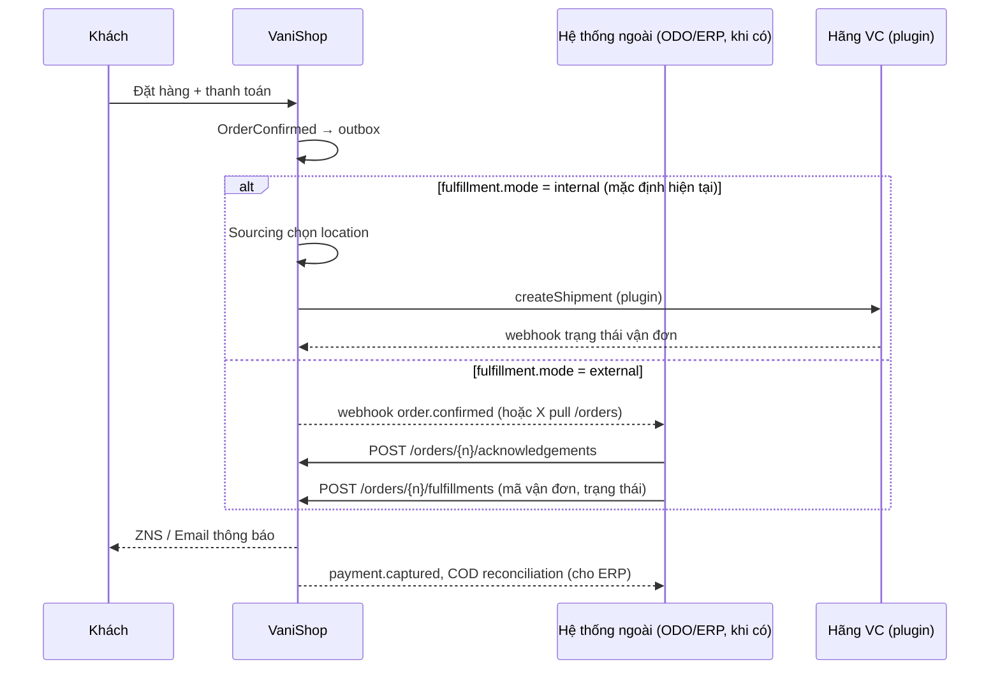

# 08 — Module Integration & API tích hợp

> **Quyết định 2026-09-28** ([ADR-0007](adr/0007-integration-module-odo-deferred.md)): vai trò cụ thể của **ODO** (chọn kho? tạo vận đơn? đối soát COD?) **tạm hoãn**. Thay vào đó VaniShop xây **module `Integration`** làm cổng tích hợp chung: cung cấp **API chuẩn** và **khung connector** để kết nối bất kỳ dịch vụ nào — ODO, ERP, POS, sàn TMĐT, hãng vận chuyển, cổng thanh toán, hoá đơn điện tử — mà **không sửa lõi**.
>
> Hệ quả: trong lúc chưa có ODO, **VaniShop tự đảm nhiệm fulfillment** (phân bổ kho, đặt vận đơn qua plugin hãng VC — xem [05](05-ton-kho-va-cua-hang.md), [06](06-don-hang-thanh-toan-giao-hang.md)). Khi ODO được chốt, chỉ cần bật connector/đối tác API và đổi cấu hình `fulfillment.mode`.

## 1. Mục tiêu module

1. **API tích hợp công khai, có version** để hệ thống ngoài **đọc/ghi** dữ liệu VaniShop (pull) và **nhận sự kiện** (push/webhook).
2. **Khung connector** (plugin) để VaniShop **chủ động gọi** API của hệ thống ngoài khi cần.
3. **Tin cậy**: không mất message, không xử lý trùng, không để bản cũ ghi đè bản mới, không làm hỏng checkout khi bên ngoài lỗi.
4. **Quan sát được**: tra vết mọi message, replay, cảnh báo.

## 2. Hai cách tích hợp

| Mô hình | Khi dùng | Thành phần |
|---|---|---|
| **A. Đối tác tự tích hợp** (partner-driven) | Hệ thống ngoài có đội dev (ERP nội bộ, ODO, POS) | Integration API (REST) + Webhook subscription |
| **B. Connector trong VaniShop** (platform-driven) | Dịch vụ SaaS có API cố định (GHN, GHTK, VNPay, MISA, Shopee…) | Plugin trong `custom/plugin/*` implement `Connector` |

Cả hai đều đi qua cùng **outbox/inbox**, **mapping**, **log** của module.

```mermaid
flowchart LR
    subgraph VaniShop
      D[Domain modules] -- ghi cùng transaction --> OB[(integration_outbox)]
      OB --> DISP[Dispatcher<br/>queue worker]
      DISP --> WHS[Webhook sender<br/>mô hình A]
      DISP --> CON{{Connector plugin<br/>mô hình B}}
      API[Integration API<br/>/api/integration/v1] --> D
      WHR[Inbound webhooks<br/>/api/integrations/{system}] --> IB[(integration_inbox)]
      IB --> PROC[Inbox processor] --> D
      MAP[(mappings<br/>external_references)]
      LOG[(integration_logs)]
    end
    WHS --> P1[[ODO / ERP / POS<br/>đối tác]]
    P1 -- REST: pull / ghi --> API
    CON <--> P2[[GHN, VNPay, MISA,<br/>Shopee...]]
    P2 -- webhook --> WHR
```

## 3. Integration Client (đối tác)

Mỗi hệ thống ngoài là một **Integration Client**:

| Trường | Ý nghĩa |
|---|---|
| `code`, `name` | `erp-main`, `odo`, `pos-kiotviet`… |
| `credentials` | API key + secret (hash), hỗ trợ xoay vòng 2 key song song |
| `scopes` | Quyền theo tài nguyên: `orders:read`, `orders.fulfillment:write`, `inventory:write`, `catalog.items:write`, `customers:read`… |
| `data_scope` | Giới hạn brand / pháp nhân / location mà client được thấy |
| `ip_allowlist` | Tuỳ chọn |
| `rate_limit` | Mặc định 600 req/phút |
| `status` | `active` / `suspended` |

Quản lý trong Admin (Inertia): tạo client, cấp/thu hồi key, xem log, bật/tắt webhook subscription.

## 4. Integration API (mô hình A)

Prefix `/api/integration/v1`, xác thực bằng key client + chữ ký HMAC (chi tiết [12](12-api.md)). Payload theo **canonical model** có version (`vanishop.order.v1`…), JSON Schema công bố trong `docs/api/`.

### 4.1 Đọc (pull)

| Method | Path | Mô tả |
|---|---|---|
| GET | `/orders?updated_since=&status=&brand=&cursor=` | Đơn hàng thay đổi từ mốc thời gian |
| GET | `/orders/{number}` | Chi tiết đơn (lines, địa chỉ, thanh toán, adjustments) |
| GET | `/returns?updated_since=` | Yêu cầu đổi trả |
| GET | `/customers?updated_since=` | Khách hàng (theo scope, PII tuỳ quyền) |
| GET | `/catalog/variants?updated_since=` | Biến thể, mã hàng, barcode |
| GET | `/payments?updated_since=` | Giao dịch thanh toán (đối soát) |
| GET | `/events?after=<cursor>` | **Event feed** tuần tự — phương án thay webhook cho hệ thống không nhận được webhook |

### 4.2 Ghi (push vào VaniShop)

| Method | Path | Mô tả |
|---|---|---|
| POST | `/orders/{number}/acknowledgements` | Đối tác xác nhận đã nhận đơn (kèm mã đơn phía họ) |
| POST | `/orders/{number}/fulfillments` | Tạo/cập nhật shipment: location xuất, dòng hàng, hãng, mã vận đơn, trạng thái |
| POST | `/orders/{number}/cancellation-decisions` | Chấp nhận/từ chối yêu cầu huỷ |
| PUT | `/inventory/levels` | Cập nhật tồn tuyệt đối theo `(location_code, sku)` + `version` (batch ≤ 1.000 dòng) |
| POST | `/inventory/snapshots` | Snapshot toàn bộ tồn (bulk, gzip, xử lý bất đồng bộ, trả `job_id`) |
| PUT | `/catalog/items` | Upsert mã hàng (sku, barcode, style_code, color, size, thuế…) |
| PUT | `/prices` | Cập nhật giá (nếu brand cấu hình giá từ hệ thống ngoài) |
| POST | `/returns/{number}/receipts` | Xác nhận đã nhận hàng trả, tình trạng |
| POST | `/pos-orders` | Đơn tại cửa hàng (cho loyalty, lịch sử khách) |
| POST | `/cod-reconciliations` | Kết quả đối soát COD |
| GET | `/jobs/{id}` | Trạng thái xử lý bulk |

Quy tắc ghi:
- **Idempotency-Key** bắt buộc cho POST; PUT idempotent theo khoá tự nhiên.
- **Không ghi đè bản mới bằng bản cũ**: tồn/giá/trạng thái có `version` hoặc `occurred_at`; bản cũ hơn → trả `409 stale_update` và bỏ qua.
- Ghi đi qua **Action** của module nghiệp vụ (không ghi thẳng bảng) → vẫn qua validation, state machine, audit.
- Chỉ client được cấp scope tương ứng mới ghi được; **mỗi loại dữ liệu chỉ 1 client được làm nguồn gốc** (cấu hình ở ma trận mục 7).

### 4.3 Webhook subscription (VaniShop → đối tác)

- Client đăng ký: `url`, danh sách `event_types`, secret ký.
- Sự kiện: `order.created`, `order.confirmed`, `order.updated`, `order.cancel_requested`, `order.cancelled`, `payment.captured`, `payment.refunded`, `return.created`, `return.approved`, `customer.updated`, `inventory.reservation_changed`…
- Envelope chuẩn và chữ ký `X-Vani-Signature` như [12 §5](12-api.md).
- Gửi qua outbox: retry backoff (1m, 5m, 15m, 1h, 6h, 24h), **giữ thứ tự theo aggregate** (cùng 1 đơn gửi tuần tự). Quá hạn → `dead`, cảnh báo, replay thủ công.
- Đối tác phải trả 2xx trong 10 giây; xử lý nặng làm bất đồng bộ phía họ.

## 5. Connector (mô hình B)

```php
interface Connector
{
    public function system(): string;                                 // 'ghn', 'vnpay', 'misa', 'shopee'...
    public function supports(string $messageType): bool;
    public function send(OutboxMessage $message): DeliveryResult;     // gọi API ngoài
    public function translateInbound(InboxMessage $message): array;   // → lệnh nội bộ chuẩn hoá
    public function healthCheck(): HealthStatus;
}
```

- Connector là **plugin** trong `custom/plugin/<Name>` ([10](10-hook-va-plugin.md)), credential cấu hình **theo pháp nhân/brand**.
- Contract chuyên biệt kế thừa khung này: `PaymentGateway`, `ShippingCarrier` ([06](06-don-hang-thanh-toan-giao-hang.md)), `EInvoiceProvider` ([09](09-dac-thu-viet-nam.md)), `MarketplaceChannel` (Phase 3).
- **Mapping** tách khỏi code: `integration_mappings(system, mapping_type, internal_value, external_value)` — mã kho, trạng thái, phương thức thanh toán, tỉnh/thành, kênh.
- `external_references(entity_type, entity_id, system, external_id)` lưu ánh xạ ID giữa hệ thống.

## 6. Độ tin cậy

### 6.1 Outbox
- Message ghi vào `integration_outbox` **trong cùng transaction** với thay đổi nghiệp vụ ([ADR-0004](adr/0004-transactional-outbox.md)).
- Cột: `id (uuid)`, `target` (client code hoặc connector), `message_type`, `aggregate_type`, `aggregate_id`, `payload (json)`, `status (pending|processing|sent|failed|dead)`, `attempts`, `next_attempt_at`, `correlation_id`, `sent_at`, `last_error`.
- Dispatcher lấy lô bằng `SELECT … FOR UPDATE SKIP LOCKED` (MySQL 8+), index `(status, next_attempt_at)`.

### 6.2 Inbox
- Webhook vào: xác thực chữ ký, lưu `integration_inbox`, **trả 2xx ngay**, xử lý bất đồng bộ.
- Khoá duy nhất `(system, external_event_id)`; không có event id → hash payload.
- Hệ thống chỉ hỗ trợ file (CSV/Excel qua SFTP): **file puller** định kỳ đọc file → đưa vào inbox như webhook.

## 7. Nguồn dữ liệu gốc (Source of Truth)

Mặc định khi **chưa có ODO**; mỗi dòng có thể chuyển nguồn gốc sang một Integration Client qua cấu hình khi hệ thống đó sẵn sàng.

| Dữ liệu | Mặc định | Có thể chuyển sang | Ghi chú |
|---|---|---|---|
| Mã hàng, barcode, nhóm thuế | VaniShop (nhập/import) | **ERP** | Khi ERP làm master, form sửa mã trong Admin bị khoá |
| Nội dung bán hàng | **VaniShop** | — | Luôn thuộc VaniShop |
| Giá bán online | **VaniShop** | ERP | Theo brand |
| Tồn vật lý (on-hand) | VaniShop (nhập/import/điều chỉnh) | **ERP / ODO / POS** | Theo location |
| Giữ hàng, ATS | **VaniShop** | — | Luôn thuộc VaniShop |
| Đơn hàng online | **VaniShop** | — | Đối tác nhận bản sao |
| Phân bổ kho, vận đơn, trạng thái giao | VaniShop + plugin hãng VC | **ODO** | `fulfillment.mode = internal \| external` |
| Đối soát COD | VaniShop (import bảng kê hãng VC) | ODO / ERP | |
| Hoá đơn điện tử | Chưa chốt | VaniShop (plugin HĐĐT) / ERP | |
| Khách hàng | **VaniShop** | — | ERP nhận bản sao |
| Đơn tại cửa hàng | **POS/ERP** | — | VaniShop nhận để tính loyalty |

> Quy tắc vàng: **mỗi trường dữ liệu chỉ có một hệ thống được ghi**. Module Integration kiểm soát bằng bảng `integration_ownerships(data_type, scope_type, scope_id, owner)` — API ghi từ client không phải owner sẽ bị từ chối `403 not_data_owner`.

## 8. Luồng đơn hàng theo `fulfillment.mode`



## 9. Giám sát

- Dashboard Admin "Integration Health": message pending/failed/dead theo client/connector, độ trễ P50/P95, tỉ lệ lỗi, lần cuối nhận tồn.
- Cảnh báo: dead message, backlog > ngưỡng, `healthCheck` fail, webhook đối tác lỗi liên tục (tự tạm dừng subscription sau 24h lỗi, thông báo).
- Tra vết theo `correlation_id` / mã đơn: mọi request API, webhook vào/ra, payload (đã che PII), phản hồi.
- Log giữ 90 ngày.

## 10. Việc còn mở (khi chốt ODO/ERP)

- [ ] ODO đảm nhiệm những gì: chọn kho, tạo vận đơn, đối soát COD, xử lý hàng trả?
- [ ] ODO/ERP tích hợp theo mô hình A (tự gọi API) hay B (VaniShop viết connector)?
- [ ] ERP là sản phẩm nào, có REST API/webhook hay chỉ file?
- [ ] Bảng mapping: kho, cửa hàng, kênh, phương thức thanh toán, hãng VC, trạng thái, tỉnh/thành.
- [ ] Quy tắc mã `sku`, `style_code`, mã màu/size thống nhất.
- [ ] Ai phát hành hoá đơn điện tử?
- [ ] SLA độ trễ tồn kho, môi trường sandbox.
