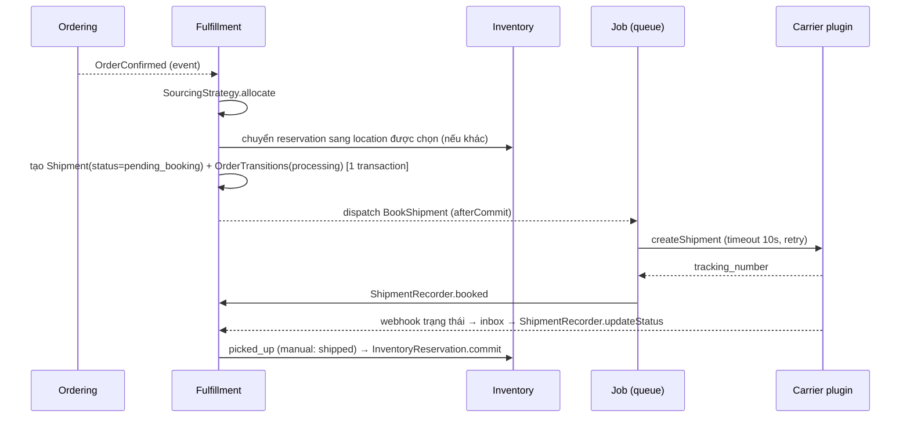

# Fulfillment & Shipment

> Trạng thái: **Designed**. Vai trò ODO đang hoãn ([ADR-007](../19-adr/ADR-007-erp-integration.md)), nên mặc định `fulfillment.mode = internal`.

## 1. Trách nhiệm

| Core (`modules/Fulfillment`) | Plugin |
|---|---|
| Shipment, shipment line, trạng thái chuẩn hoá, lịch sử | Hãng vận chuyển (`vani.ghn`, `vani.ghtk`…) |
| `SourcingStrategy` mặc định `priority_first_fit` | Sourcing nâng cao, ship-from-store |
| `FulfillmentMethod` mặc định `delivery` | `pickup` (BOPIS) |
| Carrier `flat_rate` (bảng phí) + `manual` (nhập mã vận đơn) | Đối soát COD (`vani.cod-reconciliation`) |
| Chế độ `internal` / `external` (hệ thống ngoài xử lý qua Integration API) | Connector ODO |

## 2. Contract

```php
interface ShippingCarrier
{
    public function code(): string;                                        // 'flat_rate', 'manual', 'ghn'...
    public function isAvailable(ShippingContext $ctx): bool;
    /** @return list<ShippingQuote> dịch vụ + phí (Money) + ETA */
    public function quote(ShipmentDraft $draft): array;
    public function createShipment(ShipmentData $shipment): CarrierShipment;  // mã vận đơn, nhãn in
    public function cancel(ShipmentData $shipment): void;
    public function parseWebhook(Request $request): CarrierEvent;           // trạng thái đã chuẩn hoá
}

interface SourcingStrategy
{
    public function code(): string;
    /** @return list<AllocationProposal> location + dòng + số lượng */
    public function allocate(SourcingRequest $request): array;
}

interface FulfillmentMethod
{
    public function code(): string;                                        // 'delivery', 'pickup'
    public function isAvailable(CheckoutData $checkout): bool;
    public function requiresShippingAddress(): bool;
}
```

Trạng thái vận đơn chuẩn hoá: `created`, `picked_up`, `in_transit`, `out_for_delivery`, `delivered`, `failed_attempt`, `returning`, `returned`, `cancelled`.

## 3. Flow (internal)



- Đặt vận đơn ở hãng **luôn chạy sau commit**, trong job idempotent theo `shipment_id` (dùng mã shipment làm mã đơn hàng phía hãng để hãng tự khử trùng lặp).
- Hãng lỗi quá số lần thử → shipment `booking_failed`, cảnh báo, nhân viên đặt lại hoặc chuyển sang `manual`.
- `fulfillment_status` của đơn được **tính lại** từ các shipment sau mỗi thay đổi.

## 4. Chế độ external (khi có ODO hoặc WMS)

Đối tác nhận `order.confirmed` (webhook hoặc pull), rồi gửi `acknowledgements`, `fulfillments` qua Integration API ([integration-platform §4](../11-integration/integration-platform.md)). Core vẫn giữ invariant: shipment tham chiếu dòng đơn có thật, số lượng giao ≤ số lượng đặt.

## 5. Dữ liệu và invariant

| Bảng | Invariant (DB / App) |
|---|---|
| `shipments(order_id, location_id, carrier_code, service_code, tracking_number, cod_amount, status, lock_version)` | DB: unique `(carrier_code, tracking_number)` khi không null; FK `order_id` |
| `shipment_lines(shipment_id, order_line_id, quantity)` | DB: `quantity > 0`; App: Σ số lượng mọi shipment của một dòng ≤ `order_lines.quantity` (khoá dòng đơn) |
| `shipment_events` | Append-only; unique `(shipment_id, carrier_event_id)` để khử webhook trùng |

## 6. Kiểm thử

- Contract test `ShippingCarrier` (plugin phải pass): quote trả Money, webhook parse đúng trạng thái chuẩn.
- Feature: đơn xác nhận → shipment → giao thành công → reservation được commit; hãng lỗi → `booking_failed`.
- Webhook trùng hoặc đến sai thứ tự không làm trạng thái đi lùi.
