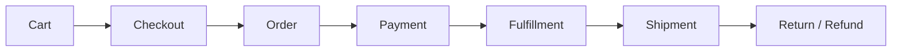
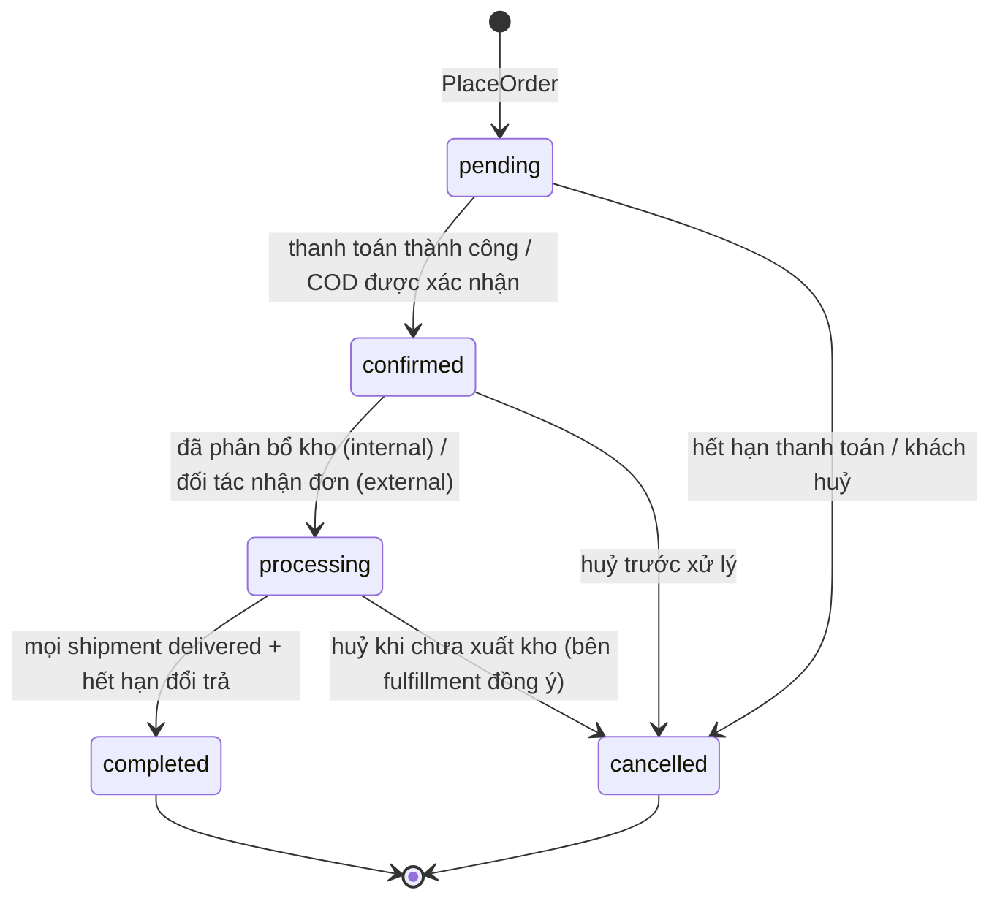
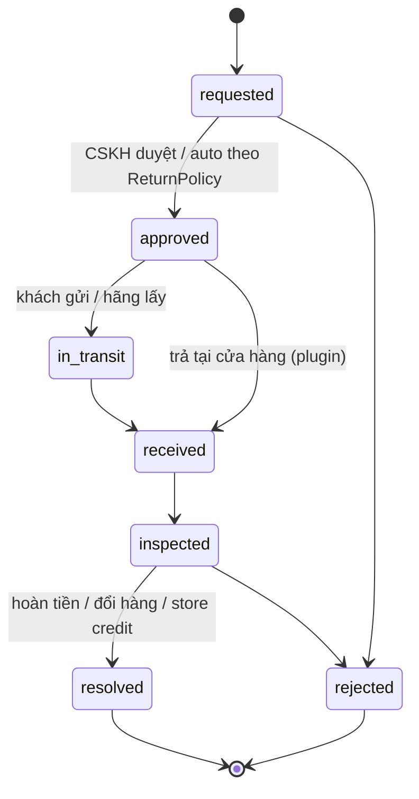

# Order & Returns

> Trạng thái: **Partially Implemented (slice 6)** — tạo đơn: `orders` (snapshot khách/địa chỉ/giao hàng, 4 cột trạng thái, số tiền), `order_lines` (snapshot tên/SKU/màu/size/ảnh, giá, giảm phân bổ, thuế), `order_adjustments`, `order_events` (append-only), số đơn `<mã brand><yymm>-<6 số>` từ `number_sequences`, contract `OrderWriter`, event `OrderPlaced`, kiểm tra cân số liệu khi lưu. **Slice 7:** `OrderStateMachine` (bảng chuyển cố định), `OrderTransitions` (khoá dòng, no-op khi trùng, `order_events`, `OrderConfirmed`/`OrderCancelled` sau commit, `setPaymentStatus`), `OrderReader`; hết hạn thanh toán → huỷ đơn → Checkout nhả hàng + hoàn lượt khuyến mãi. **Slice 8:** Admin đơn (brand workspace `/{admin}/orders/{brand}/orders`: lọc theo trạng thái/thanh toán, tìm theo số đơn hoặc SĐT, chi tiết từ snapshot, lịch sử `order_events`, xác nhận, huỷ có lý do, đổi địa chỉ trước khi giao — địa chỉ cũ lưu trong event, khoá lạc quan —, ghi chú nội bộ, panel mở rộng qua slot `vani.admin.order.sidebar` — Payment thêm panel thanh toán), `OrderPolicy` (khách huỷ khi `pending`/`confirmed` + chưa xử lý kho; nhân viên huỷ khi hàng chưa rời kho), nhãn trạng thái cho khách tính từ 4 chiều (`CustomerStatus`), contract `CustomerOrders` (tra cứu số đơn + SĐT với thông tin bị che; xem/huỷ bằng access token trả lúc đặt, server lưu `sha256`), cột `customer_phone` có index. **Slice 9:** `processing` khi tạo vận đơn, `completed` khi giao hết + hết hạn đổi trả, `fulfillment_status` do Fulfillment cập nhật (`setFulfillmentStatus`), khách/nhân viên huỷ được tới khi hàng rời kho (`allocated`), nhân viên huỷ được đơn hoàn về (`returned_to_sender`). **Slice 9b:** Returns (§7). **Huỷ một phần** (0.3.18, §2.1). **Chưa có:** order group. Quyết định: [ADR-012](../19-adr/ADR-012-order-snapshot.md).

## 1. Vòng đời tổng thể



| Bước | Context sở hữu | Tài liệu |
|---|---|---|
| Cart, Checkout | Cart, Checkout | [cart-checkout](../03-domains/cart-checkout.md) |
| Order, Returns | Ordering, Returns | Tài liệu này |
| Payment, Refund | Payment | [payment](../10-payment/payment.md) |
| Fulfillment, Shipment | Fulfillment | [fulfillment](fulfillment.md) |

## 2. Order là bản ghi nghiệp vụ bất biến

Sau khi tạo, đơn giữ **snapshot** và không phụ thuộc dữ liệu catalog hiện tại (rule R15):

| Snapshot | Lưu ở |
|---|---|
| Tên sản phẩm, SKU, màu, size, ảnh chính | `order_lines` (`product_name`, `sku`, `color_name`, `size_code`, `image_path`) |
| Giá niêm yết, giá bán, số lượng | `order_lines.compare_at_amount`, `unit_amount`, `quantity` |
| Giảm giá (phân bổ) và khuyến mãi đã áp dụng | `order_lines.discount_amount` + `order_adjustments` (mã, tên, nguồn) |
| Thuế | `order_lines.tax_rate_bp`, `tax_amount` |
| Địa chỉ, người nhận | `orders.shipping_address` (JSON) |
| Khách hàng | `orders.customer_id` + `customer_snapshot` (tên, SĐT, email lúc đặt) |
| Vận chuyển | `orders.shipping_method` (carrier, dịch vụ, phí) |
| Brand của sản phẩm | `order_lines.brand_id` + `brand_name` (snapshot, Designed — slice 12) |
| Nguồn đơn, tiền tệ | `orders.source` (`web`/`app`/`zalo`/`admin`/`pos`/`marketplace`), `currency_code`. Code hiện còn `brand_id`, `channel_id`, `legal_entity_id` trên `orders` — gỡ ở slice 12 ([ADR-028](../19-adr/ADR-028-single-store-brand-as-catalog.md)) |

**Được thay đổi sau khi tạo** (luôn có `order_events`): trạng thái (qua state machine); địa chỉ giao **trước khi** fulfillment bắt đầu (lệnh `ChangeShippingAddress`, snapshot cũ lưu trong event); ghi chú; `meta` của plugin.

**Không bao giờ thay đổi**: dòng hàng, giá, giảm giá, thuế. Muốn thay đổi thì dùng huỷ một phần (`CancelOrderLines`), đổi hàng (đơn mới liên kết `parent_order_id`), hoặc hoàn tiền.

### 2.1 Huỷ một phần (Implemented, 0.3.18)

Nhân viên huỷ bớt số lượng một số dòng (vd. hết hàng một size): `OrderCommands::cancelLines()`, Admin → đơn → "Huỷ một phần" (`orders.cancel`).

- **Điều kiện** (`OrderPolicy::staffCanCancelLines`): đơn `confirmed`/`processing`, hàng chưa rời kho (`unfulfilled`/`allocated`), thanh toán `cod_pending` hoặc đã thu (`paid`/`partially_refunded`). Online chưa trả → không (link thanh toán đã cấp mang số tiền cũ). Huỷ hết mọi dòng → dùng huỷ đơn.
- **Dữ liệu** (đúng ADR-012: snapshot tên/SKU/đơn giá/thuế suất giữ nguyên): `quantity` và tiền dòng là phần còn hiệu lực; `cancelled_quantity` cộng dồn; tiền phần huỷ chia theo tỷ lệ q/Q (làm tròn xuống, giữ "thành tiền = tạm tính − giảm giá"); tổng đơn giảm tương ứng, **phí giao giữ nguyên**. Mỗi lần huỷ: `order_adjustments` (`cancellation`, `code` = id lần huỷ, `meta` = tạm tính/giảm/thuế/thành tiền theo dòng — đủ lập chứng từ điều chỉnh) + `order_events` `lines_cancelled` + audit. Dòng huỷ hết giữ lại với `quantity = 0` (MySQL: `CHECK (quantity >= 0 AND quantity + cancelled_quantity > 0)`).
- **Cùng transaction**: nhả hàng giữ của phần huỷ (`InventoryReservation::releaseQuantities`, từ dòng giữ mới nhất).
- **Sau commit** (`OrderLinesCancelled`): Fulfillment huỷ vận đơn chưa rời kho (cả ở hãng) và tạo lại theo số còn lại, thu hộ = tổng mới; Payment giảm số tiền COD cần thu, hoặc hoàn phần huỷ (idempotent theo id lần huỷ; cổng không hỗ trợ → yêu cầu hoàn tay); Customer tính lại thống kê; Integration phát `order.lines_cancelled`.
- **Khuyến mãi sau huỷ (0.3.31)** — nhân viên chọn **nguyên nhân** (`LineCancellationCause`, mặc định `shop`):
  - `shop` (lỗi shop: hết hàng, sai giá…): khách **giữ nguyên ưu đãi**; chỉ phần giảm giá của hàng bị huỷ đi theo phần huỷ.
  - `customer` (khách yêu cầu bớt hàng): Promotion kiểm tra lại các khuyến mãi đã áp trên phần hàng còn lại (`PromotionEngine::recheck`, chỉ rule `CartContentRule` — ngưỡng tiền, số lượng, bộ sưu tập, brand; rule như "đơn đầu tiên" coi như vẫn đạt). Phần giảm giá không còn đủ điều kiện được **thu hồi**: dòng tăng thành tiền (thuế tính lại theo tỷ lệ), adjustment `promotion_clawback` (+), event `lines_cancelled` ghi `cause`, `totals.promotion_clawback`, `totals.net`.
  - **Trần**: tổng thu hồi ≤ tiền phần vừa huỷ → tổng đơn sau huỷ không bao giờ vượt tổng trước đó (khách không trả nhiều hơn số đã đồng ý). Tiền hoàn/giảm thu hộ COD = phần chênh **ròng** (`OrderLinesCancelled::$amount`).
  - Không bao giờ tăng giảm giá; khuyến mãi không kiểm tra lại được (đã xoá, plugin rule tắt) giữ nguyên.
  - Mọi lần huỷ một phần: `promotion_usages.discount_amount` và ngân sách đã dùng giảm về đúng giảm giá còn trên đơn (`PromotionEngine::adjustUsage`).
  - Cần chi tiết giảm giá theo khuyến mãi trên dòng (`order_lines.meta.promotions`, `style_id`) — ghi từ 0.3.31; đơn đặt trước đó không thu hồi được (giữ ưu đãi).
  - Phí giao giữ nguyên trong mọi trường hợp (kể cả miễn phí giao theo ngưỡng).

### 2.2 Tầng giá trên đơn (Implemented, 0.3.37)

`OrderReader::priceBreakdown()` / `OrderDetail::$pricing` / payload `vanishop.order.v1.pricing` tách tổng đơn thành từng tầng, tính từ snapshot (không đổi khi catalog/khuyến mãi đổi):

| Tầng | Nguồn |
|---|---|
| Giá niêm yết | `compare_at_amount` (nếu cao hơn giá bán) × số lượng hiện tại |
| Giảm giá bán | niêm yết − tạm tính; theo `order_lines.price_list_code` (bảng giá sale/thành viên/campaign đã cho giá bán) |
| Tạm tính | Σ `subtotal_amount` |
| Khuyến mãi tự động | phần giảm của khuyến mãi không voucher (`meta.promotions` theo dòng) |
| Mã giảm giá | phần giảm của khuyến mãi có voucher (mã lấy từ adjustment `promotion`) |
| Giảm khác | bù giá trị hàng trả (đơn đổi hàng), phần không tách được (đơn trước 0.3.31) |
| Phí giao, thuế | `shipping_amount`, `tax_amount` (VAT đã gồm trong tổng) |

Bất biến (I7, `tests/Feature/Invariants`): niêm yết − giảm giá bán = tạm tính; tạm tính − khuyến mãi − mã giảm giá − giảm khác + phí giao = tổng; tổng các khoản giảm = `discount_amount`. Đúng cả sau huỷ một phần/thu hồi khuyến mãi (phần lẻ do làm tròn dồn vào khuyến mãi lớn nhất của dòng). Admin và trang đơn storefront hiển thị từng tầng; `order_adjustments` vẫn giữ làm lịch sử điều chỉnh.

## 3. Trạng thái: 4 chiều độc lập

| Chiều | Giá trị | Ai kích hoạt |
|---|---|---|
| `order_status` | `pending` → `confirmed` → `processing` → `completed` / `cancelled` | Hệ thống, CSKH |
| `payment_status` | `unpaid`, `authorized`, `paid`, `partially_refunded`, `refunded`, `cod_pending`, `cod_collected`, `failed` | Payment |
| `fulfillment_status` | `unfulfilled`, `allocated`, `partially_shipped`, `shipped`, `delivered`, `returned_to_sender` (tổng hợp từ shipment) | Fulfillment |
| `return_status` | `none`, `requested`, `in_progress`, `partially_returned`, `returned` | Returns |

### Máy trạng thái `order_status`



```php
interface OrderTransitions   // public contract — cổng duy nhất để đổi trạng thái
{
    public function transition(OrderId $id, OrderStatus $to, TransitionReason $reason, Actor $actor): void;
    public function can(OrderId $id, OrderStatus $to): bool;
}
```

- Bảng chuyển hợp lệ khai báo trong `Domain\OrderStateMachine` (enum + map), **không** mở rộng được (xem [extension-model §2](../04-extension/extension-model.md)).
- Mỗi lần chuyển: khoá dòng `orders` (`FOR UPDATE`), kiểm tra hợp lệ, cập nhật, ghi `order_events` (append-only: from, to, reason, actor, source `customer|staff|system|integration:<client>|carrier|gateway`, correlation id), ghi outbox, phát event sau commit.
- Side effect gắn vào **listener của event**, không đặt trong state machine.
- Chuyển trạng thái trùng (đã ở trạng thái đích) → no-op idempotent.
- Nhãn hiển thị cho khách ("Đang giao", "Chờ thanh toán") được **tính** từ 4 chiều.

### Hết hạn thanh toán

Đơn thanh toán online ở `pending` + `unpaid` quá TTL (mặc định 15 phút, theo gateway) → job `ExpireUnpaidOrders` chuyển `cancelled` (reason `payment_timeout`) → `OrderCancelled` → giải phóng reservation. IPN đến muộn sau khi đã huỷ → ghi nhận payment, tự động tạo refund và cảnh báo CSKH.

## 4. Một đơn cho nhiều brand

Một giỏ chứa sản phẩm của nhiều brand tạo **một đơn** (một pháp nhân bán, một hoá đơn, một lần thanh toán). Không có order group ([ADR-028](../19-adr/ADR-028-single-store-brand-as-catalog.md)). Báo cáo theo brand đọc từ snapshot trên dòng đơn.

## 5. Số đơn

`<PREFIX><yymm>-<seq 6 số>`, một dãy cho cả cửa hàng; tiền tố cấu hình (mặc định `VN`), ví dụ `VN2610-000123`. Code hiện dùng tiền tố theo brand — đổi ở slice 12. Sinh từ `number_sequences(scope, period, last_value)` với `FOR UPDATE` trong transaction `PlaceOrder`.

## 6. Domain events

| Event | Phát khi | Listener tiêu biểu |
|---|---|---|
| `OrderPlaced` | Tạo đơn | Notification, plugin loyalty (điểm chờ), Integration |
| `OrderConfirmed` | Thanh toán xong / COD xác nhận | Fulfillment (sourcing), Integration, tracking |
| `OrderCancelled` | Huỷ | Inventory release, Payment refund, Promotion hoàn lượt |
| `OrderCompleted` | Hết hạn đổi trả | Plugin loyalty, plugin e-invoice |
| `ReturnResolved` | Hoàn tất đổi trả | Payment refund, Inventory, Integration |

## 7. Returns (RMA)

> **Implemented (slice 9b)** — module `modules/Returns`: `return_requests` (số `<số đơn>-R<n>`, lý do, tiền hoàn tính được, tiền đã hoàn, `lock_version`), `return_lines` (tình trạng `sellable`/`damaged`), `return_events` (append-only). Khách gửi yêu cầu qua `POST /orders/{id}/returns` (token đơn) cho **dòng đã giao** trong hạn; nhân viên duyệt/từ chối/đang gửi về/nhận hàng/hoàn tất trong Admin (`/{admin}/returns/{brand}/returns`), panel "Đổi/trả" trên trang đơn. Invariant **tổng trả mỗi dòng ≤ số đã giao** (khoá dòng đơn qua `OrderTransitions::lock`; concurrency test 4 yêu cầu cùng lúc → 1). Tiền hoàn = phần của các đơn vị trả trong thành tiền dòng đã phân bổ giảm giá (largest remainder — trả nhiều lần không vượt), **không hoàn phí giao**; nhân viên có thể hoàn ít hơn (trừ phí hư hỏng), không được nhiều hơn. Nhận hàng: dòng bán được nhập lại kho (location của vận đơn đã giao, movement `return`), dòng hư hỏng không nhập. Hoàn tất → `Payments::refundOrder` (cổng hỗ trợ thì tự động, COD/chuyển khoản thì chờ nhân viên chuyển trả). `return_status` của đơn tính lại sau mỗi thay đổi; đơn có yêu cầu đang mở không tự `completed`. `ReturnPolicy` (tag `vani.returns.policies`) mặc định `days_window` (`VANI_RETURN_WINDOW_DAYS`; nhân viên tạo hộ không bị giới hạn ngày). Event `ReturnRequested`, `ReturnResolved`.
>
> **Khác thiết kế:** bước `inspected` gộp vào `received` (ghi tình trạng khi nhận). **Đổi hàng:** §7.1 (0.3.32). **Chưa có:** store credit, nhân viên tạo yêu cầu hộ khách trong Admin (service đã hỗ trợ `source = staff`), nhãn trả hàng của hãng vận chuyển, trả tại cửa hàng (plugin).



| Core | Plugin |
|---|---|
| Trạng thái RMA, `ReturnPolicy` (mặc định `days_window`), tính tiền hoàn từ `line_total` đã phân bổ, nhập lại tồn (movement `return`, sellable hay không), hoàn tiền thủ công | Hoàn tiền tự động qua cổng (plugin payment), trả tại cửa hàng (`vani.store-omnichannel`), nhãn trả hàng của hãng VC |

Invariant: tổng số lượng trả của một dòng ≤ số lượng đã giao (App, khoá dòng `order_lines` khi tạo RMA); tổng hoàn ≤ số đã thu (Payment).

### 7.1 Đổi hàng (Implemented, 0.3.32)

Yêu cầu đổi/trả có `resolution = exchange` khi khách (API: `lines[].exchange_variant_id`) hoặc nhân viên (Admin: SKU thay thế theo dòng) chọn sản phẩm thay thế cho **mọi** dòng trả; variant phải đang bán. Chính sách (Owner chốt 2026-10-08):

- **Thời điểm:** đơn thay thế chỉ tạo khi hoàn tất — tức **sau khi đã nhận hàng trả** (`received → resolved`). Hàng trả bán được nhập kho như trả hàng thường.
- **Giá trị:** cùng mẫu (đổi size/màu) → giữ đúng đơn giá đã mua, **không tính chênh**; khác mẫu → giá hiện tại, bù trừ với số tiền khách đã trả cho các món trả (`return_lines.refund_amount`): thiếu → khách bù qua thu hộ COD trên đơn thay thế; thừa → hoàn phần thừa trên đơn gốc (`Payments::refundOrder`, COD đã thu → yêu cầu hoàn tay). `ReturnService::exchangeQuote` (Admin hiển thị trước khi hoàn tất).
- **Phí giao:** shop chịu (0đ). Không áp khuyến mãi.
- **Đơn thay thế** (`Checkout\Contracts\ReplacementOrders`): `source = exchange`, `parent_order_id` = đơn gốc, người nhận/địa chỉ/phương thức giao lấy từ đơn gốc, giá trị bù là giảm giá `exchange_credit` trên dòng (adjustment cùng tên), thuế qua TaxCalculator, **giữ hàng** như đơn thường, **xác nhận ngay** → Fulfillment tạo vận đơn. Phải bù → `payment_method = cod`; 0đ → `payment_method = exchange`, `payment_status = paid`, không có khoản thanh toán. Hết hàng/variant ngừng bán → `return.exchange_unavailable`, yêu cầu giữ ở `received` để nhân viên xử lý (đổi lựa chọn → huỷ và tạo lại, hoặc từ chối).
- `return_requests.replacement_order_id`; event `ReturnResolved` có `replacementOrderId`; payload `return.resolved` thêm `resolution`, `replacement_order_number`; `vanishop.order.v1` thêm `parent_order_number`.
- **Giới hạn:** đơn thay thế có dòng 0đ (giá trị nằm ở đơn gốc) nên chỉ cho **đổi tiếp size/màu cùng mẫu**; trả hoàn tiền hoặc đổi mẫu khác từ đơn thay thế bị từ chối (`return.not_eligible` / `exchange_order`) — CSKH xử lý trên đơn gốc. Chưa có: đổi một phần (một số dòng hoàn tiền, số khác đổi trong cùng yêu cầu), gửi hàng thay thế trước khi nhận hàng trả, store credit.

## 8. Kiểm thử

- Unit: mọi cặp trạng thái (hợp lệ/không hợp lệ) của state machine; tính nhãn hiển thị.
- Feature: huỷ đơn giải phóng tồn + hoàn lượt voucher; hết hạn thanh toán; IPN đến muộn; đổi địa chỉ trước/sau fulfillment.
- Snapshot: đổi tên/giá sản phẩm sau khi đặt → đơn cũ không đổi.
- Concurrency: hai lệnh chuyển trạng thái đồng thời → một thành công, một no-op/409.
