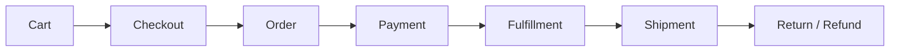
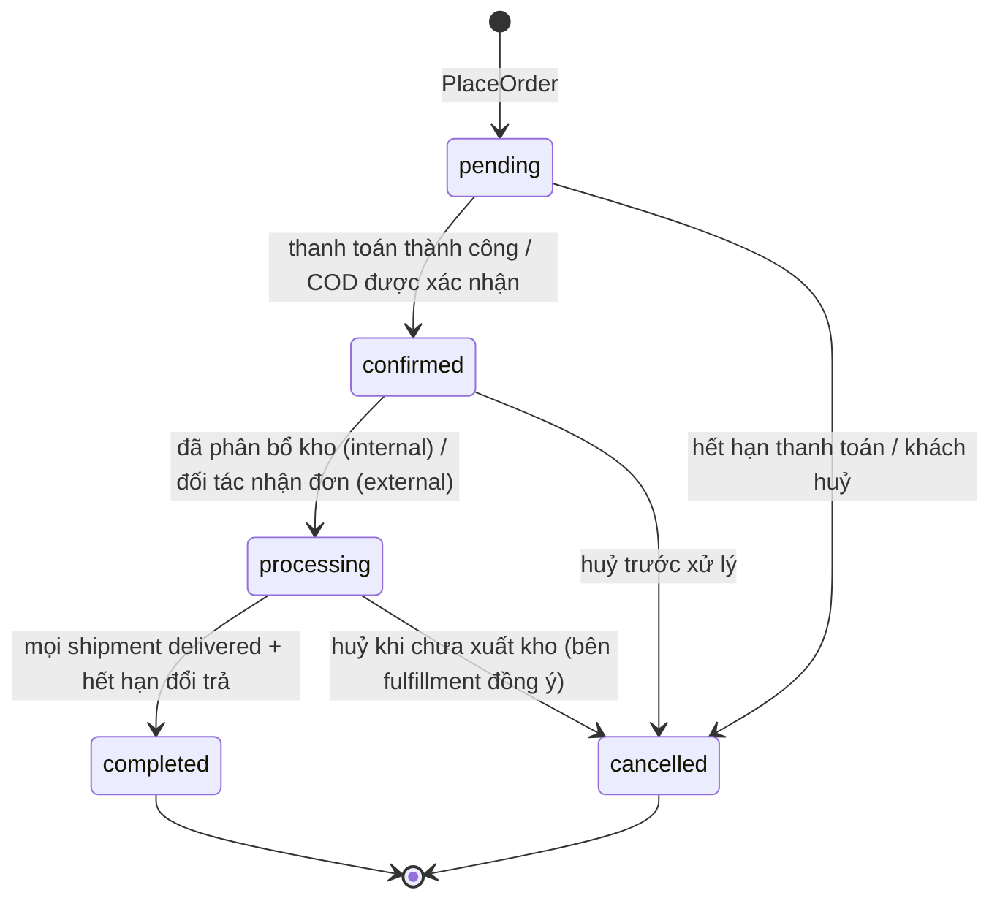
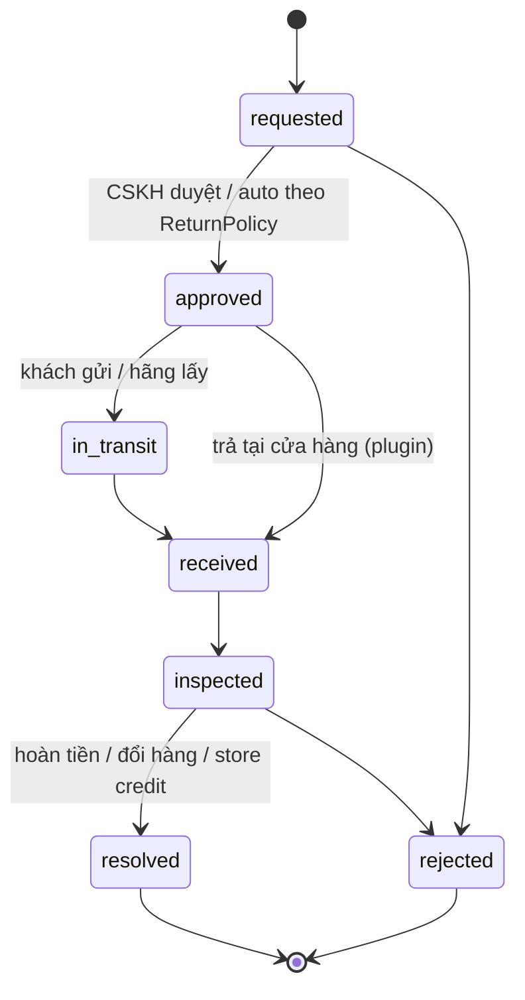

# Order & Returns

> Trạng thái: **Partially Implemented (slice 6)** — tạo đơn: `orders` (snapshot khách/địa chỉ/giao hàng, 4 cột trạng thái, số tiền), `order_lines` (snapshot tên/SKU/màu/size/ảnh, giá, giảm phân bổ, thuế), `order_adjustments`, `order_events` (append-only), số đơn `<mã brand><yymm>-<6 số>` từ `number_sequences`, contract `OrderWriter`, event `OrderPlaced`, kiểm tra cân số liệu khi lưu. **Slice 7:** `OrderStateMachine` (bảng chuyển cố định), `OrderTransitions` (khoá dòng, no-op khi trùng, `order_events`, `OrderConfirmed`/`OrderCancelled` sau commit, `setPaymentStatus`), `OrderReader`; hết hạn thanh toán → huỷ đơn → Checkout nhả hàng + hoàn lượt khuyến mãi. **Slice 8:** Admin đơn (brand workspace `/{admin}/orders/{brand}/orders`: lọc theo trạng thái/thanh toán, tìm theo số đơn hoặc SĐT, chi tiết từ snapshot, lịch sử `order_events`, xác nhận, huỷ có lý do, đổi địa chỉ trước khi giao — địa chỉ cũ lưu trong event, khoá lạc quan —, ghi chú nội bộ, panel mở rộng qua slot `vani.admin.order.sidebar` — Payment thêm panel thanh toán), `OrderPolicy` (khách huỷ khi `pending`/`confirmed` + chưa xử lý kho; nhân viên huỷ khi hàng chưa rời kho), nhãn trạng thái cho khách tính từ 4 chiều (`CustomerStatus`), contract `CustomerOrders` (tra cứu số đơn + SĐT với thông tin bị che; xem/huỷ bằng access token trả lúc đặt, server lưu `sha256`), cột `customer_phone` có index. **Slice 9:** `processing` khi tạo vận đơn, `completed` khi giao hết + hết hạn đổi trả, `fulfillment_status` do Fulfillment cập nhật (`setFulfillmentStatus`), khách/nhân viên huỷ được tới khi hàng rời kho (`allocated`), nhân viên huỷ được đơn hoàn về (`returned_to_sender`). **Chưa có:** order group, **returns** (RMA — slice kế tiếp), huỷ một phần dòng. Quyết định: [ADR-012](../19-adr/ADR-012-order-snapshot.md).

## 1. Vòng đời tổng thể



| Bước | Context sở hữu | Tài liệu |
|---|---|---|
| Cart, Checkout | Cart, Checkout | [cart-checkout](../03-domains/cart-checkout.md) |
| Order, Returns | Ordering, Returns | Tài liệu này |
| Payment, Refund | Payment | [payment](../10-payment/payment.md) |
| Fulfillment, Shipment | Fulfillment | [fulfillment](fulfillment.md) |

## 2. Order là bản ghi nghiệp vụ bất biến

Sau khi tạo, đơn giữ **snapshot** và không phụ thuộc dữ liệu catalog hiện tại (rule R15):

| Snapshot | Lưu ở |
|---|---|
| Tên sản phẩm, SKU, màu, size, ảnh chính | `order_lines` (`product_name`, `sku`, `color_name`, `size_code`, `image_path`) |
| Giá niêm yết, giá bán, số lượng | `order_lines.compare_at_amount`, `unit_amount`, `quantity` |
| Giảm giá (phân bổ) và khuyến mãi đã áp dụng | `order_lines.discount_amount` + `order_adjustments` (mã, tên, nguồn) |
| Thuế | `order_lines.tax_rate_bp`, `tax_amount` |
| Địa chỉ, người nhận | `orders.shipping_address` (JSON) |
| Khách hàng | `orders.customer_id` + `customer_snapshot` (tên, SĐT, email lúc đặt) |
| Vận chuyển | `orders.shipping_method` (carrier, dịch vụ, phí) |
| Pháp nhân, brand, channel, tiền tệ | Cột trên `orders` |

**Được thay đổi sau khi tạo** (luôn có `order_events`): trạng thái (qua state machine); địa chỉ giao **trước khi** fulfillment bắt đầu (lệnh `ChangeShippingAddress`, snapshot cũ lưu trong event); ghi chú; `meta` của plugin.

**Không bao giờ thay đổi**: dòng hàng, giá, giảm giá, thuế. Muốn thay đổi thì dùng huỷ một phần (`CancelOrderLines`), đổi hàng (đơn mới liên kết `parent_order_id`), hoặc hoàn tiền.

## 3. Trạng thái: 4 chiều độc lập

| Chiều | Giá trị | Ai kích hoạt |
|---|---|---|
| `order_status` | `pending` → `confirmed` → `processing` → `completed` / `cancelled` | Hệ thống, CSKH |
| `payment_status` | `unpaid`, `authorized`, `paid`, `partially_refunded`, `refunded`, `cod_pending`, `cod_collected`, `failed` | Payment |
| `fulfillment_status` | `unfulfilled`, `allocated`, `partially_shipped`, `shipped`, `delivered`, `returned_to_sender` (tổng hợp từ shipment) | Fulfillment |
| `return_status` | `none`, `requested`, `in_progress`, `partially_returned`, `returned` | Returns |

### Máy trạng thái `order_status`



```php
interface OrderTransitions   // public contract — cổng duy nhất để đổi trạng thái
{
    public function transition(OrderId $id, OrderStatus $to, TransitionReason $reason, Actor $actor): void;
    public function can(OrderId $id, OrderStatus $to): bool;
}
```

- Bảng chuyển hợp lệ khai báo trong `Domain\OrderStateMachine` (enum + map), **không** mở rộng được (xem [extension-model §2](../04-extension/extension-model.md)).
- Mỗi lần chuyển: khoá dòng `orders` (`FOR UPDATE`), kiểm tra hợp lệ, cập nhật, ghi `order_events` (append-only: from, to, reason, actor, source `customer|staff|system|integration:<client>|carrier|gateway`, correlation id), ghi outbox, phát event sau commit.
- Side effect gắn vào **listener của event**, không đặt trong state machine.
- Chuyển trạng thái trùng (đã ở trạng thái đích) → no-op idempotent.
- Nhãn hiển thị cho khách ("Đang giao", "Chờ thanh toán") được **tính** từ 4 chiều.

### Hết hạn thanh toán

Đơn thanh toán online ở `pending` + `unpaid` quá TTL (mặc định 15 phút, theo gateway) → job `ExpireUnpaidOrders` chuyển `cancelled` (reason `payment_timeout`) → `OrderCancelled` → giải phóng reservation. IPN đến muộn sau khi đã huỷ → ghi nhận payment, tự động tạo refund và cảnh báo CSKH.

## 4. Order Group (kênh đa brand)

Một lần checkout trên kênh đa brand tạo `order_groups` (mã hiển thị cho khách) và **N đơn con theo brand/pháp nhân**. Mỗi đơn con có hoá đơn, fulfillment, đối soát riêng. Giảm giá cấp group được phân bổ về đơn con theo tỷ lệ giá trị ([multi-brand](../12-multi-brand/multi-brand.md)).

## 5. Số đơn

`<BRAND_PREFIX><yymm>-<seq 6 số>`, ví dụ `LM2609-000123`. Sinh từ `number_sequences(scope, period, last_value)` với `FOR UPDATE` trong transaction `PlaceOrder`.

## 6. Domain events

| Event | Phát khi | Listener tiêu biểu |
|---|---|---|
| `OrderPlaced` | Tạo đơn | Notification, plugin loyalty (điểm chờ), Integration |
| `OrderConfirmed` | Thanh toán xong / COD xác nhận | Fulfillment (sourcing), Integration, tracking |
| `OrderCancelled` | Huỷ | Inventory release, Payment refund, Promotion hoàn lượt |
| `OrderCompleted` | Hết hạn đổi trả | Plugin loyalty, plugin e-invoice |
| `ReturnResolved` | Hoàn tất đổi trả | Payment refund, Inventory, Integration |

## 7. Returns (RMA)



| Core | Plugin |
|---|---|
| Trạng thái RMA, `ReturnPolicy` (mặc định `days_window`), tính tiền hoàn từ `line_total` đã phân bổ, nhập lại tồn (movement `return`, sellable hay không), hoàn tiền thủ công | Hoàn tiền tự động qua cổng (plugin payment), trả tại cửa hàng (`vani.store-omnichannel`), nhãn trả hàng của hãng VC |

Invariant: tổng số lượng trả của một dòng ≤ số lượng đã giao (App, khoá dòng `order_lines` khi tạo RMA); tổng hoàn ≤ số đã thu (Payment).

## 8. Kiểm thử

- Unit: mọi cặp trạng thái (hợp lệ/không hợp lệ) của state machine; tính nhãn hiển thị.
- Feature: huỷ đơn giải phóng tồn + hoàn lượt voucher; hết hạn thanh toán; IPN đến muộn; đổi địa chỉ trước/sau fulfillment.
- Snapshot: đổi tên/giá sản phẩm sau khi đặt → đơn cũ không đổi.
- Concurrency: hai lệnh chuyển trạng thái đồng thời → một thành công, một no-op/409.
