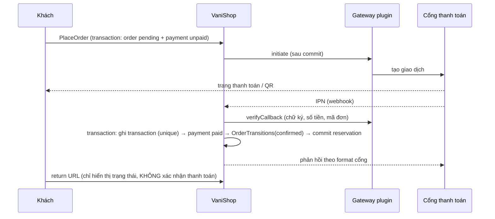

# Payment

> Trạng thái: **Partially Implemented (slice 7)**.
>
> **Đã có:** module `modules/Payment`: `payments` (theo đơn + pháp nhân, `expires_at`, `refunded_amount`, CHECK số tiền), `payment_transactions` (append-only, unique `(gateway_code, gateway_transaction_id, type)` chống IPN trùng), `refunds` (unique `idempotency_key`); contract `PaymentGateway` (tag `vani.payment.gateways`) + `GatewayCapabilities` (callbacks, query, refund, partial refund, xác nhận thủ công, TTL); cổng Core `cod` (giới hạn `VANI_COD_MAX_AMOUNT`, tự xác nhận đơn `VANI_COD_AUTO_CONFIRM`) và `manual_bank_transfer` (tài khoản theo pháp nhân, nội dung = số đơn, nhân viên xác nhận); IPN chung `/api/payments/{gateway}/callback` (xác minh ở cổng, ghi nhận ở Core, so số tiền, trùng → trả OK, không xử lý lại); `vani:payment:expire` (mỗi phút: hết hạn → huỷ đơn → nhả hàng + hoàn lượt khuyến mãi), `vani:payment:reconcile` (mỗi phút: hỏi cổng các giao dịch treo > 5 phút); IPN đến sau khi huỷ → ghi nhận rồi tự hoàn tiền; hoàn tiền một phần/toàn bộ (tự động qua cổng nếu hỗ trợ, không thì chờ nhân viên chuyển trả); Admin brand workspace (xác nhận chuyển khoản, hoàn tiền, danh sách chờ hoàn); **bộ contract test** `Modules\Payment\Testing\PaymentGatewayContract` (§8); concurrency test IPN trùng.
>
> **Slice 9:** giao thành công vận đơn có COD → payment `paid`, đơn `cod_collected` (idempotent theo vận đơn).
>
> **Chưa có:** ngưỡng phê duyệt hoàn tiền 2 bước, credential cổng mã hoá theo pháp nhân trong settings (chờ Tenancy settings), khách chọn lại phương thức sau khi thanh toán lỗi, cổng online thật (plugin `vani.vietqr`, slice 10).

## 1. Trách nhiệm

| Core (`modules/Payment`) | Plugin |
|---|---|
| Payment, transaction, refund; trạng thái `payment_status` | Cổng: VietQR, VNPay, MoMo, ZaloPay, ShopeePay, BNPL |
| Khung `PaymentGateway` + registry theo scope | Đối soát COD chi tiết theo bảng kê hãng |
| COD, chuyển khoản thủ công (nhân viên xác nhận) | Chống bom hàng COD |
| Xử lý IPN/webhook chung: xác thực, idempotency, ghi transaction | |
| Hoàn tiền thủ công, job truy vấn giao dịch treo | |

## 2. Contract

```php
interface PaymentGateway
{
    public function code(): string;                                        // 'cod', 'manual_bank_transfer', 'vietqr'...
    public function isAvailable(PaymentContext $ctx): bool;                // theo brand, số tiền, thiết bị, health
    public function initiate(PaymentData $payment): PaymentInitiation;     // redirect URL / QR / deeplink / none
    public function verifyCallback(Request $request): GatewayCallback;     // xác minh chữ ký → dữ liệu chuẩn hoá
    public function query(PaymentData $payment): GatewayStatus;            // truy vấn trạng thái giao dịch treo
    public function refund(PaymentData $payment, Money $amount, string $idempotencyKey): GatewayResult;
    public function capabilities(): GatewayCapabilities;                   // refund? partial refund? authorize/capture?
}
```

Credential cấu hình **theo pháp nhân** (tài khoản nhận tiền của công ty nào), lưu mã hoá trong settings ([security](../15-security/security.md)).

## 3. Dữ liệu và invariant

| Bảng | Invariant |
|---|---|
| `payments(order_id, gateway_code, amount, currency_code, status, legal_entity_id, expires_at, lock_version)` | DB: `amount > 0`; App: Σ payment `paid` của đơn ≤ tổng đơn |
| `payment_transactions(payment_id, type[initiate|callback|query|capture|refund], gateway_transaction_id, amount, status, raw_payload_masked, correlation_id)` | DB: unique `(gateway_code, gateway_transaction_id, type)` → khử IPN trùng; append-only |
| `refunds(payment_id, amount, status, reason, idempotency_key, requested_by)` | DB: unique `idempotency_key`; App: Σ refund ≤ số đã thu (khoá `payments` khi tạo refund) |

## 4. Flow thanh toán online



| Tình huống lỗi | Xử lý |
|---|---|
| IPN trùng | Unique transaction → trả OK cho cổng, không xử lý lại |
| IPN sai chữ ký / sai số tiền | Từ chối, ghi `security` log, cảnh báo |
| Không nhận được IPN | Job `ReconcilePendingPayments` mỗi phút gọi `query()` cho payment treo > 5 phút |
| IPN đến sau khi đơn đã huỷ vì hết hạn | Ghi nhận `paid`, tự tạo refund, cảnh báo CSKH |
| `initiate` lỗi | Đơn vẫn `pending`; khách thử lại/chọn phương thức khác |

## 5. COD và chuyển khoản thủ công (Core)

- **COD**: đặt hàng → `payment_status = cod_pending` → xác nhận đơn (tự động hoặc CSKH, tuỳ cấu hình brand) → `confirmed`. Giao thành công → `cod_collected` (khi hãng báo hoặc đối soát xác nhận). Giới hạn giá trị COD theo cấu hình.
- **Chuyển khoản thủ công**: hiển thị số tài khoản của pháp nhân + nội dung = mã đơn; nhân viên có quyền `payments.confirm` xác nhận đã nhận tiền (audit).

## 6. Phương thức theo thị trường VN

| Phương thức | Nơi triển khai |
|---|---|
| COD, chuyển khoản thủ công | Core |
| VietQR tự xác nhận (NAPAS QR + webhook ngân hàng/Casso/SePay) | `vani.vietqr` |
| Thẻ nội địa/quốc tế, QR ngân hàng (VNPay, OnePay, Payoo) | Plugin |
| Ví điện tử (MoMo, ZaloPay, ShopeePay) | Plugin |
| Trả góp / BNPL | `vani.bnpl` |

## 7. Bảo mật

Không lưu/không truyền dữ liệu thẻ qua server (hosted page/redirect) → PCI-DSS SAQ-A. Payload lưu log đã che thông tin nhạy cảm. Hoàn tiền cần quyền riêng + ngưỡng phê duyệt 2 bước.

## 8. Kiểm thử

Plugin cổng thanh toán **phải** chạy bộ contract test của Core:

```php
// custom/plugin/<Plugin>/Tests/Feature/GatewayContractTest.php
use Modules\Payment\Testing\PaymentGatewayContract;

PaymentGatewayContract::define('vani.vietqr', fn () => new VietQrGateway(/* client giả */),
    validCallback: fn (PaymentData $p) => Request::create('/callback', 'POST', VietQrFixtures::signed($p)),
    tamperedCallback: fn (PaymentData $p) => Request::create('/callback', 'POST', VietQrFixtures::tampered($p)));
```

Bộ test kiểm tra: mã cổng hợp lệ; `initiate` idempotent; callback đúng chữ ký được chấp nhận và khớp payment/số tiền, bị sửa thì `InvalidCallback`; cổng không có callback luôn từ chối; `query` trả trạng thái chuẩn hoá; `refund` idempotent theo key. Cổng online mẫu: `modules/Payment/Tests/Feature/Fixtures/FakeOnlineGateway.php`.

- Contract test `PaymentGateway`: chữ ký sai bị từ chối, callback trùng idempotent, `refund` với cùng idempotency key chỉ hoàn một lần.
- Feature: COD end-to-end; online paid; hết hạn thanh toán; IPN muộn; hoàn tiền một phần.
- Concurrency: hai IPN cùng giao dịch đến đồng thời → một lần ghi nhận.
