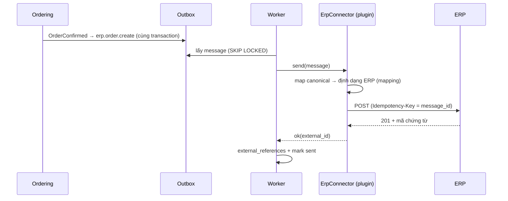

# ERP Integration

> Trạng thái: **Designed** (abstraction). Chưa chốt ERP cụ thể; vai trò **ODO tạm hoãn**. Quyết định: [ADR-007](../19-adr/ADR-007-erp-integration.md).

## 1. Khái niệm

| Khái niệm | Nghĩa trong VaniShop |
|---|---|
| **System of Record (SoR)** | Nơi lưu bản gốc đầy đủ và lâu dài của dữ liệu (ví dụ kế toán nằm trên ERP) |
| **System of Authority (SoA)** | Hệ thống **duy nhất được quyền ghi** một trường dữ liệu trong một scope. Hệ thống khác chỉ giữ bản sao read-only |
| **Hướng đồng bộ** | Mặc định **một chiều** từ SoA sang nơi khác. **Không** mặc định đồng bộ hai chiều |
| **Conflict resolution** | Chỉ SoA được ghi. Bản sao nhận cập nhật theo `version`/`occurred_at` (last-writer-by-version); ghi từ bên không phải SoA bị từ chối |

## 2. Ma trận authority mặc định

Cấu hình trong `integration_ownerships(data_type, scope_type, scope_id, authority)`. Bảng dưới là mặc định; khi có ERP thì Owner đổi theo từng dòng.

| Dữ liệu | Authority mặc định | Có thể chuyển sang | Hướng | Ghi chú |
|---|---|---|---|---|
| Mã hàng (SKU, barcode, đơn vị, nhóm thuế) | VaniShop | **ERP** | ERP → VaniShop | Khi ERP là SoA, form sửa mã trong Admin bị khoá |
| Nội dung bán hàng (tên hiển thị, mô tả, ảnh, SEO) | **VaniShop** | — | VaniShop → ERP (tên ngắn, tuỳ chọn) | |
| Giá bán online | VaniShop | ERP | Một chiều theo cấu hình | Theo brand |
| Giá vốn | ERP | — | Không đồng bộ | |
| Tồn vật lý (on-hand) | VaniShop | ERP / POS / ODO (theo location) | Authority → VaniShop | [inventory](../08-inventory/inventory.md) |
| Reservation, ATS | **VaniShop** | — | VaniShop → ngoài (thông tin) | Không cho ERP ghi |
| Khách hàng | **VaniShop** | — | VaniShop → ERP | |
| Đơn online | **VaniShop** | — | VaniShop → ERP/ODO | |
| Trạng thái fulfillment | VaniShop (internal) | ODO/WMS (external) | Authority → VaniShop | [fulfillment](../09-order/fulfillment.md) |
| Thanh toán online | **VaniShop** | — | VaniShop → ERP | |
| Hạch toán, công nợ, hoá đơn điện tử | ERP (SoR) | — | VaniShop → ERP | HĐĐT có thể do plugin `vani.einvoice` phát hành |
| Warehouse/Location master | VaniShop | ERP | Theo cấu hình | Mapping mã kho |
| Shipment | VaniShop / hãng VC | ODO | Authority → nơi khác | |

## 3. Contract

```php
namespace Modules\Integration\Contracts;

interface ErpConnector extends Connector
{
    /** Khả năng mà ERP này hỗ trợ — Core chỉ gọi những gì được khai báo */
    public function capabilities(): ErpCapabilities;   // items, stock, prices, customers, orders, payments, shipments

    // Pull (khi ERP không tự đẩy qua Integration API)
    public function pullItems(Cursor $since): ItemPage;
    public function pullStock(Cursor $since): StockPage;
    public function pullPrices(Cursor $since): PricePage;

    // Push được gọi bởi outbox worker thông qua send(OutboxMessage)
    //  message types: erp.customer.upsert, erp.order.create, erp.order.cancel,
    //                 erp.payment.record, erp.refund.record, erp.shipment.record
}
```

Implementation là plugin: `vani.erp-odoo` (`OdooConnector`), `vani.erp-sap` (`SapConnector`), `vani.erp-misa`, hoặc `vani.erp-custom` cho ERP tự viết. Nếu ERP có đội dev riêng, họ có thể **không cần connector** mà gọi thẳng Integration API (mô hình A).

## 4. Mapping

| Đối tượng | Khoá mapping | Bảng |
|---|---|---|
| Product/Style | `style_code` ↔ mã mẫu ERP | `external_references` |
| SKU/Variant | `sku` (khuyến nghị dùng chung một mã) | `external_references` |
| Customer | `customer.public_id` ↔ mã KH ERP (khách lẻ có thể gộp thành một mã "khách lẻ online") | `external_references` |
| Order | `order.number` ↔ số chứng từ ERP | `external_references` |
| Payment | `payment.id` ↔ phiếu thu | `external_references` |
| Warehouse | `location.code` ↔ mã kho | `integration_mappings(type=warehouse)` |
| Shipment | `shipment.id` ↔ phiếu xuất | `external_references` |
| Danh mục mã (phương thức thanh toán, trạng thái, tỉnh/thành, thuế) | giá trị nội bộ ↔ giá trị ERP | `integration_mappings` |

Mapping thiếu → message `failed` với lỗi `mapping.missing:<type>:<value>`; sau khi Admin bổ sung mapping thì replay.

## 5. Flow ví dụ: đơn online → ERP



## 6. Khi chốt ODO

Làm theo checklist: ODO đảm nhiệm những gì (chọn kho, tạo vận đơn, đối soát COD, hàng trả); tích hợp theo mô hình A hay B; mapping kho/trạng thái; SLA độ trễ; môi trường sandbox. Sau đó cấp Integration Client cho ODO, đặt ownership `fulfillment_status` = ODO cho các brand liên quan, và chuyển `fulfillment.mode = external`.

## 7. Kiểm thử

- Contract test `ErpConnector` với fake ERP server: đúng mapping, idempotent, phân loại lỗi đúng.
- Feature: ghi tồn từ client không phải authority → 403; bản cũ → `stale_update`; mapping thiếu → failed rồi replay thành công.
