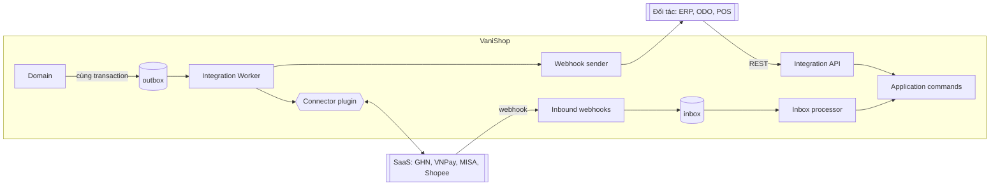

# Integration Platform

> Trạng thái: **Partially Implemented** (slice 11 — phần lõi, xem §11). Quyết định: [ADR-005](../19-adr/ADR-005-event-driven-integration.md), [ADR-013](../19-adr/ADR-013-outbox-inbox.md), [ADR-014](../19-adr/ADR-014-idempotency.md). ERP: [erp-integration](erp-integration.md).

Module `modules/Integration` là **platform** dùng chung cho mọi tích hợp: ERP, ODO, POS, sàn TMĐT, hãng vận chuyển, cổng thanh toán, hoá đơn điện tử. Nó không chứa nghiệp vụ của domain, và không có connector cụ thể nào (connector là plugin).

## 1. Thành phần

| Thành phần | Trách nhiệm |
|---|---|
| **Integration Client** | Danh tính hệ thống ngoài: key, scope, data scope, rate limit, IP allowlist |
| **Integration API** `/api/integration/v1` | Hệ thống ngoài pull/push dữ liệu (mô hình A) |
| **Webhook subscription** | VaniShop đẩy sự kiện cho đối tác (mô hình A) |
| **Connector** (plugin) | VaniShop chủ động gọi API ngoài (mô hình B) |
| **Mapping** | `integration_mappings`, `external_references` |
| **Ownership** | `integration_ownerships`: ai là authority của loại dữ liệu nào, theo scope |
| **Outbox** | Message ra ngoài, ghi cùng transaction |
| **Inbox** | Message vào, lưu trước khi xử lý |
| **Retry / Dead letter / Replay** | Backoff, chuyển `dead`, phát lại có kiểm soát |
| **Reconciliation** | Đối chiếu định kỳ theo từng loại dữ liệu |
| **Correlation ID** | Truy vết xuyên hệ thống |

## 2. Hai mô hình



**Không bao giờ** có flow `Checkout → HTTP request trực tiếp ERP` (rule R12).

## 3. Integration Client

| Trường | Ý nghĩa |
|---|---|
| `code`, `name`, `status` | `erp-main`, `odo`, `pos-kiotviet`; `active`/`suspended` |
| Keys | `integration_client_keys(client_id, key_id, secret_hash, created_at, expires_at, revoked_at)`; cho phép **2 key song song** để xoay vòng |
| `scopes` | `orders:read`, `orders.fulfillment:write`, `inventory:write`, `catalog.items:write`, `customers:read`… |
| Data scope | Brand / pháp nhân / location được thấy |
| `ip_allowlist`, `rate_limit` | Tuỳ chọn; mặc định 600 req/phút |

## 4. Integration API (mô hình A)

Xác thực HMAC ([api §5](../06-api/api.md)). Payload theo **canonical model** có version (`vanishop.order.v1`), JSON Schema trong `docs/api/schemas/` (được tạo khi triển khai).

**Đọc**: `GET /orders?updated_since=&cursor=`, `/orders/{number}`, `/returns`, `/customers`, `/catalog/variants`, `/payments`, `/events?after=<cursor>` (event feed thay cho webhook).

**Ghi**: `POST /orders/{number}/acknowledgements`, `POST /orders/{number}/fulfillments`, `POST /orders/{number}/cancellation-decisions`, `PUT /inventory/levels`, `POST /inventory/snapshots`, `PUT /catalog/items`, `PUT /prices`, `POST /returns/{number}/receipts`, `POST /pos-orders`, `POST /cod-reconciliations`, `GET /jobs/{id}`.

Quy tắc ghi:
- `Idempotency-Key` bắt buộc cho POST; PUT idempotent theo khoá tự nhiên.
- Bản cũ không ghi đè bản mới: `version`/`occurred_at`; bản cũ → `409 stale_update`.
- Ghi đi qua **Application command** của context sở hữu, nên vẫn chịu validation, state machine và audit.
- Client không phải authority của loại dữ liệu đó → `403 not_data_owner`.

## 5. Webhook subscription

- Đăng ký: `url`, `event_types`, secret ký. Event: `order.created|confirmed|updated|cancel_requested|cancelled`, `payment.captured|refunded`, `return.created|approved`, `customer.updated`, `inventory.reservation_changed`…
- Gửi qua outbox; đối tác phải trả 2xx trong 10 giây.
- Lỗi liên tục 24h → subscription tự `paused` + thông báo.

## 6. Connector (mô hình B)

```php
interface Connector
{
    public function system(): string;
    public function supports(string $messageType): bool;
    public function send(OutboxMessage $message): DeliveryResult;     // DeliveryResult: ok | retryable(err) | permanent(err)
    public function translateInbound(InboxMessage $message): array;   // → Application commands
    public function healthCheck(): HealthStatus;
}
```

- `retryable` (timeout, 5xx, 429) → retry với backoff. `permanent` (4xx do dữ liệu sai) → `dead` ngay, không retry vô ích.
- Mỗi lời gọi HTTP: timeout kết nối 3s, tổng 10s; circuit breaker theo connector (mở sau 5 lỗi liên tiếp, thử lại sau 60s).
- Header gửi đi: `Idempotency-Key: <message_id>`, `X-Correlation-Id`.

## 7. Outbox, Inbox, Retry, Dead letter, Replay

### Outbox

```
integration_outbox(id uuid, target, message_type, schema_version, aggregate_type, aggregate_id,
                   payload json, status[pending|processing|sent|failed|dead], attempts,
                   next_attempt_at, correlation_id, last_error, created_at, sent_at)
INDEX (status, next_attempt_at), INDEX (aggregate_type, aggregate_id, created_at)
```

```php
// Worker (chạy liên tục qua Horizon + scheduler dự phòng)
$batch = DB::transaction(fn () => OutboxRecord::where('status', 'pending')
    ->where('next_attempt_at', '<=', now())
    ->orderBy('created_at')->limit(100)
    ->lockForUpdate()->skipLocked()->get()
    ->each->markProcessing());

foreach ($batch->groupBy('aggregate_key') as $messages) {   // tuần tự trong cùng aggregate
    foreach ($messages as $m) {
        $result = $this->router->deliver($m);               // webhook hoặc connector
        if ($result->failed()) { $m->scheduleRetryOrDead($result); break; } // chặn message sau cùng aggregate
        $m->markSent();
    }
}
```

Backoff: 1m, 5m, 15m, 1h, 6h, 24h (+ jitter ±20%). Hết 6 lần → `dead`.

### Inbox

```
integration_inbox(id, system, external_event_id, message_type, payload json, received_at,
                  status[received|processed|failed|dead|ignored_stale], attempts, correlation_id, last_error)
UNIQUE (system, external_event_id)
```

Endpoint webhook: xác thực chữ ký → insert (trùng thì trả 2xx luôn) → trả 2xx → xử lý bất đồng bộ.

### Replay

- Admin "Integration Health" (quyền `integration.replay`): xem message `failed/dead`, xem payload (đã che PII), **replay** từng message hoặc theo bộ lọc; mỗi lần replay đều có audit.
- Replay dùng lại đúng `message_id`, nên phía nhận vẫn khử trùng lặp được.
- CLI: `php artisan vani:integration:replay --status=dead --target=erp-main --since=...`.

## 8. Reconciliation

| Dữ liệu | Cách đối chiếu | Tần suất |
|---|---|---|
| Tồn kho | Snapshot authority ↔ `on_hand` ([inventory §6](../08-inventory/inventory.md)) | Hằng đêm |
| Đơn hàng | Danh sách đơn phía đối tác (acknowledged) ↔ đơn `confirmed` của VaniShop; thiếu thì gửi lại | Mỗi giờ |
| Thanh toán | Sao kê cổng ↔ `payment_transactions` | Hằng ngày |
| COD | Bảng kê hãng ↔ shipment (plugin `vani.cod-reconciliation`) | Theo kỳ đối soát |

Kết quả ghi vào `integration_reconciliations`, có báo cáo chênh lệch và cảnh báo khi vượt ngưỡng.

## 9. Observability

- Mỗi message mang `correlation_id` gốc từ request/command tạo ra nó ([observability](../16-observability/observability.md)).
- Metric: `integration_outbox_pending{target}`, `integration_delivery_seconds{target}`, `integration_failures_total{target,kind}`, `integration_dead_total`.
- Cảnh báo: có message `dead` loại `order.*`, backlog > 500 hoặc trễ > 5 phút, `healthCheck` fail.
- Log giữ 90 ngày.

## 10. Kiểm thử

- Outbox: rollback thì không có message; worker nhiều tiến trình không gửi trùng; thứ tự theo aggregate được giữ.
- Inbox: webhook trùng chỉ xử lý một lần; chữ ký sai bị 401.
- Contract test connector với fake server (`Http::fake`), phân loại đúng retryable/permanent.
- API: scope/data scope/ownership bị chặn đúng; `stale_update`.

## 11. Ghi chú triển khai (slice 11)

Đã có: event feed, outbox, inbox, worker, webhook, replay, Integration Client, một phần Integration API, Admin "Tích hợp". Những điểm khác hoặc cụ thể hơn thiết kế ở trên:

| Chủ đề | Triển khai |
|---|---|
| Event feed | Bảng `integration_events` (append-only, `id` là cursor của `GET /events`). `IntegrationEvents::publish()` ghi feed **và** fan-out outbox (webhook subscription khớp loại + data scope brand, connector `supports()`) trong một transaction |
| Nguồn event | Domain event của Core là `ShouldDispatchAfterCommit`, nên bridge (`PublishDomainEvents`) ghi feed ngay **sau** commit nghiệp vụ, không cùng transaction. Khe hở (tiến trình chết giữa commit và ghi feed) được bù bằng đối soát đơn ↔ feed hằng giờ (`vani:integration:reconcile-orders`: đơn đổi trong 25h, bỏ 5 phút gần nhất; thiếu `order.created`/`order.confirmed`/`order.cancelled` theo trạng thái → phát bù với `reconciled: true`, event bù có thể đến sau event kế tiếp của cùng đơn). Event thanh toán/đổi trả/giao hàng chưa được đối soát. Bridge đăng ký ở `register()` để chạy trước listener của module khác — giữ `order.created` trước `order.confirmed` khi COD tự xác nhận |
| Aggregate | Mọi event hiện có (`order.*`, `payment.*`, `return.*`, `shipment.status_changed`) dùng aggregate = số đơn, nên đối tác nhận đúng thứ tự trong một đơn |
| Envelope | Như [api §5.1](../06-api/api.md), thêm `aggregate: {type, id}` |
| Trạng thái message | `pending` (chờ gửi hoặc đã hẹn retry), `processing`, `sent`, `failed` (lỗi vĩnh viễn: 4xx, mapping thiếu, connector bị tắt — không tự retry), `dead` (hết lượt retry). Inbox dùng `received` thay cho `pending`, `processed` thay cho `sent`, thêm `ignored_stale` |
| Thứ tự | Worker chỉ lấy message đầu hàng của mỗi (target, aggregate): message sau chờ khi message trước còn `pending`/`processing`. `failed`/`dead` **không** chặn hàng (tránh kẹt vô hạn); replay sau khi sửa |
| Retry | 6 lần thử lại (1m, 5m, 15m, 1h, 6h, 24h ± 20%), tổng 7 lần gửi; cấu hình `vanishop.integration.retry_delays`. Message `processing` quá `processing_timeout` (600s) được trả về hàng đợi |
| Webhook | Subscription thuộc một Integration Client (dùng data scope của client). Lỗi liên tục ≥ 24h → `paused` + log cảnh báo; khi `paused` không nhận message mới, đối tác bắt kịp qua `GET /events?after=` rồi được bật lại trong Admin. Mẫu `event_types`: `*`, `order.*`, hoặc tên chính xác |
| Key | `integration_client_keys.secret` lưu **mã hoá** bằng `APP_KEY` (không phải hash) vì server cần secret để kiểm HMAC. Tối đa 2 key còn hiệu lực |
| Chữ ký request | `X-Vani-Key-Id` + `X-Vani-Signature: t=,v1=hmac(secret, t + "." + METHOD + "." + path?query + "." + body)` — xem [api §5.1](../06-api/api.md) |
| Scope | `events:read`, `orders:read`, `orders:write` (acknowledgements), `inventory:write` |
| Ownership | Chưa có `integration_ownerships`. Authority tồn vật lý lấy từ `locations.stock_authority` = mã client |
| Worker | `vani:integration:dispatch` / `vani:integration:process-inbox`: scheduler chạy mỗi phút (dự phòng); production chạy `--work` dưới supervisor/Horizon |
| Connector | Extension point `Modules\Integration\Contracts\Connector` (tag `vani.integration.connectors`, có hiệu lực theo brand bật plugin) và `InboundHandler` (tag `vani.integration.inbound`) — thay cho `translateInbound()` trong §6. Circuit breaker theo connector (cache dùng chung giữa worker): mở sau `circuit_threshold` (5) lỗi retryable/exception liên tiếp, message hoãn tới hết `circuit_cooldown` (60s) mà không tăng `attempts`; lỗi vĩnh viễn không tính. Webhook không dùng breaker (đã có cơ chế `paused`) |
