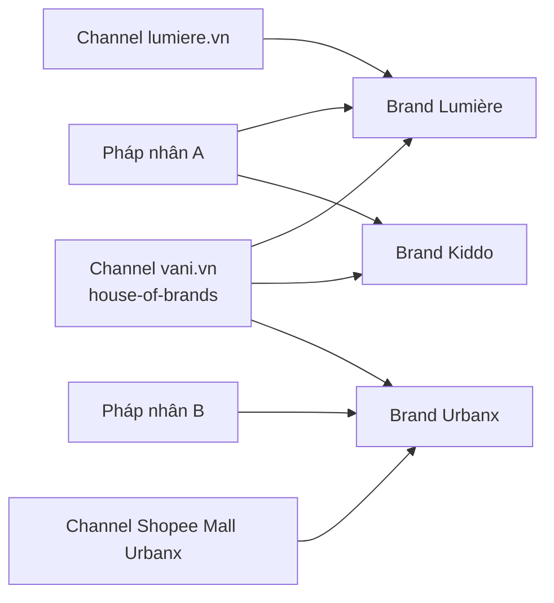

# Multi-brand & Multi-channel

> Trạng thái: **Designed**. Quyết định: [ADR-008](../19-adr/ADR-008-multi-brand-model.md).

## 1. Mô hình

```text
Owner (1 bản cài đặt)
  └── Legal Entity (pháp nhân, MST)       ← xuất hoá đơn, nhận tiền
        └── Brand (thương hiệu)            ← danh tính, sở hữu sản phẩm
Channel (kênh bán)                         ← điểm bán; chứa 1..N brand
Location (kho/cửa hàng)                    ← thuộc pháp nhân; phục vụ 1..N brand
```

**Không đồng nhất các khái niệm:**

| Không phải | Vì |
|---|---|
| Brand = Channel | Một brand bán trên nhiều kênh (web riêng, sàn, POS); một kênh có thể bán nhiều brand |
| Brand = Category | Category là cách sắp xếp sản phẩm trong một kênh; brand là chủ sở hữu sản phẩm |
| Brand = Store/Location | Location là nơi để hàng, có thể dùng chung cho nhiều brand |



## 2. Context sở hữu

| Context | Sở hữu |
|---|---|
| **Tenancy** | Owner, Legal Entity, settings kế thừa `owner → legal_entity → brand → channel` |
| **Brand** | Danh tính (tên, slug, logo, favicon), **theme tokens** (màu, typography, radius, spacing), cấu hình brand (chính sách đổi trả, rounding step, giới hạn KM), sở hữu sản phẩm, quyền theo brand |
| **Channel** | Loại kênh (`web`, `marketplace`, `pos`, `app`, `social`), domain, locale, tiền tệ, danh sách brand trong kênh (`channel_brands`), bảng giá áp dụng, location phục vụ, theme sử dụng |

Theo sở hữu dữ liệu: **Collections, merchandising, content** thuộc Catalog/Content nhưng có phạm vi brand hoặc channel. **Product, Cart, Checkout, Order, Payment vẫn thuộc Commerce Core**; Brand chỉ là thuộc tính phạm vi (`brand_id`) trên chúng.

## 3. Phạm vi dữ liệu

| Dữ liệu | Phạm vi |
|---|---|
| Customer, loyalty, location, tồn | Owner (dùng chung) |
| Style/Variant | Brand (1 style thuộc đúng 1 brand) |
| Danh mục, bộ sưu tập, CMS, menu | Brand hoặc Channel |
| Bảng giá | Brand, gán cho Channel |
| Khuyến mãi | Owner / Brand / Channel |
| Đơn hàng | Channel + Brand + Legal Entity (kênh đa brand thì tách đơn con theo brand) |
| Nhân viên | Owner; quyền gán theo scope ([security](../15-security/security.md)) |

### Cơ chế cô lập

1. **Policy** (lớp 1): mọi thao tác Admin/API kiểm tra quyền theo scope của bản ghi.
2. **Global scope `BelongsToBrand`** (lớp 2): lọc theo `CurrentContext::brandIds()`.
   - Storefront: các brand của channel hiện tại.
   - Admin: các brand nhân viên được phân quyền.
   - Job/CLI: bắt buộc `CurrentContext::runAs(...)`; thiếu context → exception, **không** mặc định "tất cả".
3. **Test bắt buộc**: nhân viên brand A không đọc/ghi được dữ liệu brand B.

```php
final class CurrentContext   // scoped singleton theo request/job
{
    public function channel(): ?ChannelData;
    /** @return list<int> */
    public function brandIds(): array;
    public function locale(): string;
    public function actor(): Actor;                  // customer | staff | integration client | system
    public function runAs(Scope $scope, Closure $fn): mixed;
}
```

`ResolveChannel` middleware: host (+ path prefix) → `channel_domains` → channel → brands, locale, currency, price lists, theme → `CurrentContext`. Không khớp domain nào → 404.

## 4. Kênh đa brand (house-of-brands)

- Giỏ chứa nhiều brand; checkout một lần, thanh toán một lần.
- `PlaceOrder` tạo `order_group` + **N đơn con theo brand/pháp nhân** trong cùng transaction; mỗi đơn con có fulfillment, hoá đơn, đối soát riêng.
- Khuyến mãi cấp group phân bổ về đơn con theo tỷ lệ giá trị (`Money::allocate`).
- Một payment trả cho cả group được ghi nhận phân bổ theo pháp nhân. Việc thu hộ nội bộ giữa các pháp nhân cần kế toán xác nhận trước khi bật.

## 5. Theme và domain

- Không fork storefront cho từng brand. Brand tuỳ biến qua **theme tokens + brand config + collection config + content + layout/blocks** ([storefront](../14-storefront/storefront.md)).
- `channel_domains(host, path_prefix, channel_id, is_primary)`; SSL tự động qua CDN; canonical theo domain chính.

## 6. Thêm brand mới

1. Tạo pháp nhân (nếu mới), brand, channel; gắn domain.
2. Chọn theme cơ sở, đặt theme tokens, logo.
3. Gán location, bảng giá, bật plugin thanh toán/vận chuyển theo scope brand.
4. Import catalog (ERP hoặc Excel mẫu).
5. `php artisan vani:brand:preflight {brand}`: kiểm tra cấu hình thiếu (thông tin pháp lý website, phương thức thanh toán, bảng phí…).

Mục tiêu: ≤ 5 ngày làm việc, không cần deploy code.

## 7. Kiểm thử

- Feature: cô lập dữ liệu giữa brand ở mọi model có phạm vi; `ResolveChannel` với domain/path prefix; job không có context bị từ chối.
- Feature: checkout kênh đa brand tạo đúng N đơn con, tổng phân bổ bằng tổng group.
