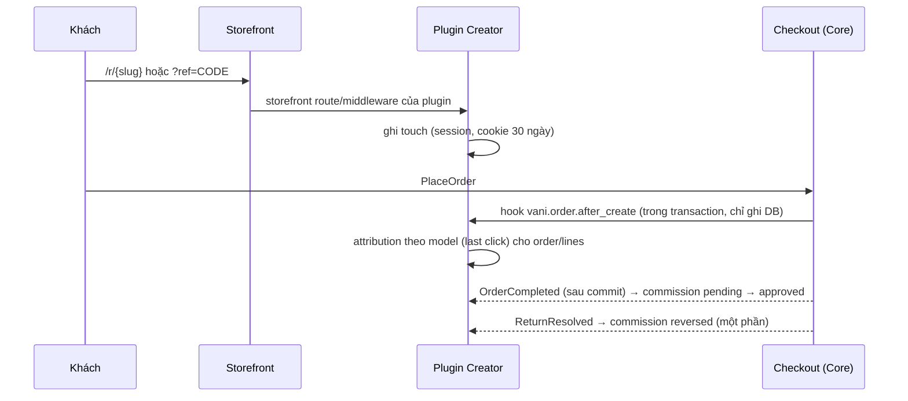

# Creator / Affiliate / Attribution (plugin `vani.creator`)

> Trạng thái: **❄️ Đóng băng** (2026-10-08, roadmap Phase 10) — mục tiêu hiện tại là một cửa hàng, một người bán. Giữ làm tham khảo khi Owner mở lại; không triển khai. Trước đó: **Designed**, đợt **Later**.

Không nhúng logic Creator vào Checkout Core. Attribution **độc lập với Order** và liên kết với đơn qua ID.

## 1. Mô hình (plugin)

```
plg_creator_creators(id, code, name, status, payout_account_encrypted, commission_plan_id)
plg_creator_campaigns(id, creator_id NULL, brand_id NULL, code,   -- brand_id: giới hạn chiến dịch cho sản phẩm của một brand catalog
                       starts_at, ends_at, commission_rules json)
plg_creator_links(id, campaign_id, creator_id, slug UNIQUE, target_url)
plg_creator_touches(id, session_id, customer_id NULL, creator_id, campaign_id, link_id, source, touched_at)
plg_creator_attributions(id, order_id, order_line_id NULL, creator_id, campaign_id, touch_id, model[last_click], weight_bp)
plg_creator_commissions(id, attribution_id, amount, status[pending|approved|reversed|paid])
plg_creator_settlements(...), plg_creator_payouts(...)
```

## 2. Flow



| Nhu cầu | Extension point |
|---|---|
| Bắt referral | Registry `storefrontRoutes()` + middleware của plugin (chỉ ghi cookie/session) |
| Giảm giá của creator | `PromotionRule` `creator_code` (voucher gắn creator) |
| Gắn attribution vào đơn | Hook `vani.order.after_create`; `PromotionContext.attributes.creator_ref` qua hook `vani.checkout.before_validate` |
| Commission | Events `OrderCompleted`, `ReturnResolved` |
| Portal | `adminPages()` với scope `creator` |

## 3. Invariant

- Mỗi `order_line` có tổng `weight_bp` attribution ≤ 10000.
- Commission tính trên `line_total` đã phân bổ giảm giá, không tính trên phí ship/thuế (cấu hình được).
- Tự giới thiệu chính mình (creator = customer) → không tính commission.
- Mọi đảo commission là dòng âm mới, không sửa dòng cũ (ledger).

## 4. Kiểm thử

Feature với fake order: touch → order → attribution → completed → commission; trả hàng một phần → đảo đúng tỷ lệ; hai creator chạm cùng phiên → last click thắng.
