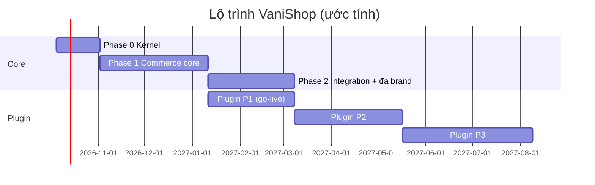

# 15 — Lộ trình

> Nguyên tắc ([ADR-0009](adr/0009-core-toi-gian-nghiep-vu-bang-plugin.md)): **xây core trước, ổn định điểm mở rộng, sau đó làm plugin nghiệp vụ song song**. Thời lượng ước tính cho đội 4–6 dev + 1 QA + 1 BA/PO.

## Phase 0 — Kernel (≈ 4 tuần)

- [x] Chốt ADR: MySQL, Admin Inertia + Vue 3 + TypeScript, module tại `modules/`, plugin tại `custom/plugin/`, theme tại `custom/theme/`, hoãn ODO, hạ tầng tại VN, core tối giản (xem [adr/](adr/README.md)).
- [ ] Dựng staging tại nhà cung cấp VN do Owner chọn (Docker + Terraform/Ansible).
- [ ] Autoload `Modules\`, `Plugin\`; `ModuleServiceProvider` tự đăng ký module.
- [ ] **Extension**: facade `Hook` + registry hook, plugin loader (manifest, vòng đời, scope), `PluginServiceProvider` với các registry ([10 §6.4](10-hook-va-plugin.md)).
- [ ] Khung Admin Inertia (layout, auth, menu động từ registry, bảng/lọc dùng chung, form tự sinh từ `settings_schema`).
- [ ] `.env` MySQL 8.4; CI có service MySQL.
- [ ] Shared: `Money`, `Phone`, `CurrentContext`, địa giới hành chính 2 cấp.
- [ ] Tenancy: pháp nhân, brand, channel, domain, settings kế thừa; middleware `ResolveChannel`; trait `BelongsToBrand`.
- [ ] Identity: staff, 2FA, scoped RBAC, audit log.
- [ ] CI: Pint, Larastan, Pest (kèm arch test ranh giới module), clean-room checks, license check.
- [ ] **Plugin mẫu** `HelloWorld` trong `custom/plugin/` dùng đủ registry, làm chuẩn cho người viết plugin.
- **Done khi**: 2 brand với 2 domain local; nhân viên brand A không thấy dữ liệu brand B; plugin mẫu cài/bật/tắt theo brand được (có test).

## Phase 1 — Commerce core (≈ 10 tuần)

Chỉ dùng **core**, không cần plugin nào mà vẫn bán được.

- [ ] Catalog: style/màu/variant, thuộc tính, danh mục, bộ sưu tập, media, import Excel, tìm kiếm (Scout).
- [ ] Pricing: bảng giá, giá niêm yết/giá bán, lịch giá, lịch sử giá.
- [ ] Inventory: location, stock level, reservation, ATS, movement, điều chỉnh tay/import.
- [ ] Customer: tài khoản hợp nhất, OTP qua `OtpSender` (email), địa chỉ, consent.
- [ ] Checkout: giỏ, totals pipeline (subtotal/shipping/tax/rounding), `CheckoutValidator`, `PlaceOrder`.
- [ ] Ordering: 4 chiều trạng thái, state machine, Admin quản lý đơn, tra cứu đơn.
- [ ] Payment: khung `PaymentGateway` + COD + chuyển khoản thủ công.
- [ ] Fulfillment: shipment, `flat_rate`, `manual`, `SourcingStrategy` mặc định, `FulfillmentMethod` `delivery`.
- [ ] Returns: RMA cơ bản, `ReturnPolicy`.
- [ ] Content: trang, menu, banner, page builder + block cơ bản; theme `custom/theme/vani-base`; SEO, sitemap.
- [ ] Notification: template theo brand/event, email.
- [ ] Domain events + contract đọc/ghi ([10 §6.2–6.3](10-hook-va-plugin.md)) **đóng băng v1**.
- **Done khi**: 1 brand chạy trên staging với luồng đặt (COD) → giao (vận đơn nhập tay) → hoàn tất → đổi trả; load test đạt NFR; điểm mở rộng v1 có tài liệu.

## Phase 2 — Integration + đa brand (≈ 8 tuần, core)

- [ ] Module Integration: client, API key/HMAC, outbox, inbox, mapping, ownership, log, dashboard, replay.
- [ ] Integration API v1 + webhook subscription + tài liệu OpenAPI + sandbox.
- [ ] Brand thứ 2, 3 lên nền tảng (quy trình ≤ 5 ngày, lệnh preflight).
- [ ] Kênh tập đoàn house-of-brands (order group, tách đơn theo pháp nhân).
- **Done khi**: đối tác (ERP) tích hợp được bằng Integration API mà không cần sửa core; 3 brand hoạt động.

## Plugin — chạy song song sau Phase 1

Danh mục đầy đủ ở [17](17-danh-muc-plugin.md). Mỗi plugin là một dự án nhỏ có README đặc tả, test, và tiêu chí Done riêng.

| Đợt | Plugin | Mục tiêu |
|---|---|---|
| **P1 — go-live** | `VietQr`, `VnPay`, `Ghn` hoặc `Ghtk`, `ZaloZns`, `SmsBrandname`, `Promotion` (cơ bản), `TrackingPixels` | Go-live production brand đầu tiên |
| **P2** | `MoMo`, `ZaloPay`, `ShopeePay`, `CodReconciliation`, `CodRiskGuard`, `EInvoice` + nhà cung cấp, `StoreOmnichannel` (tra tồn, BOPIS), `AbandonedCart`, `Wishlist`, `SocialLogin`, `FeedExport`, `Blog`, connector ERP (nếu cần) | Vận hành đầy đủ đa brand |
| **P3** | `Loyalty`, `Promotion` nâng cao (cross-brand, BxGy, combo), `AdvancedSourcing`, `ChannelAllocation`, `Shopee`/`Lazada`/`TikTokShop`, `Bnpl`, `SizeAdvisor`, `ProductBundle`, `PosSync`, `AdvancedReports`, `Odo` (khi chốt) | Omnichannel & kênh mới |

## Sau đó

- Mobile app / Zalo Mini App trên Storefront API.
- Cá nhân hoá, gợi ý sản phẩm; CDP/Marketing automation (plugin).
- Đa tiền tệ, bán quốc tế.
- Xem xét tách service (Search, Integration) nếu tải đòi hỏi.

## Rủi ro chính

| Rủi ro | Mức | Giảm thiểu |
|---|---|---|
| Điểm mở rộng thiếu hoặc sai khiến plugin phải "hack" core | Cao | Plugin mẫu từ Phase 0; đóng băng v1 cuối Phase 1 sau khi thử bằng 2–3 plugin P1; bổ sung điểm mở rộng qua PR vào core |
| Vai trò ODO chưa chốt; API ERP chưa sẵn sàng / chỉ hỗ trợ file | Cao | VaniShop tự fulfillment (`internal`); Integration API chuẩn; file puller SFTP dự phòng |
| Chất lượng dữ liệu mã hàng giữa các brand không đồng nhất | Cao | Chuẩn hoá quy tắc mã trước Phase 1; import có dry-run |
| Oversell mùa sale | Trung bình | Reservation atomic, safety stock, load test |
| Vô tình vi phạm license BeikeShop | Trung bình | Quy trình clean-room + CI kiểm tra ([01](01-clean-room-va-license.md)) |
| Thay đổi quy định (HĐĐT, dữ liệu cá nhân, địa giới) | Trung bình | Nghiệp vụ theo quy định nằm trong plugin, cập nhật độc lập với core |
| Phạm vi core phình to | Cao | Áp tiêu chí vào core của [ADR-0009](adr/0009-core-toi-gian-nghiep-vu-bang-plugin.md) khi review mọi PR |
