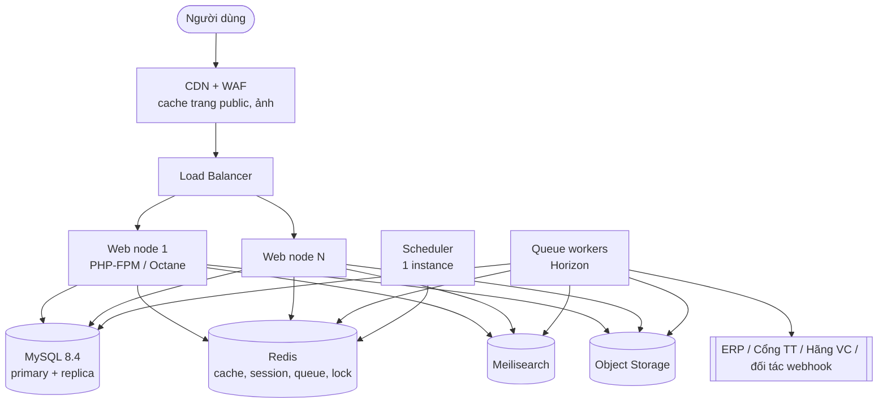

# Operations

> Trạng thái: **Designed**. Hạ tầng tại Việt Nam ([ADR-018](../19-adr/ADR-018-infrastructure-vietnam.md)). Giám sát: [observability](../16-observability/observability.md). CI: [testing §8](../17-testing/testing.md).

## 1. Môi trường

| Môi trường | Mục đích | Dữ liệu | Tích hợp |
|---|---|---|---|
| `local` | Phát triển | Seeder/factory | Fake connector |
| `ci` | Test tự động | SQLite in-memory (unit) + MySQL 8.4 service (feature, concurrency) | Fake |
| `staging` | UAT, demo nghiệp vụ | Dữ liệu giả lập/ẩn danh | Sandbox ERP/cổng TT/hãng VC (ODO khi có) |
| `production` | Vận hành | Thật | Thật |

Không bao giờ copy dữ liệu khách production xuống môi trường thấp hơn nếu chưa ẩn danh hoá.

## 2. Kiến trúc triển khai

- **Toàn bộ hạ tầng và dữ liệu đặt tại Việt Nam** từ slice Foundation ([ADR-018](../19-adr/ADR-018-infrastructure-vietnam.md)): Viettel IDC, FPT Cloud, VNG Cloud, BizFly Cloud hoặc CMC Cloud (Owner chọn trực tiếp). Ưu tiên managed MySQL + object storage S3-compatible; Redis/Meilisearch tự vận hành nếu không có managed.
- Triển khai bằng container (Docker), hạ tầng mô tả bằng mã (Terraform/Ansible) để có thể đổi nhà cung cấp.
- Backup khác vùng: 2 DC (Hà Nội ↔ TP.HCM).
- Web node **stateless**; session/cache ở Redis; file ở object storage.
- Cân nhắc **Laravel Octane** cho storefront API khi tải cao (sau khi đo đạc).

## 3. Queue

| Queue | Công việc | Ưu tiên |
|---|---|---|
| `critical` | Xử lý IPN thanh toán, giải phóng reservation, xác nhận đơn | Cao nhất |
| `integration` | Outbox dispatcher, inbox processor | Cao |
| `notifications` | Email/SMS/ZNS | Trung bình |
| `search` | Đồng bộ index | Trung bình |
| `default` | Khác | Trung bình |
| `bulk` | Import/export, snapshot tồn, báo cáo | Thấp, giới hạn concurrency |

Job phải **idempotent**, có `tries`, `backoff`, `timeout`; job tích hợp theo cùng aggregate dùng `WithoutOverlapping`/`ShouldBeUnique`.

## 4. Scheduler (tham khảo)

| Tần suất | Lệnh |
|---|---|
| Mỗi phút | Giải phóng reservation hết hạn; dispatcher outbox (bổ sung cho worker); kiểm tra thanh toán treo |
| 5 phút | Health check connector; đồng bộ trạng thái vận đơn (fallback polling) |
| Hằng giờ | Kích hoạt/kết thúc khuyến mãi & bảng giá theo lịch; giỏ bỏ quên |
| Hằng đêm | Snapshot tồn đối chiếu; chuyển điểm loyalty pending → available; hết hạn điểm; sitemap; feed sàn/quảng cáo; dọn log |
| Hằng tháng | Xét hạng thành viên |

## 5. Cache

- Cache theo khoá có **brand/channel** trong tên: `ch:{channel}:product:{style}:v{version}`.
- Invalidate theo event (sản phẩm, giá, tồn) — dùng version key thay vì xoá hàng loạt.
- Trang public (home, PLP, PDP) cache ở CDN ngắn (60–300s) + `stale-while-revalidate`; phần giá/tồn động tải qua API nếu cần độ chính xác cao.

## 6. Giám sát & cảnh báo

Xem [observability](../16-observability/observability.md) (log, metric, tracing, ngưỡng cảnh báo). Thêm synthetic check mỗi 5 phút cho: trang chủ, PDP, thêm giỏ, checkout COD trên brand sandbox.

## 7. Triển khai (CI/CD)

1. PR → CI theo [testing §8](../17-testing/testing.md), build asset.
2. Merge `main` → deploy staging tự động → smoke test.
3. Release tag → deploy production **zero-downtime** (migrate an toàn, `php artisan optimize`, reload worker).
4. Feature flag (Laravel Pennant) cho tính năng lớn, bật theo brand.
5. Rollback: giữ artifact 5 bản gần nhất; migration theo expand/contract để rollback code không cần rollback DB.

## 8. Sao lưu & khôi phục

- MySQL: binlog (row-based) cho PITR giữ 14 ngày + snapshot/backup hằng ngày (Percona XtraBackup hoặc snapshot dịch vụ managed) giữ 35 ngày, lưu khác vùng.
- Object storage: versioning.
- **RPO ≤ 5 phút, RTO ≤ 2 giờ**; diễn tập khôi phục mỗi quý.

## 9. Chuẩn bị mùa cao điểm (11.11, 12.12, Tết)

- Load test (k6) kịch bản flash sale trước 2 tuần: 3× tải dự kiến.
- Pre-warm cache, tăng worker, tạm dừng job `bulk`.
- Flash sale: hàng đợi phòng chờ (waiting room) ở CDN nếu cần; counter tồn Redis.
- Đóng băng deploy (code freeze) 48h trước và trong sự kiện.
- **Safe mode plugin** (`VANI_PLUGINS_SAFE_MODE=true`) khi nghi plugin gây sự cố ([plugin-system §8](../05-plugin/plugin-system.md)).
- Runbook sự cố: cổng thanh toán lỗi (ẩn phương thức, ưu tiên COD), đối tác tích hợp/ERP chậm (outbox giữ message, không ảnh hưởng checkout), sự cố dữ liệu cá nhân.
