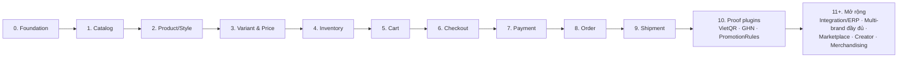

# Roadmap

> Trạng thái: **Planned**. Tài liệu kiến trúc đã đủ để bắt đầu code. **Từ đây ưu tiên implementation theo vertical slice**; chỉ mở rộng tài liệu khi code cần. Mỗi slice xong phải cập nhật [status](../00-overview/status.md).

## 1. Nguyên tắc

- **Vertical slice**: mỗi slice đi hết Domain → Application → Persistence → Http/API → Admin UI tối thiểu → test (unit, feature, arch) → tài liệu trạng thái.
- Làm Core trước, chứng minh extension point bằng plugin thật, **sau đó** mới mở rộng nghiệp vụ.
- Mỗi slice có **Definition of Done** riêng. Chưa đạt thì không sang slice sau.

## 2. Các slice

| # | Slice | Nội dung chính | Done khi |
|---|---|---|---|
| 0 ✅ (phần lớn) | **Foundation** | `modules/`, `custom/` + autoload; `ModuleServiceProvider`; Shared (`Money`, `Phone`, `CurrentContext`, correlation id middleware); Tenancy/Brand/Channel tối thiểu (1 pháp nhân, 1 brand, 1 channel, `ResolveChannel`, `BelongsToBrand`); Identity (staff, RBAC theo scope, audit); Extension (`Hook` + registry, plugin loader, manifest, CLI `vani:plugin:*`, safe mode) + plugin mẫu `HelloWorld`; khung Admin Inertia; MySQL 8.4 + `.env`; CI (Pint, Larastan, Pest, arch test, clean-room) | Arch test chạy trong CI; nhân viên brand A không thấy dữ liệu brand B; `HelloWorld` install/enable/disable được theo scope |
| 1 ✅ | **Catalog** | Danh mục, thuộc tính, màu/size, media. (`SearchProvider` dời sang slice 2 vì chưa có sản phẩm để tìm) | CRUD Admin + Storefront API đọc danh mục: **đạt** (2026-09-29) |
| 2 ✅ | **Product (Style)** | Style, style color, nội dung đa ngôn ngữ, trạng thái, gắn danh mục/thuộc tính/ảnh, hook `vani.product.before_save`, event `ProductCreated/Updated`, **`SearchProvider`** (database + Meilisearch), bộ sưu tập thủ công | PDP render được từ Application query; tìm kiếm sản phẩm qua Storefront API: **đạt** (2026-09-30) |
| 3 ✅ | **Variant & Price** | Variant/SKU, bảng giá, `PricingStrategy` mặc định, `price_history` | Giá hiển thị đúng theo channel; test Money: **đạt** (2026-10-01). Thêm module `Storefront` làm tầng ghép (ADR-021) |
| 4 ✅ | **Inventory** | Location, stock level, reservation, ledger, ATS, `InventoryStrategy` mặc định, điều chỉnh tay (import dời lại) | **Concurrency test không oversell pass trên MySQL**: **đạt** (2026-10-02). Storefront API có `in_stock`/`available`/`low_stock` |
| 5 ✅ | **Cart** | Giỏ, gộp giỏ, Storefront API cart | Thêm/sửa/xoá giỏ qua API: **đạt** (2026-10-03). Native storefront dời tới khi có theme `vani-base`; gộp giỏ khi đăng nhập chờ module Customer (logic `merge` đã có) |
| 6 ✅ | **Checkout** | Totals pipeline, `TaxCalculator` VAT, `CheckoutValidator`, Promotion framework (voucher + action primitive), `PlaceOrder` + idempotency | Test PlaceOrder: thành công/hết hàng/totals đổi/voucher hết/trùng: **đạt** (2026-10-04), kèm concurrency test (tồn, voucher, một giỏ một đơn). Tạo đơn tối thiểu (module Ordering) để PlaceOrder hoàn chỉnh; thanh toán COD |
| 7 ✅ | **Payment** | Khung `PaymentGateway`, COD, chuyển khoản thủ công, IPN handler chung, hết hạn thanh toán | COD end-to-end; contract test suite `PaymentGateway` có sẵn: **đạt** (2026-10-05). Làm sớm state machine đơn + `OrderTransitions` (Payment cần xác nhận/huỷ đơn) |
| 8 ✅ | **Order** | State machine 4 chiều, snapshot, `order_events`, Admin quản lý đơn, tra cứu đơn, huỷ, returns cơ bản | Mọi transition có test; snapshot không đổi khi catalog đổi: **đạt** (2026-10-06). **Returns dời sang sau slice 9** (đổi/trả chỉ áp cho hàng đã giao, cần Shipment) |
| 9 ✅ | **Shipment** | Shipment, `flat_rate`, `manual`, sourcing mặc định, commit reservation | E2E: browse → cart → checkout COD → order → ship → delivered: **đạt** (2026-10-07, mức API). `flat_rate` là phí checkout (slice 6); sourcing mặc định `reserved_locations` |
| 9b ✅ | **Returns** | RMA cơ bản: yêu cầu đổi/trả theo dòng đã giao, duyệt, nhận hàng, nhập kho, hoàn tiền (Payment) | Tổng trả ≤ đã giao; hoàn ≤ đã thu; có test: **đạt** (2026-10-08), kèm concurrency test. Đổi hàng (đơn thay thế): chưa |
| 10 ✅ | **Proof plugins** | `vani.vietqr`, `vani.ghn`, `vani.promotion-rules` ([plugin-catalog §2](../05-plugin/plugin-catalog.md)) | **Đạt** (2026-10-09): cả 3 plugin cài/bật theo scope và đóng góp implementation qua extension point; contract test `PaymentGatewayContract` + `ShippingCarrierContract` pass; arch test R5 giữ nguyên (plugin không chạm tầng nội bộ của Core). Thay đổi trong `modules/` chỉ là **PR Core tổng quát**: hằng tag trên contract (`PromotionRule::TAG`, `PaymentGateway::TAG`, `ShippingCarrier::CARRIERS_TAG`, `ShippingRateProvider::TAG`), `Extensions::contribute()`, `CollectionDirectory` (Catalog), `OrderReader::customerHasPlacedOrder()` (Ordering), `validateConfig()` trên `PromotionRule`, và sửa route lookup cho plugin nạp runtime |

### Tiến độ slice 10 — Proof plugins (2026-10-09)

- [x] `vani.promotion-rules`: 4 rule (`min_order_subtotal`, `min_quantity`, `in_collections`, `first_order_only`) cắm vào engine của Core
- [x] `vani.vietqr`: cổng QR động, IPN HMAC qua route chung `/api/payments/vietqr/callback`
- [x] `vani.ghn`: `ShippingCarrier` (đặt đơn idempotent, webhook trạng thái) + `ShippingRateProvider` (báo cước checkout)
- [x] Cả 3 plugin: manifest, `Config/`, `README.md`, unit/feature/contract test
- [x] Bật theo scope `owner`/`brand` — implementation của plugin chỉ hiện trong phạm vi được bật
- [x] Arch test R5 pass: plugin chỉ dùng `Contracts/`, `Events/`, `PluginServiceProvider` và `Shared\Domain\Money`

### Tiến độ slice 0 (2026-09-28)

- [x] `modules/`, `custom/` + autoload, `ModuleServiceProvider`
- [x] Shared: `Money`, `PhoneNumber`, `CurrentContext`, correlation id
- [x] Tenancy/Brand/Channel tối thiểu, `ResolveChannel`, `BelongsToBrand`
- [x] Identity: nhân viên, RBAC theo scope, audit, đăng nhập Admin
- [x] Identity: đường dẫn Admin cấu hình được `VANI_ADMIN_PATH` + kiểm soát bù trừ ([ADR-020](../19-adr/ADR-020-admin-path-no-2fa.md)). Không dùng 2FA.
- [x] Extension: `Hook` + registry, plugin loader, manifest, CLI, safe mode, plugin mẫu `HelloWorld`
- [x] Khung Admin Inertia
- [x] MySQL + `.env`
- [x] CI (chưa chạy trên GitHub vì repo chưa có remote CI)
- [ ] Larastan (chờ duyệt dependency)
- [ ] Settings kế thừa theo scope (Tenancy), dời sang slice cần dùng đầu tiên

## 3. Sau khi chứng minh kiến trúc

| Thứ tự | Hạng mục | Tài liệu |
|---|---|---|
| 11 | Integration platform đầy đủ (client, API, webhook, outbox/inbox, replay, reconciliation) + ERP connector khi chốt ERP | [integration-platform](../11-integration/integration-platform.md), [erp-integration](../11-integration/erp-integration.md) |
| 12 | Multi-brand đầy đủ: brand thứ 2–3, theme tokens, kênh đa brand (order group), lệnh preflight | [multi-brand](../12-multi-brand/multi-brand.md) |
| 13 | Plugin go-live P1 còn lại: `vani.vnpay`, `vani.zalo-zns`, `vani.sms-brandname`, `vani.tracking-pixels` | [plugin-catalog](../05-plugin/plugin-catalog.md) |
| 14 | Plugin P2: ví, đối soát COD, HĐĐT, store omnichannel, abandoned cart… | [plugin-catalog](../05-plugin/plugin-catalog.md) |
| 15 | Plugin P3: loyalty, promotion nâng cao, sàn TMĐT, advanced sourcing | [plugin-catalog](../05-plugin/plugin-catalog.md) |
| Later | Marketplace, Creator/Affiliate, advanced merchandising, recommendation | [marketplace](../13-marketplace/marketplace.md), [creator-affiliate](../13-marketplace/creator-affiliate.md) |

## 4. Go-live gate (brand đầu tiên)

- [ ] Slice 0–10 đạt Done; slice 11 ở mức cần thiết cho ERP (nếu Owner yêu cầu ERP trước go-live).
- [ ] Plugin P1 hoạt động trên staging với tài khoản sandbox thật.
- [ ] Load test đạt NFR ([overview §7](../02-architecture/overview.md)); concurrency test pass.
- [ ] Observability: dashboard, cảnh báo khẩn, correlation id xuyên suốt ([observability](../16-observability/observability.md)). → **Một phần**: correlation id đã đi vào mọi dòng log (`App\Logging\ContextProcessor`). Còn thiếu metric/tracing, dashboard, cảnh báo.
- [ ] Bảo mật: pentest, đường dẫn Admin bí mật + kiểm soát bù trừ của ADR-020, secret scan, backup/restore đã diễn tập ([security](../15-security/security.md), [operations](../18-operations/operations.md)).
- [ ] Pháp lý: chốt mô hình website (một pháp nhân vận hành hay đăng ký sàn TMĐT, [ADR-019](../19-adr/ADR-019-shared-domain-brand-path.md)), thông báo/đăng ký với Bộ Công Thương, chính sách, consent ([vietnam-localization](../03-domains/vietnam-localization.md)).
- [ ] Staging/production đặt tại VN tại nhà cung cấp Owner chọn ([ADR-018](../19-adr/ADR-018-infrastructure-vietnam.md)).

## 5. Rủi ro

| Rủi ro | Mức | Giảm thiểu |
|---|---|---|
| Extension point thiếu/sai khiến plugin phải hack Core | Cao | Slice 10 là bài kiểm tra bắt buộc; bổ sung extension point bằng PR Core tổng quát |
| Tài liệu lệch khỏi implementation | Cao | `status.md` cập nhật mỗi PR; OpenAPI viết cùng code; rule R24 |
| Over-engineering DDD | Trung bình | Phân biệt context "rich" và "CRUD" ([ADR-002](../19-adr/ADR-002-ddd-boundaries.md)) |
| Vai trò ODO/ERP chưa chốt | Cao | Fulfillment `internal` trước; Integration API chuẩn |
| Oversell mùa sale | Trung bình | Reservation atomic + Redis gate + concurrency test |
| Vi phạm license BeikeShop | Trung bình | [clean-room](../01-principles/clean-room-license.md) + CI grep |
| Phạm vi Core phình to | Cao | Tiêu chí [commerce-kernel §1](../02-architecture/commerce-kernel.md) khi review |
